Windows 2008
------------

To install the enStratus agent on a Windows 2008 instance, use the following steps:

Launch an Instance
~~~~~~~~~~~~~~~~~~

In the enStratus console, go to Compute > Machine Images. Once you have located the image
you wish to launch, select Launch from the actions menu.

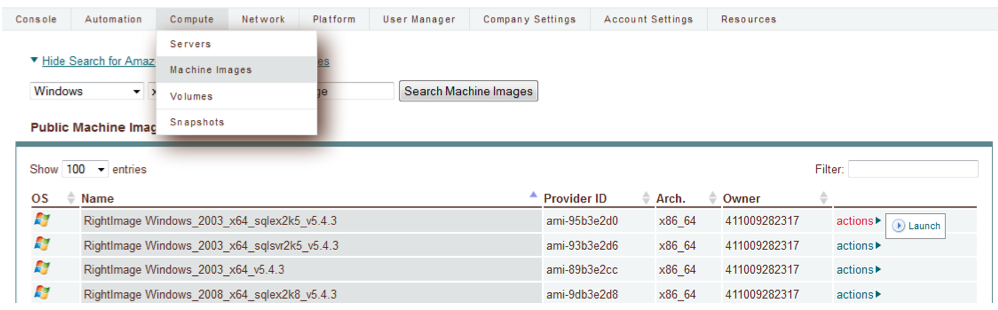

   Launch 2008 Instance

Specify appropriate properties for your server and click Launch Server. 

.. note:: If you are using the Amazon cloud, do not specify a key pair.

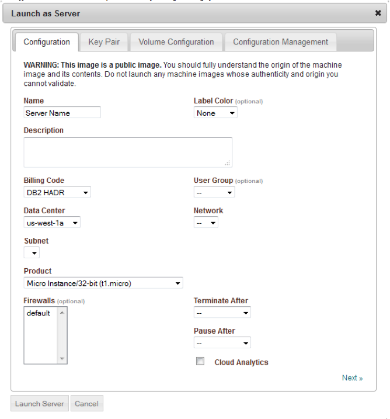

   Launch 2008 Instance

.. warning:: The screenshot shows the server being launched with a size: micro. Please use
   at least a small size (or equivalent) product offering. (768Mb Memory)

RDP to the Server
~~~~~~~~~~~~~~~~~

In Compute > Servers, go to the actions menu for the server you just created and click
get password. 

.. note:: You may have to wait up to 20 minutes after creating the server before
   get password appears in the actions menu.

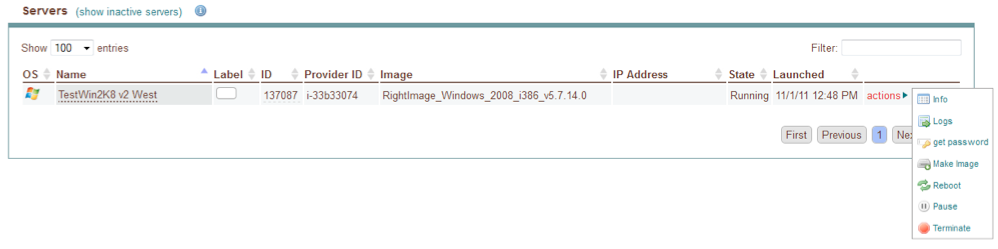

   Server Actions, Get Password

RDP to the instance as the Administrator user with the password you just retrieved. Note:
If your firewall isn’t already configured for RDP access, you will need to do so before
connecting. The default port for RDP is 3389.

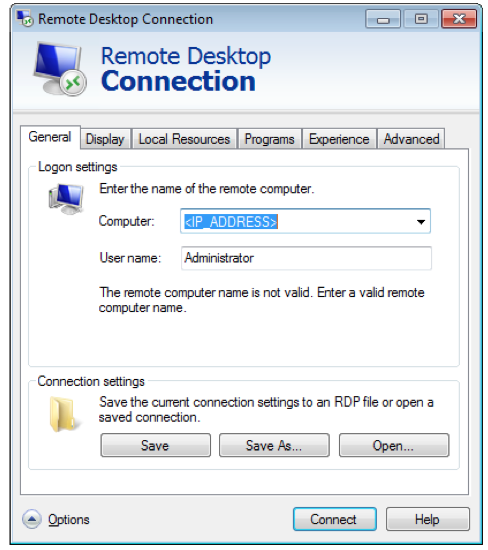

   RDP

Make sure your internet connection is working

Open up Internet Explorer by going to Start > Internet Explorer.

Install PowerShell
~~~~~~~~~~~~~~~~~~

1. Click Start, click Server Manager, in the left pane click Features, and then in the
   right pane click Add Features. This opens the Add Features Wizard.

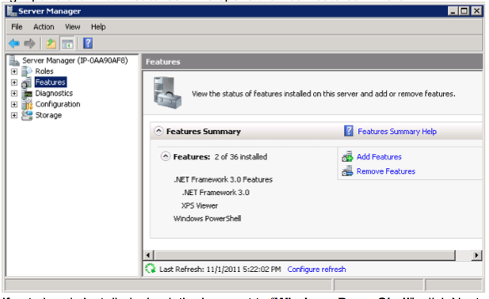

   Install Powershell

2. If not already installed, check the box next to “Windows PowerShell”, click Next, then
   click Install

Update Windows
~~~~~~~~~~~~~~

1. Click Start, click Control Panel 
2. Open Windows Update

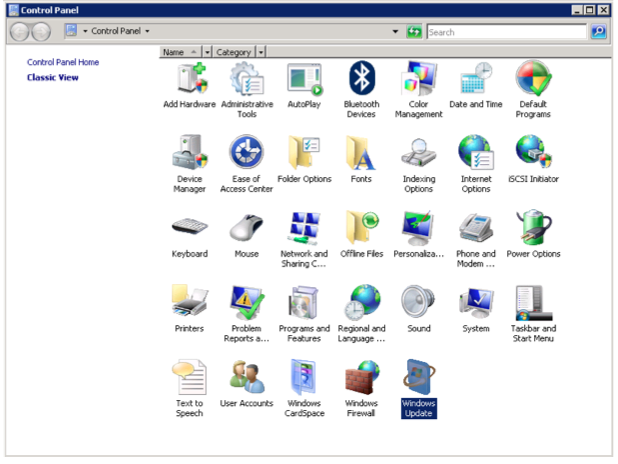

   Update Windows

3. Download and install the latest updates

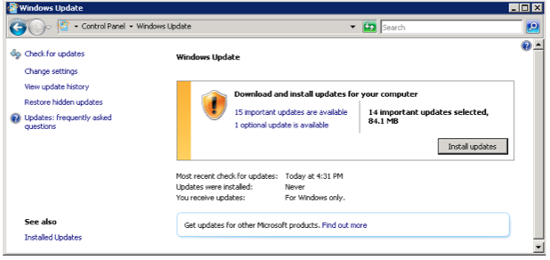

   Update Windows

Modify Firewall
~~~~~~~~~~~~~~~

To modify the windows firewall:

1. Click Start, click Control Panel

2. Open Windows Firewall

3. Click on Change Settings

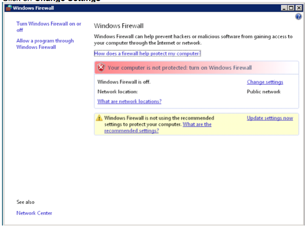

   Modify Firewall

4. Go to the Exceptions tab, and click on Add port...

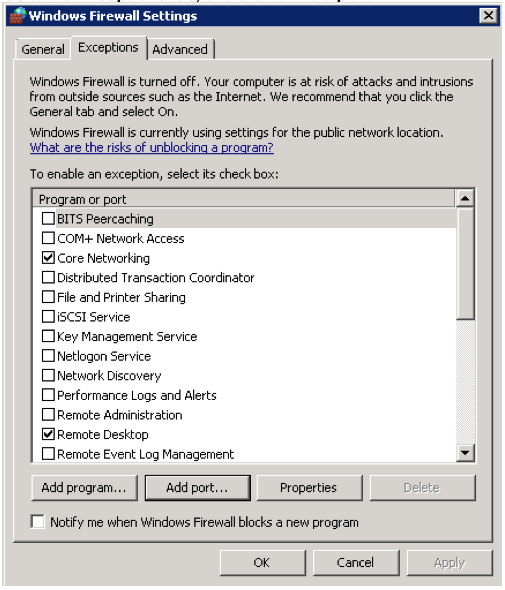

   Modify Firewall Port

5. Enter enStratus Agent in the name field, 2003 in the Port Number box, and select TCP
   for Protocol

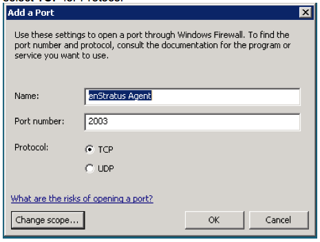

   Modify Firewall Port

6.Find the IP address of the host: provisioning.enstratus.com 

   Click Change scope, enter select Custom list, enter "216.250.165.20/29".
   
   if 216.250.165.20 is not the IP, please enter the one you found.

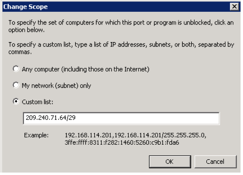

   Modify Firewall Scope

Install the Agent
~~~~~~~~~~~~~~~~~

.. note:: There are other ways to do this, if you know a better way, please use your
   method.

1. Open PowerShell by going to Start > All Programs > Accessories > Windows Power Shell

2. Run the following PowerShell commands to download the required files:

Set the execution policy to unrestricted:

.. code-block:: powershell
 
   Set-ExecutionPolicy Unrestricted

Create the download client:

.. code-block:: powershell

   $client.DownloadFile('http://windows-agent-files.s3.amazonaws.com/PSCX-1.2.msi',
   'C:\Users\Administrator\Desktop\PSCX-1.2.msi')

Download the Sun Java 7 JDK and install it.

Download the enStratus Agent:

.. code-block:: powershell

   $client.DownloadFile('http://es-download.s3.amazonaws.com/enstratus-agent-windows-64bit-latest.zip',
   'C:\Users\Administrator\Desktop\enstratus-agent-windows-64bit-latest.zip')

Download the MS C Runtime Library:

.. code-block:: powershell

   $client.DownloadFile('http://windows-agent-files.s3.amazonaws.com/msvcr71.zip',
   'C:\Users\Administrator\Desktop\msvcr71.zip')

3. Install Powershell Extensions:

   Double-click PSCX-1.2.msi to install the PowerShell Community Extensions, accepting all
   defaults during installation.

4. Install Java: 

   Double-click jdk-7-windows-x64.exe, accepting all defaults during installation.
   Set the JAVA_HOME environment variable, by entering the following into

.. code-block:: powershell

   $env:JAVA_HOME = "C:\Program Files\Java\jdk1.7.0"

5. Install the C runtime library:

   Right-click on msvcr71.zip and select "Extract All". Use the default extract
   location. From the folder which is created, copy the extracted msvcr71.dll file to
   C:\Program Files\Java\jdk1.7.0\jre\bin\

6. Extract the enStratus Agent 

   Right-click on enstratus-agent-windows-64bit-latest.zip  and select "Extract All".

   Change the location to C:\Program Files\enstratus-agent-windows-64bit-latest, and
   click Next.

   In PowerShell, change the location to the enStratus install directory:

.. code-block:: powershell
   
   cd C:\Program Files\enstratus-agent-windows-64bit-latest

7. Install the agent:

   Install the enStratus Agent. To do so, you will need to enter the appropriate cloud
   provider and environment values, listed below, and run the command:

.. code-block:: powershell

   /install.ps1 <CLOUD PROVIDER> <ENVIRONMENT>

Where <CLOUD PROVIDER> is a cloud provider of the list below:

.. hlist::
   :columns: 3

   * Amazon
   * Atmos
   * ATT
   * Azure
   * CloudCentral
   * CloudSigma
   * CloudStack
   * Eucalyptus
   * GoGrid
   * Google
   * Nimbula
   * OpenStack
   * Rackspace
   * Savvis
   * ServerExpress
   * Terremark
   * VMware

Where <ENVIRONMENT> is either:

1. **production** - should be used by SaaS (cloud.enstratus.com) customers
2. **staging** - should be used by on-premise customers using self-signed_certificates

An example installation command for the Amazon EC2 cloud with enStratus SaaS is:

.. code-block:: powershell

  ./install.ps1 Amazon production

.. note:: It will take a few minutes for the agent to show up in the enStratus console.

Confirming the Installation
~~~~~~~~~~~~~~~~~~~~~~~~~~~

Go to your enStratus web console, and open up the Compute > Servers page.

You should now see the “remote access” option if the agent has installed properly. Click on it.

.. figure:: ./images/2008_12.png
   :height: 450px
   :width: 300 px
   :scale: 65 %
   :alt: Confirming Agent Installation
   :align: center

   Confirming Agent Installation

Select your account and click “Save”. After a few seconds, the account will shop up at the top of the list.

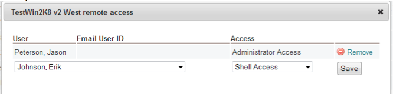

   Launch 2008 Instance

You can now RDP into the server. The enStratus agent is installed and working normally.

