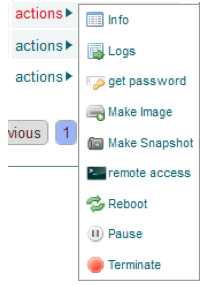

Windows 2008
------------

..
    To install the enStratus agent on a Windows 2008 instance, use the following steps:

Windows 2008 のインスタンスに enStratus エージェントをインストールするには、次の手順で行います。

..
    Launch an Instance
    ~~~~~~~~~~~~~~~~~~

インスタンスの起動
~~~~~~~~~~~~~~~~~~

..
    In the enStratus console, go to Compute > Machine Images. Once you have located the image
    you wish to launch, select Launch from the actions menu.

enStratus コンソールの "Compute > Machine Images" に移動する。起動したいイメージを置いたら、アクションメニューから "Launch" を選択します。

..
   Launch 2008 Instance

   2008 インスタンスの起動

..
    Specify appropriate properties for your server and click Launch Server. 

サーバーの適切なプロパティを指定して "Launch Server" をクリックします。

.. note::
   ..
       If you are using the Amazon cloud, do not specify a key pair.

   Amazon クラウドを使っている場合は、キーペアを指定しないでください。

..
   Launch 2008 Instance

   2008 インスタンスの起動

.. warning::
   ..
       The screenshot shows the server being launched with a size: micro. Please use
       at least a small size (or equivalent) product offering. (768Mb Memory)

   スクリーンショットは、micro サイズで起動されるサーバーを表示しています。本番環境では、最小構成でも small サイズ (かそれ相当) を使うようにしてください (768 Mb メモリー) 。

..
    RDP to the Server
    ~~~~~~~~~~~~~~~~~

サーバーへの RDP 接続
~~~~~~~~~~~~~~~~~~~~~

..
    In Compute > Servers, go to the actions menu for the server you just created and click
    get password.

"Compute > Servers" から、たった今作ったサーバーのアクションメニューへ移動して、"get password" をクリックしてください。

.. note::
   ..
       You may have to wait up to 20 minutes after creating the server before
       get password appears in the actions menu.

   サーバーを作成した後、アクションメニューに "get password" が表示されるのに、20分待つ必要があるかもしれません。

..
   Server Actions, Get Password

   サーバーアクション、パスワードの取得

..
    RDP to the instance as the Administrator user with the password you just retrieved. Note:
    If your firewall isn’t already configured for RDP access, you will need to do so before
    connecting. The default port for RDP is 3389.

先ほど取得したパスワードで管理者としてインスタンスに RDP で接続します。RDP アクセスを許可するようにファイアウォールを設定していない場合、接続する前にアクセスできるように設定する必要があることに注意してください。RDP のデフォルトポート番号は 3389 です。

.. figure:: ./images/2008_4.png
   :height: 650px
   :width: 600 px
   :scale: 65 %
   :alt: RDP
   :align: center

   RDP

..
    Make sure your internet connection is working

インターネット接続ができることを確認します。

..
    Open up Internet Explorer by going to Start > Internet Explorer.

"Start > Internet Explorer" からインターネットエクスプローラーを起動してください。

..
    Install PowerShell
    ~~~~~~~~~~~~~~~~~~

PowerShell のインストール
~~~~~~~~~~~~~~~~~~~~~~~~~

..
    1. Click Start, click Server Manager, in the left pane click Features, and then in the
       right pane click Add Features. This opens the Add Features Wizard.

1. [スタート] ボタンから、"Server Manager" をクリックして、左ペインの "Features" を選択します。それから、右ペインの "Add Features" をクリックします。これで "Add Features Wizard" を起動します。

..
   Install Powershell

.. figure:: ./images/2008_5.png
   :height: 650px
   :width: 950 px
   :scale: 55 %
   :alt: Install Powershell
   :align: center

   Powershell のインストール

..
    2. If not already installed, check the box next to “Windows PowerShell”, click Next, then
       click Install

2. まだインストールしていない場合は "Windows PowerShell" のチェックボックスを選択して、"Next" -> "Install" とクリックします。

..
    Update Windows
    ~~~~~~~~~~~~~~

Windows Update
~~~~~~~~~~~~~~

..
    1. Click Start, click Control Panel 
    2. Open Windows Update

1. [スタート] ボタンから、コントロールパネルをクリックする
2. Windows Update を起動する

..
   Update Windows

.. figure:: ./images/2008_6.png
   :height: 650px
   :width: 950 px
   :scale: 55 %
   :alt: Update Windows
   :align: center

   Windows Update

..
    3. Download and install the latest updates

3. 最新の更新プログラムをダウンロードしてインストールする

..
   Update Windows

.. figure:: ./images/2008_7.png
   :height: 650px
   :width: 950 px
   :scale: 55 %
   :alt: Update Windows
   :align: center

   Windows Update

..
    Modify Firewall
    ~~~~~~~~~~~~~~~

ファイアウォールの変更
~~~~~~~~~~~~~~~~~~~~~~

..
    To modify the windows firewall:

Windows ファイアウォールを変更するには次のようにします:

..
    1. Click Start, click Control Panel

1. [スタート] ボタンから、コントロールパネルをクリックします

..
    2. Open Windows Firewall

2. Windows ファイアウォールを開きます

..
    3. Click on Change Settings

3. "Change Settings" をクリックします

..
   Modify Firewall

   ファイアウォールの変更

..
    4. Go to the Exceptions tab, and click on Add port...

4. [例外] タブに移動し、"Add port" をクリックします

..
   Modify Firewall Port

.. figure:: ./images/2008_9.png
   :height: 650px
   :width: 800 px
   :scale: 55 %
   :alt: Modify Firewall Port
   :align: center

   ファイアウォールのポート番号の変更

..
    5. Enter enStratus Agent in the name field, 2003 in the Port Number box, and select TCP
       for Protocol

5. 名前欄に "enStratus Agent"、"Port Number" 欄に 2003 を入力して、"Protocol" を TCP に選択します

..
   Modify Firewall Port

   ファイアウォールのポート番号の変更

..
    6. Find the IP address of the host: provisioning.enstratus.com 

6. ホストの IP アドレスを調べる: provisioning.enstratus.com

   ..
       Click Change scope, enter select Custom list, enter "216.250.165.20/29".

   "Change scope" をクリックして、"Custom list" に "216.250.165.20/29" を入力します。

   ..
       if 216.250.165.20 is not the IP, please enter the one you found.

   IP アドレスが 216.250.165.20 ではない場合、適切な IP アドレスを入力してください。

..
   Modify Firewall Scope

   ファイアウォールのスコープの変更

..
    Install the Agent
    ~~~~~~~~~~~~~~~~~

エージェントのインストール
~~~~~~~~~~~~~~~~~~~~~~~~~~

.. note::
   ..
       There are other ways to do this, if you know a better way, please use your
       method.

   この作業は他にもやり方があります。もっと良い方法をご存知なら、その方法を使ってください。

..
    1. Open PowerShell by going to Start > All Programs > Accessories > Windows Power Shell

1.  "Start > All Programs > Accessories > Windows Power Shell" から PowerShell を起動します

..
    2. Run the following PowerShell commands to download the required files:

2. 必要なファイルをダウンロードするには、次の PowerShell コマンドを実行します:

..
    Set the execution policy to unrestricted:

実行ポリシーを無制限に設定します:

.. code-block:: powershell
 
   Set-ExecutionPolicy Unrestricted

..
    Create the download client:

ダウンロードクライアントを作成します:

.. code-block:: powershell

   $client.DownloadFile('http://windows-agent-files.s3.amazonaws.com/PSCX-1.2.msi',
   'C:\Users\Administrator\Desktop\PSCX-1.2.msi')

..
    Download the Sun Java 7 JDK and install it.

Sun Java 7 JDK をダウンロードしてインストールします。

..
    Download the enStratus Agent:

enStratus エージェントをダウンロードします:

.. code-block:: powershell

   $client.DownloadFile('http://es-download.s3.amazonaws.com/enstratus-agent-windows-64bit-latest.zip',
   'C:\Users\Administrator\Desktop\enstratus-agent-windows-64bit-latest.zip')

..
    Download the MS C Runtime Library:

MS C ランタイムライブラリをダウンロードします:

.. code-block:: powershell

   $client.DownloadFile('http://windows-agent-files.s3.amazonaws.com/msvcr71.zip',
   'C:\Users\Administrator\Desktop\msvcr71.zip')

..
    3. Install Powershell Extensions:

3. Powershell の拡張機能をインストールします:

   ..
       Double-click PSCX-1.2.msi to install the PowerShell Community Extensions, accepting all
       defaults during installation.

   "PowerShell Community Extensions" をインストールするために PSCX-1.2.msi をダブルクリックして、全てデフォルト値でインストールします

..
    4. Install Java: 

4. Java をインストールします:

   ..
       Double-click jdk-7-windows-x64.exe, accepting all defaults during installation.
       Set the JAVA_HOME environment variable, by entering the following into

   jdk-7-windows-x64.exe をダブルクリックして、全てデフォルト値でインストールします。JAVA_HOME 環境変数を次のように設定します

.. code-block:: powershell

   $env:JAVA_HOME = "C:\Program Files\Java\jdk1.7.0"

..
    5. Install the C runtime library:

5. C ランタイムライブラリをインストールします:

   ..
       Right-click on msvcr71.zip and select "Extract All". Use the default extract
       location. From the folder which is created, copy the extracted msvcr71.dll file to
       C:\Program Files\Java\jdk1.7.0\jre\bin\

   msvcr71.zip を右クリックして "Extract All" を選択します。ここではデフォルトの解凍場所を使います。作成されたフォルダーで解凍された msvcr71.dll を C:\\Program Files\\Java\\jdk1.7.0\\jre\\bin\\ にコピーます

..
    6. Extract the enStratus Agent

6. enStratus エージェントを解凍します

   ..
       Right-click on enstratus-agent-windows-64bit-latest.zip  and select "Extract All".

   enstratus-agent-windows-64bit-latest.zip を右クリックして "Extract All" を選択します

   ..
       Change the location to C:\Program Files\enstratus-agent-windows-64bit-latest, and
       click Next.

   解凍場所を C:\Program Files\enstratus-agent-windows-64bit-latest に変更して "Next" をクリックします

   ..
       In PowerShell, change the location to the enStratus install directory:

   PowerShell で enStratus インストールディレクトリへ移動します:

.. code-block:: powershell
   
   cd C:\Program Files\enstratus-agent-windows-64bit-latest

..
    7. Install the agent:

7. エージェントをインストールします:

   ..
       Install the enStratus Agent. To do so, you will need to enter the appropriate cloud
       provider and environment values, listed below, and run the command:

   enStratus エージェントをインストールします。この作業を行うには、次の適切なクラウドプロバイダーと環境変数を入力する必要があります。次のコマンドを実行します:

.. code-block:: powershell

   /install.ps1 <CLOUD PROVIDER> <ENVIRONMENT>

..
    Where <CLOUD PROVIDER> is a cloud provider of the list below:

<CLOUD PROVIDER> には次のクラウドプロバイダーを設定します:

.. hlist::
   :columns: 3

   * Amazon
   * Atmos
   * ATT
   * Azure
   * CloudCentral
   * CloudSigma
   * CloudStack
   * Eucalyptus
   * GoGrid
   * Google
   * Nimbula
   * OpenStack
   * Rackspace
   * Savvis
   * ServerExpress
   * Terremark
   * VMware

..
    Where <ENVIRONMENT> is either:

<ENVIRONMENT> は次のどちらかを設定します:

..
    1. **production** - should be used by SaaS (cloud.enstratus.com) customers
    2. **staging** - should be used by on-premise customers using self-signed_certificates

1. **production** - SaaS (cloud.enstratus.com) のユーザーが使います
2. **staging** - 自己署名認証を使う on-premise のユーザーが使います

..
    An example installation command for the Amazon EC2 cloud with enStratus SaaS is:

enStratus SaaS で Amazon EC2 クラウドを使うインストールコマンドの例です:

.. code-block:: powershell

  ./install.ps1 Amazon production

.. note::
   ..
       It will take a few minutes for the agent to show up in the enStratus console.

   enStratus コンソールにエージェントが表示されるのに数分かかります

Confirming the Installation
~~~~~~~~~~~~~~~~~~~~~~~~~~~

..
    Go to your enStratus web console, and open up the Compute > Servers page.

enStratus web コンソールに移動して、"Compute > Servers" ページを開きます。

..
    You should now see the “remote access” option if the agent has installed properly. Click on it.

エージェントが正常にインストールされたら、"remote access" が見えているはずです。それをクリックしてください。

..
   Confirming Agent Installation

   エージェントのインストール確認

..
    Select your account and click “Save”. After a few seconds, the account will shop up at the top of the list.

アカウントを選択して "Save" をクリックします。数秒後に、アカウントがそのリストの上部に表示されます。

..
   Launch 2008 Instance

.. figure:: ./images/2008_13.png
   :height: 250px
   :width: 900 px
   :scale: 95 %
   :alt: Launch 2008 Instance
   :align: center

   2008 インスタンスの起動

..
    You can now RDP into the server. The enStratus agent is installed and working normally.

これでサーバーに RDP で接続できます。enStratus エージェントがインストールされて、正常に動作するようになりました。
