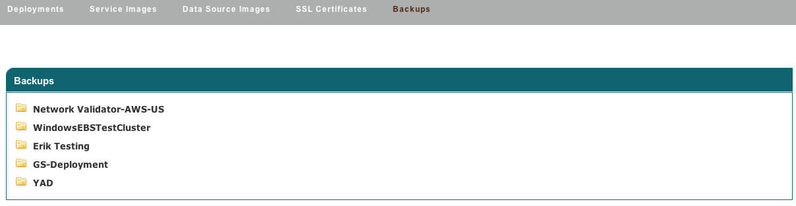

Backups
-------

Backups occur according the the parameters specified in the Launch Configuration
configuration. As snapshots and occur, they are tracked in the Automation > Backups part
of the enStratus console.

   Deployment Backups
