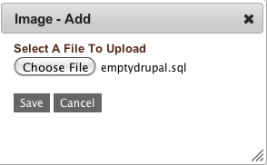

Data Sources
------------

To upload a data source into enStratus, navigate to Automation > Data Source Images and
select add data source.

A data source can be a database backup file. For example, for a MySQL database, the data
source may be represented by a file with a .sql extension. This file is downloaded from
cloud storage during the start and configuration of a service that has associated a data
source.

   Add Data Source

Using
~~~~~

Data sources are used when configuring a service. More is said about this in the
section on Tiers, which hold services. A data source is a database backup file, typically
in the form of a "dump" file of the form database1.sql. Data sources, like
services, should be uploaded into cloud storage before configuring the deployment.
