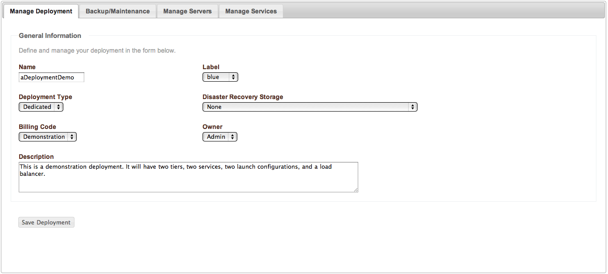
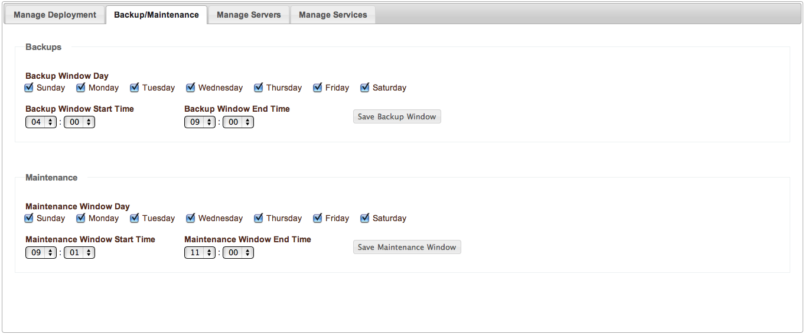

Deployment Management
---------------------

   Deployment Management

Deployment management and configuration starts  with the options shown in the figure
above.

#. **Name**

   The name of the deployment is simply the logical name that will be presented in the
   enStratus console. 

#. **Label**

   An optional color code may be applied to the deployment.

#. **Deployment Type**

   The deployment type has two options:
   
   * Dedicated. 

     A dedicated deployment will track all deployments costs against the same
     billing code.

   * Shared. 

     A shared deployment will track deployment costs against multiple billing codes.
     If a shared deployment is chosen, billing code usage will be tracked at the service level.

#. **Disaster Recovery Storage**

   Disaster recovery storage specifies a cloud storage option for backup files. It is
   possible to run all or parts of a deployment in one cloud while performing backups via
   /enstratus/bin/backupService to another cloud altogether for disaster recovery purposes.

#. **Billing Code**

   The billing code is the code against which all deployment charges will be made.

#. **Owner**

   The owner specifies an optional owner for the deployment so that role based access
   controls may apply to the deployment.

#. **Description**

   The description is a free form text field for describing the deployment.

Backup/Maintenance
~~~~~~~~~~~~~~~~~~

   Backup and Maintenance

The backup options designate the times when enStratus will peform backups such as
snapshots of attached volumes or service level backups via the agent script
/enstratus/bin/backupService.

Manage Servers/Services
~~~~~~~~~~~~~~~~~~~~~~~

These tabs display an aggregated view of all servers running in the deployment and all of
the services installed on the deployment.
