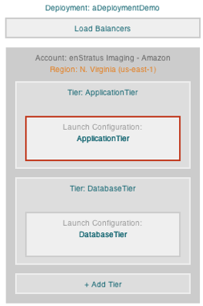
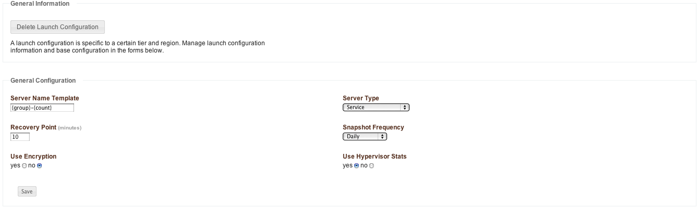
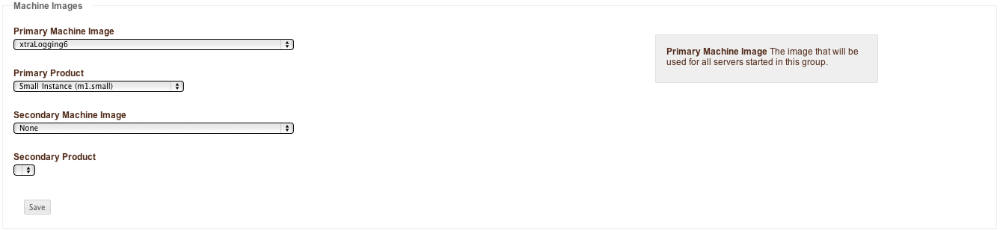
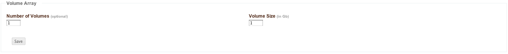
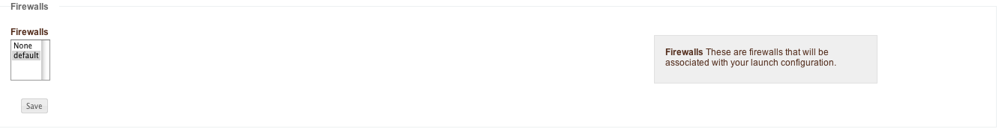

Launch Configuration
--------------------

A launch configuration is a definition that governs the resources provisioned to support a
virtual machine. At one level, this is roughly analogous to the size definitions provided
for by some clouds, such as in Amazon AWS small, medium, large, etc.  For enStratus a
launch configuration includes this definition, but goes beyond to include attaching,
raiding, and encrypting volumes as well as the firewall into which the server is started.

   Launch Configuration

Manage Launch Configuration, General Information
~~~~~~~~~~~~~~~~~~~~~~~~~~~~~~~~~~~~~~~~~~~~~~~~

   Launch Configuration (General Information)

#. **Server Name Template**

   The server name template controls the name that is applied to servers that are started
   according to the launch configuration. There are two approaches to naming servers as part
   of the launch configuration.
   
   The first approach is to just hard code a value for this field. The implications of this
   are if the tier scales to include many servers, they will all be named the same thing,
   which is allowed, and not always desirable.
   
   The second approach is to use parameters as shown in the figure above. The available
   parameters are:
   
   * {tier} name of the tier this server is running in.
   * {group} currently resolves to tier name, for backwards compatibility.
   * {count} count of this server (sequential numbering from 1 for a tier.)
   * {role} one of: CLUSTER NODE, INDEPENDENT NODE, MASTER, REPLICANT, STANDALONE (converted
     to lowercase string)
   * {type} one of: LOAD, SERVICE, CLUSTERED DATABASE, REPLICATED DATABASE, UNKNOWN
     (converted to lowercase string)
   * {zone} the provider zone ID where the server is running.
   * {dc} resolves the same as zone above.
   * {region} the provider region ID where the server is running.
   * {ip} reserved address (public IP) of the server.
   * {year} launch year of the server.
   * {day} launch day of the server.
   * {hour} launch hour of the server.
   * {minute} launch minute of the server.
   
   This approach has the advantage of uniquely naming servers as they join/leave a tier in an
   intelligent manner.

#. **Recovery Point**

   The recovery point parameter sets the amount of time enStratus will wait to begin a
   recovery event of a failed server. A server is assumed to have failed if the agent is
   unreachable, and the server is un-ping-able, or the server has stopped altogether and is
   no longer being counted in the min/max.

#. **Use Encryption**

   This setting determines whether volumes attached to servers are encrypted. This option is
   currently only meaningful for Linux-based servers that can employ the Linux Unified Key
   Setup. This type of encryption is file-system based encryption.

#. **Server Type**

   There are five options for Server Type:

   * Load balancer. This option specifies a launch configuration as a load balancer so
     that servers in this tier will be treated as such.
   * Service General Service. This option identifies the servers governed by this launch
     configuration as a generic service such as a web application.
   * Clustered Database A clustered database is a database that is not using replication and
     is therefore treated as an independent entity.
   * Replicated Database A replicated database is a database that is set up to perform
     replication.
   * Unknown Similar to a service, this is a generic entry for a service.

#. **Snapshot Frequency**

   This parameter sets the frequency with which enStratus automatically performs snapshots of
   the attached volume. It is important to note that although there may be multiple servers
   running as part of a tier, each with its own volume attached, enStratus will only snapshot
   one of the volumes.
   
   This highlights an important architectural consideration. Each server running in a tier
   should be identical, as should the attached volumes. If variation is required in the
   architecture between servers, that is an indication that an extra tier should be
   configured.
   
   Take care not to set the snapshot frequency too low. Snapshots lock the file system until
   they are complete, which can impact your application performance. Additionally, most cloud
   providers limit the number of snapshots that can be stored and if the setting is to a high
   frequency, this limit may result in errors. Typically one snapshot per day is sufficient
   for most applications.

Machine Images
~~~~~~~~~~~~~~

   Launch Configuration Machine Images

#. **Primary Machine Image**

   The primary machine image specifies the machine image that enStratus will use to start
   servers in the tier.

#. **Primary Product**

   The primary product will contain a list of options that is very cloud-specific. The figure
   shows an option that is specific to the AWS EC2 provider. If you are using a different
   cloud provider you will see other options present here.

#. **Secondary Machine Image**

   The secondary machine image is a machine image of an optionally unique definition that 
   enStratus will use to launch subsequent servers from the secondary machine image definition.
   
   The most logical implementation for using a secondary machine image is in the case of
   replicated databases. The primary machine image would be used by enStratus to launch the
   master database and all subsequent servers would function as slaves using the secondary
   machine image.

#. **Secondary Product**

   The secondary product defines the amount of virtual hardware provisioned in the same
   manner as the primary product.

Volumes
~~~~~~~

.. note:: The volumes option is only present if the cloud provider features block storage.

   Launch Configuration, Volumes

The volumes specification determines the number and size of volumes that will be attached
to servers in the tier. The option to encrypt these volumes is specified as part of the
general configuration above.

   Launch Configuration, Firewalls

The firewall definition specifies the firewall into which servers in this launch
configuration are started.

Manage Servers, Servers
~~~~~~~~~~~~~~~~~~~~~~~

Selecting this tab will show the servers running as part of the selected launch
configuration.

