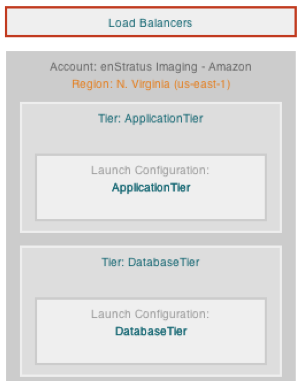
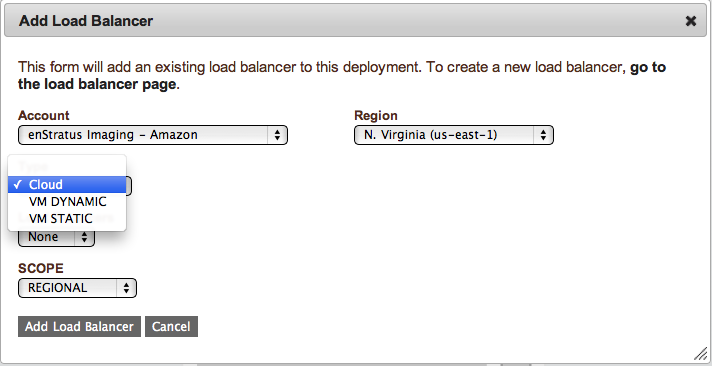

Load Balancers
--------------

A load balancer balances traffic typically to multiple application servers. enStratus
supports multiple types of load balancers through different mechanisms.

   Load Balancer

Physical
~~~~~~~~

A virtual machine based load balancer can use HA-Proxy, mod-jk, or zeus as a load
balancer. When a service is connected to a virtual machine based load balancer, The agent
script /enstratus/bin/startProxy is used to signal the load balancer that a new
application server has joined the pool. The agent script /enstratus/bin/stopProxy is used
to signal the load balancer that an application server has left the pool.

Virtual (Example: ELB)
~~~~~~~~~~~~~~~~~~~~~~

Some cloud providers support service-based load balancing in the from of a virtual load
balancer. In AWS, this is called an Elastic Load Balancer (ELB). In cloudstack (cloud.com)
clouds, sometimes this is called a Router Virtual Machine (RVM). If your cloud provider
has this concept with API support, enStratus can support it.

If a service is tied to a virtual load balancer, the server upon which that service runs
will be added to and dropped from the load balancer via api calls. Furthermore, if the
load balancer is set to balance traffic to a specific zone or zones, enStratus will ensure
that your application servers only start in those zones.

Load balancing is connected to the deployment at the *service* level with enStratus. An
important point which will be illustrated shortly.

.. note:: It is possible to associate multiple load balancers with a deployment. This
  feature is useful when working in a cross-cloud or in a massively scaled, geographically
  disperse environment.

   Adding a Load Balancer

Load balancer configuration options are:

#. **Account**

   The account specifies the account to which the load balancer is provisioned. If the
   administrator is a member of multiple accounts, there may be multiple options here.
   One possibility here is to have a load balancer span across several clouds. For example, a
   load balancer may be provisioned into a cloud.com cloud with application servers in both
   EC2 and in cloud.com

#. **Region**

   It is possible to have a load balancer span regions within a cloud. For example, the EC2
   cloud has at the time of this writing 5 regions.

#. **Scope**

   The scope parameter has three different settings:

  * **Global**
    
    A global setting will cause the load balancer to balance across regions, but is
    nonsensical for virtual load balancing offerings such as an ELB.

  *  **Regional** 

     A regional load balancer will balance traffic to only one region, and evenly
     to all data centers within that region.

  * **Data Center** 

    A data center setting will balance to specific data centers. This type of
    load balancing only makes sense for virtual load balancing offerings such as an ELB where
    data centers (zones) can be specified prior to launch. This setting is non-sensical for
    VM-based load balancing where no such option exists.

There are three types load balancer that can be provisioned within enStratus:

#. **Cloud**

   A cloud load balancer is a virtual load balancer such as an Amazon EC2 Elastic
   Load Balancer. If the cloud provider has no such concept, there will be no option
   presented.

   In order for this option to be presented, a cloud load balancer must have already been
   provisioned.

#. **VM Dynamic** 

   A VM Dynamic load balancer means that at the time of deployment start,
   enStratus will provision a virtual server from the specified template with the appropriate
   resources, and launch it into the specified fireall. If a VM Dynamic load balancer is
   provisioned, it will benefit from auto-recovery.

#. **VM Static** 
   
   A VM Static load balancer will "convert" an existing virtual machine
   into a load balancer by calling the /enstratus/bin/startProxy script on the VM specified
   at the appropriate time.

   Currently, VM Static load balancer do not benefit from auto-recovery. If auto-recovery is
   desired, use a VM Dynamic load balancer instead.
