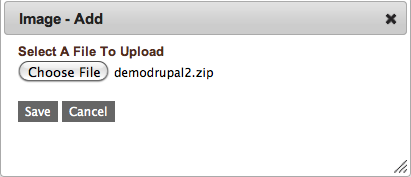

Services
--------

Services are software objects in the form of files, typically tarred, zipped, or gzipped.
Services must be uploaded to cloud storage before configuring the deployment.

A service "image" is a zip (or tar, gz, etc.)  file that can be uploaded to enStratus and
then selected for use in an automated deployment environment. Services are installed on
tiers, and have several configuration options, one of which can accomplish the logical
connections between services known as dependencies.

   Add Service Image

To upload a service image, navigate to Automation > Service Images and select a service
image from your local file system. Once the service image is finished uploading, it will
be available as an option for use in a tier.
