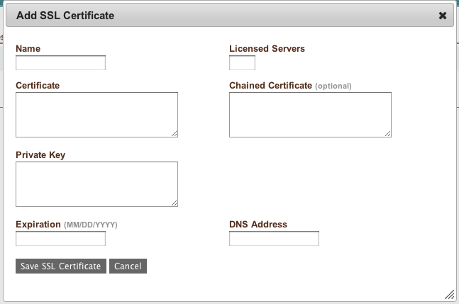

SSL
---

SSL certificates may be uploaded to enStratus where they will be protected via the same
encryption methods as any credentials for the customer account. SSL certificates should
not be imaged onto servers, rather, they should be installed in an automated on-demand
fashion at the time of server start.

Creating
~~~~~~~~

Create SSL certificates by any method you desire. enStratus will inform the administrator
via an alert when the SSL cerfiticate is set to expire via a message of the form:

.. literalinclude:: ./files/sslExpire

Uploading
~~~~~~~~~

To upload your certificate to enStratus, navigate to Infrastructure > SSL Certificates as
shown:

   SSL, Upload

Updating
~~~~~~~~

To update your SSL certificate, choose an existing certificate from the list and update
the necessary fields, then save.

Using
~~~~~

Data sources are used when configuring a service. More is said about this in the section
on Tiers, which hold services.

