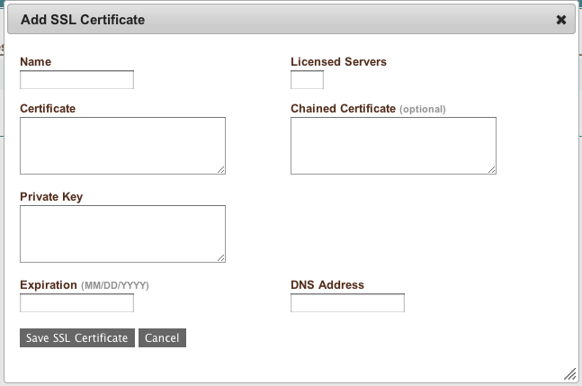

Tier
----

A tier is a logically and physically scalable division that contain servers running. Tiers
may span one or more clouds, so it is possible to have a tier that starts by provisioning
servers in your private data center but "bursts" when demand dictates additional
infrastructure into a public cloud provider.

A launch configuration is logically contained within a tier. In fact, a tier cannot exist
in any region without a corresponding launch configuration.

   Tier

Manage Tier, General Information
~~~~~~~~~~~~~~~~~~~~~~~~~~~~~~~~

.. figure:: ./images/tierGeneralInformation.png
   :height: 500px
   :width: 1200 px
   :scale: 50 %
   :alt: Tier, General
   :align: center

   Tier, General Information

Managing a tier includes the capability to delete the tier or grant shell access for the
tier. If the tier is deleted, any associated launch configurations will also be deleted.
If the shell access option is selected, a dialog box will be presented to the
administrator for adding shell access to servers running in the tier.

Manage Tier, Shell Access
~~~~~~~~~~~~~~~~~~~~~~~~~

.. figure:: ./images/tierShellAccess.png
   :height: 300px
   :width: 1000 px
   :scale: 50 %
   :alt: Tier, Shell Access
   :align: center

   Tier, Shell Access

When servers are started as part of ongoing tier operations, Users designated for shell
access will be granted shell access shortly after the server has registered with the
enStratus provisioning server.

The same requirements for shell access in individual servers apply, namely that the
firewall must be open on the port where SSH is running, and the user must have a public
key as part of their profile.

Tier Scaling Rules, Scaling Rules
~~~~~~~~~~~~~~~~~~~~~~~~~~~~~~~~~

.. figure:: ./images/tierScalingRules.png
   :height: 700px
   :width: 1300 px
   :scale: 50 %
   :alt: Tier, Scaling Rules
   :align: center

   Tier, Scaling Rules

Scaling rules are where the parameters that govern the scaling of tier resources.

#. **Minimum Servers**

   The minimum servers specification sets the minimum required number of servers that must be
   kept running in the tier at all times. If the total number of running servers in the tier
   falls below this threshold, an auto-recovery event will be triggered.

#. **Maximum Servers**

   The maximum servers specification sets the maximum allowable number of servers for a tier.
   If the demand on the tier is such that additional server resources are required, enStratus
   will scale up to, but not exceed, this value.

#. **Scaling Rules**

There are three options for scaling rules:

   1. **enStratus** 

      enStratus scaling options are the ones shown by default. Scaling behavior is
      governed by certain "hardware" parameters described here.
   
      enStratus can govern scaling events by monitoring the CPU load of the servers. The CPU
      load is equal to: 15-minute load average/# of CPU. For example, if the system has 2 CPU
      and the load average is 0.89, the CPU threshold reading is 0.445*100 = 44.5.
   
      * Lower CPU Threshold. 
        The lower bound on CPU threshold. If the threshold drops
        below this level and there are more than the minimum number of servers running, 
        servers will be terminated due to the decreased demand.
   
      * Upper CPU Threshold
   
        The upper bound on CPU threshold. If the threshold rises above this level and there are
        less than the maximum number of servers running, servers will be started to meet increased
        demand.
   
      * Lower RAM Threshold
   
        The lower RAM threshold sets the lower bound on RAM usage on a percentage used basis. If
        the threshold drops below this level and there are more than the minimum number of
        required servers running, servers will be scaled down due to decreased demand.
   
      * Upper RAM Threshold
   
        The upper RAM threshold set the upper bound on RAM usage on a percentage used basis. If
        the threshold is above this threshold and there is room available to scale, servers will
        be scaled up due to increased demand.
   
   2. **Cloud**
   
      enStratus can also trigger scaling events based on the properties of the cloud provider.
      If your cloud provider has mechanisms in place to govern scaling, enStratus will defer to
      them if the cloud option is selected.
   
   3. **Custom**
   
      Custom scaling rules are by far the most powerful method for controlling scaling events.
      There are inherent problems with reading CPU load by default as CPU isn't really all
      that meaningful of a concept when working in a multi-tenant cloud environment where actual
      CPU are load shared.
   
      In short, custom scaling with enStratus means that on an interval of about 30s, enStratus
      will read the output of a script called /enstratus/bin/scaleCheck. The scaleCheck script
      that controls scaling behavior signals enStratus to scale up, do nothing, or scale down by
      returning 1, 0, or -1, respectively.
   
      A voting mechanism is used by enStratus to determine whether or not to scale the number of
      servers in a group. Essentially, if the majority of servers in a server group
      "vote" to scale up by returning 1, a new server will be started. If the majority
      of servers in a server group vote to scale down by returning -1, a random server in that
      group will be terminated. If most servers vote 0, no scaling will occur.
   
      Here is an example of a scaleCheck script that was written to provide a mechanism for
      applying a normalization factor to "small" servers running in EC2.

.. note:: In all cases, enStratus manages the actions of initiating the scale. Each
   scaling event is a server launch, and all of the orchestration/automation around that
   launch is controlled using the parameters set in enStratus 

.. literalinclude:: ./files/scaleCheck
   :language: bash

Scaling Sensitivity
~~~~~~~~~~~~~~~~~~~

#. **Breach Period**

   The amount of time for which the load average must exceed the upper CPU threshold before a
   scaling event will occur resulting in more servers.

#. **Cooldown Period**

   The amount of time for which the load average must be below the lower CPU threshold before
   a scaling event will occur resulting in less servers.
   The breach and cooldown periods control the "sensitivity" of the scaling behavior.

#. **Breach Increment**

   The breach increment controls the size of the "step" enStratus uses to scale up or
   down. If the minimum and maximum number of servers specification is such that there is
   room to scale, enStratus will do so by the number of servers specified in the breach
   increment.

   For example if the minimum and maximum values are 2 and 10, respectively, and the breach
   increment is 2, if demand requires extra resources, the first scaling action will result
   in 4 servers. The same principle applies to scaling down as it does when scaling up.

.. note:: If enStratus scaling rules are in place, enStratus reads the values presented to it
  via a file called /mnt/tmp/stats.properties, that is a product of the
  /enstratus/bin/calculateAgentData script.

Manage Servers, Servers
~~~~~~~~~~~~~~~~~~~~~~~

Selecting this tab will show the servers running as part of the selected tier. The view
will aggregate the server list across all regions in the tier.

.. figure:: ./images/tierServers.png
   :height: 400px
   :width: 1400 px
   :scale: 50 %
   :alt: Tier, Servers
   :align: center

   Tier, Servers

Manage Services, Services
~~~~~~~~~~~~~~~~~~~~~~~~~

From here it is possible to interact with services. To add a service to a tier, first
select the tier from the diagram. Next navigate to the Manage Service tab shown above.
Choose Add Service.

   Tier, Add Service

A list of available services will be presented. Adding a service requires fairly minimal
information. The more interesting part of services is in the configuration.

Selecting this option will present the services that are connected to this tier.

.. figure:: ./images/tierManageService.png
   :height: 400px
   :width: 1400 px
   :scale: 50 %
   :alt: Tier, Services
   :align: center

   Tier, Services

Using the same process, a service was also added to the Database tier. To view all
services, select the deployment and choose Manage Services. This will cause the console to
display all of the services installed in all tiers on the deployment.

   Tier, All Services

Configuring Services
~~~~~~~~~~~~~~~~~~~~

Configuring services controls options such as the port upon which the services listen for
incoming traffic, credentials, and dependencies. To view the configuration options
associated with a service, click on the green action button for the service:

   Service, Actions

Launch
~~~~~~

   Launch is an option that is reserved for starting services on an already running
   deployment. On the service, enStratus will call the script called
   /mnt/services/$serviceID/bin/enstratus-start.

.. note::  If the deployment is not running, this action is meaningless.

Edit
~~~~

   Service, Edit

Editing a service presents several options. The options presented here control how
enStratus treats your service and what information is passed to your service when changes
occur.

3. **Backup Frequency**

   The backup frequency setting controls the frequency with which enStratus calls any custom
   backup script located in /mnt/services/$serviceID/enstratus/bin/enstratus-backupService.
   This is a service level backup and enStratus will store the resulting backup file in
   cloud storage.

4. **Configuration**

   Configuration is a free form text field that allows an administrator to pass in sensitive
   information to the service. This information makes its way directly into the
   enstratus.cfg file that is passed as an argument to the
   /mnt/services/$serviceID/bin/enstratus-configure as necessary during scaling and starting
   events. Remember that the enstratus.cfg file is securely erased after it is used.

5. Run as User

   The run as user controls the user enStratus will use to start the service.

6. Service Image

   The service image is the service image that will be used for the specified service.
   Service images must first be uploaded via Automation > Service Images.

7. Scaling Model

   The scaling model has four options:

      1. **None** 

         This option means that no special action will be taken during scaling beyond the
         normal scaling mechanism.

      2. **Load Balanced** 

         This option tells enStratus to notify a load balancer when a scaling
         event occurs that affects this service.

      3. **Replicated Database** 

         This option tells enStratus to treat the first server started in a tier as a master
         and all subsequent servers as slaves. Please refer to the MySQL service image for
         more information about this process.

      4. **Clustered Database** 

         This option tells enStratus to treat all database servers as peers with no
         master/slave relationship.

8. SSL Certificate

   SSL Certificates may be uploaded to enStratus via the interface at Infrastructure > SSL.

   SSL, Add

If a certificate has been uploaded to enStratus, it will be present as an option and
securely passed in to the servers at launch via the /enstratus/bin/configureService script
and ultimately to the user-defined /mnt/services/$serviceID/bin/enstratus-configure script
for use in configuring the service.

In this option, the SSL certificates are passed to the application servers.

7. **Load Balancer SSL**

   Checking this option will allow the administrator to specify the load balancer as a target
   for the SSL certificate. This option is only available for virtual machine based load
   balancers.

   SSL certificates may be available to cloud based load balancers, and must be configured
   via your cloud provider as not all cloud support this option.

8. **Billing Code**

   It is possible to track tier costs against a billing code. Different tiers within the same
   deployment may have different billing codes.

9. **Owning Group**

   The owning group will specify the group attribute for the service.

Ports
~~~~~

.. figure:: ./images/servicePorts.png
   :height: 400px
   :width: 800 px
   :scale: 50 %
   :alt: Service, Ports
   :align: center

   Service, Ports

Adding a service port to a service will configure enStratus to pass in the relevant port
information to the service via the enstratus.cfg file. If there is a load balancer
connected to the deployment, it will appear in the Load Balancers selection window. If a
load balancer is selected, enStratus will ensure that servers that have this service
installed upon them are connected to the load balancer upon start.

More specifically, if you have virtual machine-based load balancer specified, and an
application server has a service installed that is connected to the load balancer,
enStratus will call /enstratus/bin/startProxy on the load balancer after the service is
configured on the application server.

If a cloud based load balancer such as an elastic load balancer (ELB), enStratus will call
the correct API command to connect that server to the ELB. The cloud based load balancer
must be configured beforehand to pass traffic on the correct ports and protocols.

The relevant section of the enstratus.cfg file for ports is shown here: 

.. code-block:: bash

  [enstratus]
  port.80.protocol=TCP 
  port.80.publicPort=80 
  port.80.privatePort=80 

Credentials are also securely passed to the service via the enstratus.cfg file during
deployment start. What happens to these credentials is determined by the actions taken by
the enstratus-configure script which should be written by the application/service architect.

Credentials
~~~~~~~~~~~

Credentials are also securely passed to the service via the enstratus.cfg file during
deployment start. What happens to these credentials is determined by the actions taken by
the enstratus-configure script which should be written by the application/service
architect.

.. figure:: ./images/serviceCredentials.png
   :height: 600px
   :width: 700 px
   :scale: 50 %
   :alt: Service, Credentials
   :align: center

   Service, Credentials

The relevant section of the enstratus.cfg file for credentials is here: 

.. code-block:: bash

  [enstratus]
  serviceKeys=admin 
  serviceKey.admin.user=adminUser
  serviceKey.admin.password=trustno1

This configuration option controls the information that is passed to services via the
enstratus.cfg file. What happens to this information is determined by the actions
specified in the enstratus-configure script written by your application architect.

Data Sources
~~~~~~~~~~~~

.. figure:: ./images/serviceDataSources.png
   :height: 400px
   :width: 800 px
   :scale: 50 %
   :alt: Service, Data Soruce
   :align: center

   Service, Data Soruce

   Data Source, Edit

A data source is tied only to database services. Data sources are database backup files
such as a datasource.sql file that have been uploaded to enStratus for use in deployments
via Automation > Data Sources.

The figure above displays the data source configuration for a MySQL service. The available
configuration options for data sources and their functions are described here:

#. **Name**

   The name is a logical name for the data source as it will appear in the enStratus console.

#. **Name in Database**

   This configuration option ultimately becomes the name of the database itself as in the
   case of a MySQL service.

#. **Description**

   A text description of the service for human reference.

#. **Label**

   An optional color code that will be applied to the service in the enStratus console.

#. **Service User**

   The service user will be the user on the server that owns the service.

#. **Backup Frequency**

   This configuration option specifies the frequency with which enStratus calls the agent
   script called /enstratus/bin/backupService. The function of this script is to call a
   user-configured script called /mnt/services/$serviceID/bin/enstratus-backupDataSource. If
   this script exists, enStratus will execute it and place the resulting file into cloud
   storage. If not, this is a nonoperational event.

#. **Service Password**

   This parameter will become the password that can be used to connect to the data source

#. **Custom Configuration**

   The custom configuration option is a free-form text field that can be used to pass
   information to the enstratus-configure script at the time of service configuration. This
   information will be contained within the enstratus.cfg file.

#. **Data Source Image**

   The data source image is the database dump file that will be used to initialize the
   database named in the Name in Database field.

#. **Owning Group**

   The owning group can be assigned to the service if role based access controls are being
   used.

Dependencies
~~~~~~~~~~~~

   Service, Dependencies

Creating an dependency means establishing a logical connection between services. For
example, an application service may have a dependency on a database service. Perhaps even
more meaningful than that, an application service may have a dependency on a database data
source.

Operationally, if there exists a dependency between two services, when there are changes
that affect either service such as an auto-recovery or an auto-scaling event, the other
service is notified by enStratus of this environmental change.

This notification process is conducted using the enstratus.cfg file which is passed to all
affected services in a tier.

In the figure above, an application service has a dependency on a data source installed on
a database service. If there is an auto-recovery event on a database server housing the
data source, the application services that depend on it will be notified when enStratus
passes in a new enstratus.cfg file to each of them.

Similarly, when changes such as an auto-recovery or an auto-scaling event occur on servers
housing the application service, the database service will be notified as well to grant or
revoke database access as necessary to compensate for changes at the application tier.
The takeaway message for dependencies is that dependencies establish logical relationships
between services that ensure the required information is passed when environment
changes occur such as a scale or recovery of a server that is running an affected service.

Delete
~~~~~~

Deleting a service will remove it from a tier.

Versioning
~~~~~~~~~~

Maintaining the most recent version of a service is dependent somewhat on the cloud
provider. If your cloud provider has a concept of attachable block storage devices and
your services are installed upon one of them that is regularly being snapshotted, it may
be acceptable to rely on this mechanism for maintaing the most recent software. Update
your services on the running volumes, and the updates will persist once the next snapshot
is taken.

This approach is dependent upon the enStratus auto-recovery and scaling procedures. It is
advisable to also update the service images that are defined for each service in a tier by
uploading a new service image via Infrastructure > Service Images and then pointing the
service definition to the newest version.

If your cloud provider has no concept of attachable block storage devices, the only option
is to take the approach of uploading the new, updated service image via Infrastructure >
Service images and then pointing the service definition to the newest version.

