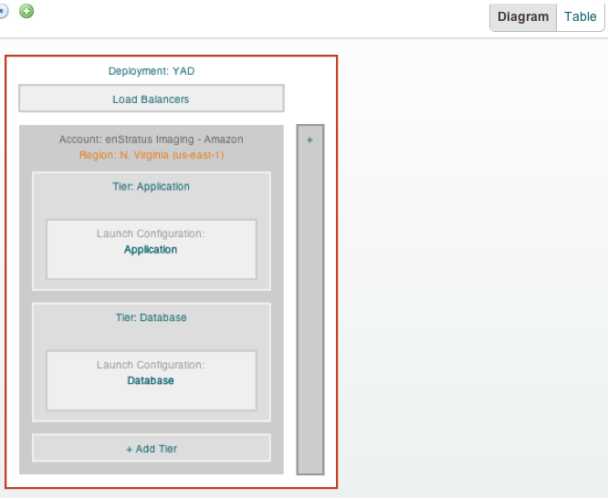
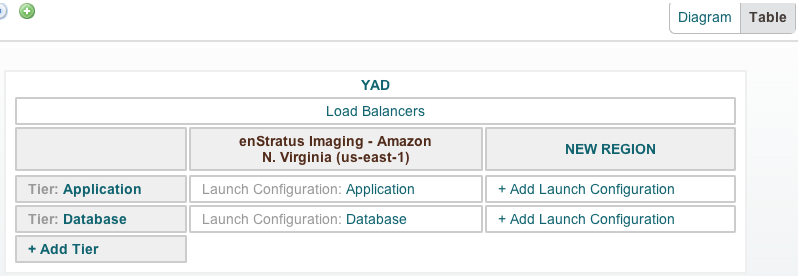
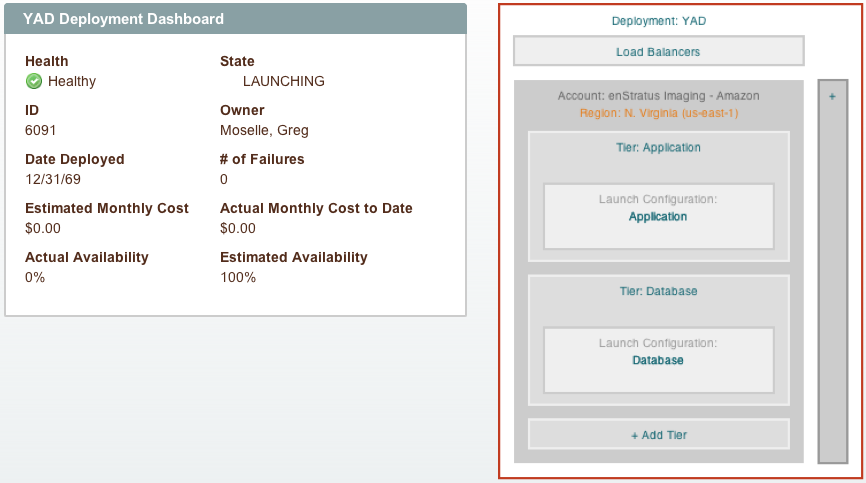

User Interface
--------------

The enStratus automation interface is designed to be intuitive and easy to operate. There
are several sections of the enStratus console that are relevant to interacting with and
configuring automation.

The deployment designer interface allows the user to build an application architecture
using the enStratus web console. 

Diagram
~~~~~~~

   Deployment Designer (Diagram View)

Table
~~~~~

This deployment has two tiers tier and two launch configurations in one region. The
graphical representation of the deployment can also be toggled to a table view.

   Deployment Designer (Table View)

Deployment Dashboard
~~~~~~~~~~~~~~~~~~~~

The deployment dashboard is meant to display relevant statistics and other information to
deployment administrators.

   Deployment Dashboard

