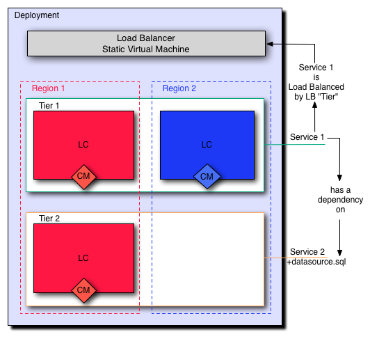
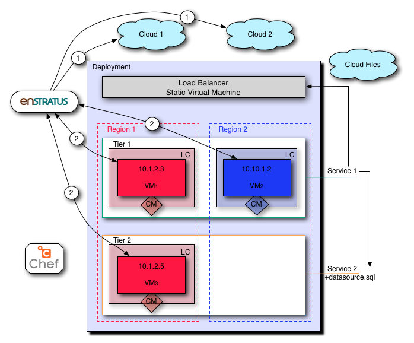
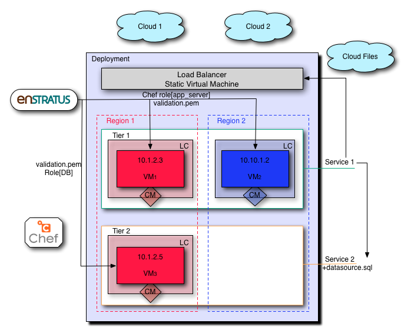
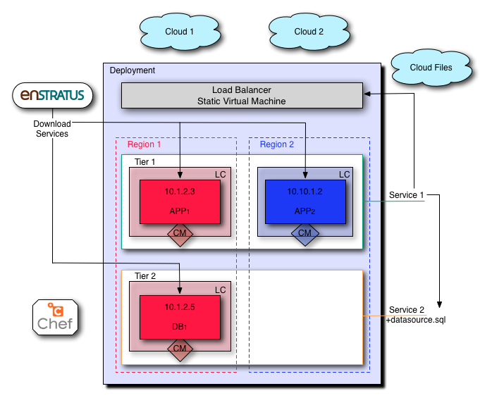
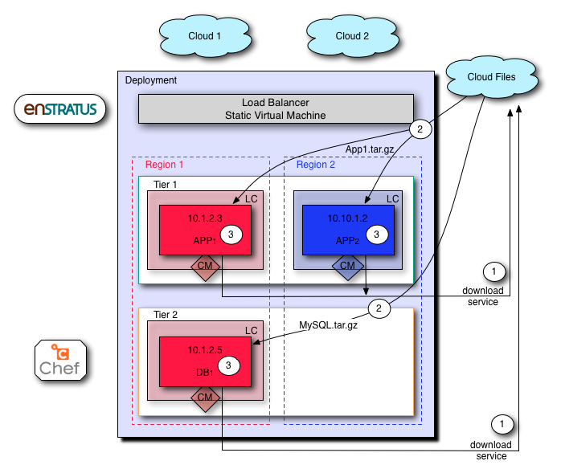
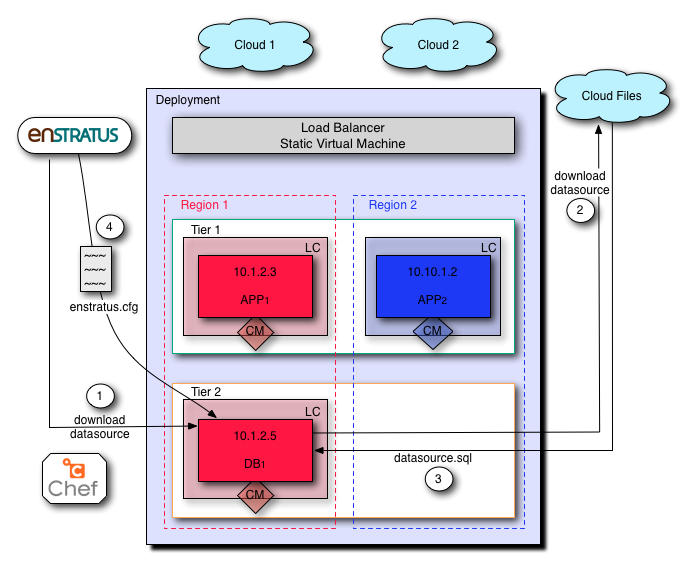
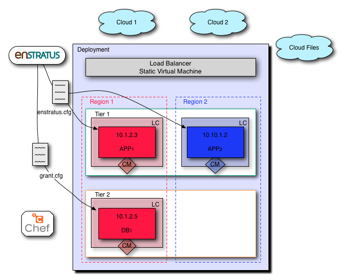
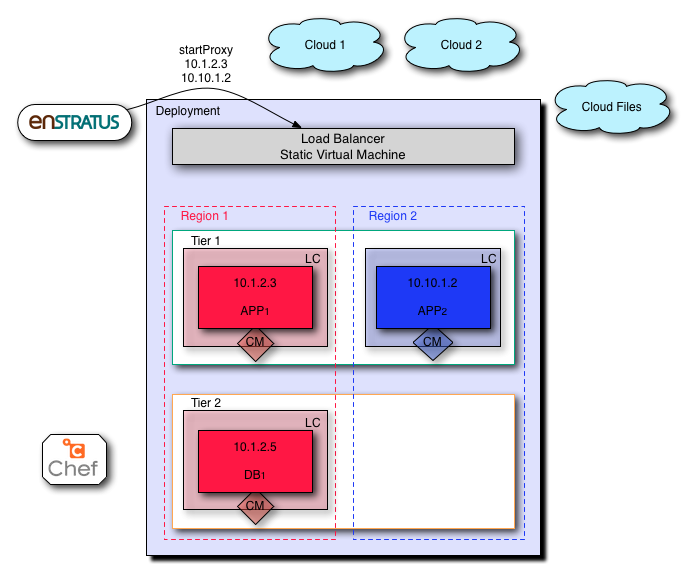

..
    Launch
    ------

起動
----

..
    Launching a deployment triggers a series of highly orchestrated and controlled events
    leading to a successful deployment and configuration of an application stack.

デプロイメントを起動すると、高度に調整され、且つ制御された一連のイベントをトリガーします。このイベントは、アプリケーションスタックのデプロイメントとその設定を正しく行います。

..
    Starting with the deployment configuration shown below. We'll track the launch of the
    deployment from cold start to running.

次のデプロイメント設定で起動してください。デプロイメントの起動から実行するまでを追跡します。

..
    We'll track the deployment launch by following the enStratus components throughout the
    event.

イベント全体を通して、次の enStratus コンポーネントによるデプロイメントの起動を追跡します。

..
    **enStratus**: State/actions of the enStratus management platform.

**enStratus**: enStratus 管理プラットフォームの状態/アクション。

..
    **Deployment**: State of the deployment. Values will be LAUNCHING, RUNNING.

**デプロイメント**: デプロイメントの状態。値は LAUNCHING (起動中) と RUNNING (実行中)

..
    **Agent**: State of the agent. Script(s) called. Logs to watch.

**エージェント**: エージェントの状態。スクリプトを呼び出したり、ログを監視する。

..
    **Service**: State of the service. Script(s) called.

**サービス**: サービスの状態。スクリプトを実行する。

.. Important::
   ..
       SaaS users may not have access to view some logs and files that are generated.

   SaaS ユーザーは、生成されるログやファイルをみる権限がない可能性があります。

..
    **Logs**: Relevant enStratus logs to watch during this step.

**ログ**: このステップ間を監視する enStratus 関連ログ。

..
    **Files**: Files generated by enStratus.

**ファイル**: enStratus が生成するファイル。

..
    Pre-Launch
    ^^^^^^^^^^

起動前
^^^^^^

..
   Pre-Launch

   起動前

.. note::
   ..
       CM = Configuration Management. Applied at the level of launch configuration.

   CM = 構成管理。起動構成の設定時に適用されます。

..
    Launch Initiated/Scale Up
    ^^^^^^^^^^^^^^^^^^^^^^^^^

起動開始/スケールアウト
^^^^^^^^^^^^^^^^^^^^^^^

..
    During deployment launch, enStratus begins the process of provisioning the infrastructure
    needed to support the application architecture.

デプロイメントの起動中、enStratus は、アプリケーションアーキテクチャに対応する必要があるインフラストラクチャのプロビジョニング処理を開始します。

.. note::
   ..
       Server launches in an automated "deployment" context are initiated by the
       Scaling worker process, not the dispatcher service as in standalone server launches.

   自動化された "デプロイメント" コンテキスト内のサーバー起動は、スケーリングのワーカープロセスによって起動され、スタンドアロンサーバーの起動のようにディスパッチャーサービスではありません。

   ..
       All deployment server launches are "scaling events". The start of a deployment is a
       scale up from 0 to the minimum number of servers, as specified in the tier.

   全てのデプロイメントサーバーの起動は "スケーリングイベント" です。デプロイメントの開始は、階層で設定したように、0から最小サーバー数までのスケールアウトです。

..
   Launch Initiated

   起動開始

..
    Component Actions
    %%%%%%%%%%%%%%%%%

コンポーネントアクション
%%%%%%%%%%%%%%%%%%%%%%%%

..
    **Overview**

**概要**

..
    #. enStratus makes API calls to launch the servers.
    #. Once the servers are started, the agents will initiate a handshake.

#. enStratus API はサーバを起動させます。
#. サーバが起動されると、エージェントはハンドシェイクを開始します。

..
    **enStratus**: Initiate scaling event, launch VM. Register launch event. Change deployment state to LAUNCHING.

**enStratus**: スケーリングイベント開始、VM 起動、起動イベント登録、デプロイメント状態を LAUNCHING (起動中) に移る。

..
    **Deployment**: LAUNCHING. This is an informative status change.

**デプロイメント**: LAUNCHING (起動中)。これはステータスが変化したという情報表示です。

..
    **Agent**: STARTING, then RUNNING.

**エージェント**: STARTING (開始中) の後で RUNNING (実行中) に移る。

..
    **Services**:

**サービス**:

  ..
      * Application: PAUSED
      * Database: PAUSED

  * アプリケーション: 一時停止
  * データベース: 一時停止

..
    **Logs**:

**ログ**:

..
    #. Worker: scaling will launch the VM via the cloud API.

       Log location: /services/worker/log/

       com.enstratus.automation.worker.ScalingTaskWorker.100.log

       where 100 is a customer ID, yours may be different

    #. Monitor: Server log "discovers" new servers. Deployment log tracks deployment tier
       state. ScalingEvent logs track state of scaling events.

       Log location: /services/monitor/log/

       * Server-1.log
       * Deployment-1.log
       * ScalingEvent-1.log
       * ScalingEventProcess-1.log

    #. Dispatcher service: dispatcher log will register the agent handshake.

#. ワーカー: スケーリングがクラウド API 経由で VM を起動する。

   ログの場所: /services/worker/log/

   com.enstratus.automation.worker.ScalingTaskWorker.100.log

   100は顧客 ID なので、実際とは異なる場合があります

#. モニター: サーバーログは、新規のサーバーを "検出" する。デプロイメントログは、デプロイメント層の状態をを追跡する。ScalingEvent ログは、scaling events の状態を監視する。

   ログの場所: /services/monitor/log/

   * Server-1.log
   * Deployment-1.log
   * ScalingEvent-1.log
   * ScalingEventProcess-1.log

#. ディスパッチャーサービス: ディスパッチャーログは、エージェントのハンドシェイクを登録する。

..
    **Files**: A new scaling worker log will be created if one does not already exist.

**ファイル**: 存在しない場合は、新規にスケーリングワーカーのログが作成される。

.. note::
   ..
       Expect time from when the launch button is pressed to the generation of a
       scaling event is less than one minute. The expected time of running servers is cloud
       dependent, but should be a few minutes.

   起動ボタンを押してから、スケーリングイベントが生成されるまでの予想時間は1分未満です。実行中のサーバーにおける予想時間はクラウドに依りますが、数分のはずです。

..
    Prepare Configuration Management
    ^^^^^^^^^^^^^^^^^^^^^^^^^^^^^^^^

構成管理の準備
^^^^^^^^^^^^^^

..
    In this step, enStratus prepares each VM for executing the configuration management run by
    passing the necessary credentials/endpoint information to the VM via the enStratus agent.

このステップでは、enStratus が、enStratus エージェント経由で VM に必要な認証/エンドポイント情報を渡すことで、それぞれの VM が構成管理の実行をする準備をします。

.. note::
   ..
       The actions in this step will only take place if there is a configuration
       management action set in the launch configuration.

   このステップのアクションは、起動構成に構成管理アクションの設定がある場合にのみ行われます。

..
   Prepare Configuration Management

   構成管理の準備

..
    Component Actions
    %%%%%%%%%%%%%%%%%

コンポーネントアクション
%%%%%%%%%%%%%%%%%%%%%%%%

..
    **enStratus**: Get credentials for the configuration management run from Key/credentials
    Management system. Pass them to the VM.

**enStratus**: 構成管理用の認証情報をキー/認証管理システムから入手して VM に渡す。

..
    **Deployment**: LAUNCHING

**デプロイメント**: LAUNCHING (起動中)

..
    **Agent**: RUNNING. Script called:

**エージェント**: RUNNING (実行中)。スクリプトを実行する。

* /enstratus/bin/runConfigurationManagement-CHEF

..
    **Services**:

**サービス**:

  ..
      * Application: PAUSED
      * Database: PAUSED

  * アプリケーション: 一時停止
  * データベース: 一時停止

..
    **Logs**:

**ログ**:

..
    #. Worker Service: Configuration worker.

#. ワーカーサービス: 構成ワーカー。

   ..
       Log location: /services/worker/log

   ログの場所: /services/worker/log

   com.enstratus.automation.worker.ConfigurationTaskWorker.100.log

..
    **Files**: first-boot.json, validation.pem. These files are passed to the agent script.

**ファイル**: first-boot.json, validation.pem。これらのファイルは、エージェントスクリプトに渡される。

..
    Execute Configuration Management
    ^^^^^^^^^^^^^^^^^^^^^^^^^^^^^^^^

構成管理の実行
^^^^^^^^^^^^^^

..
    enStratus executes the agent script /enstratus/bin/runConfigurationManagement-CHEF ( in
    the case of Chef ) which in turn calls chef-client with first-boot.json as an argument.

enStratus は、エージェントスクリプト /enstratus/bin/runConfigurationManagement-CHEF (Chef の場合) を実行します。このスクリプトは first-boot.json を引数としてとして chef-client を順番に実行します。

.. note::
   ..
       first-boot.json contains the json for executing the appropriate chef role. For
       example: {"run_list":["role[applicationServer]"]}

   first-boot.json は、適切な chef ロールを実行するための JSON ファイルです。例: {"run_list":["role[applicationServer]"]}

..
   Execute Configuration Management

   構成管理の実行

..
    Component Actions
    %%%%%%%%%%%%%%%%%

コンポーネントアクション
%%%%%%%%%%%%%%%%%%%%%%%%

..
    **enStratus**: Execute the agent script runConfigurationManagement-CHEF.

**enStratus**: エージェントスクリプトrunConfigurationManagement-CHEF を実行する。

..
    **Deployment**: LAUNCHING

**デプロイメント**: LAUNCHING (起動中)

..
    **Agent**: RUNNING. Script called: runConfigurationManagement-CHEF

**エージェント**: RUNNING (実行中)。runConfigurationManagement-CHEF スクリプトを実行する。

..
    **Services**:

**サービス**:

  ..
      * Application: PAUSED
      * Database: PAUSED

  * アプリケーション: 一時停止
  * データベース: 一時停止

..
    **Logs**:

**ログ**:

..
    #. Worker Service: Configuration worker. Also, the scaling log will still be helpful to
       track.

       Log location: /services/worker/log

       * com.enstratus.automation.worker.ConfigurationTaskWorker.100.log
       * com.enstratus.automation.worker.ScalingTaskWorker.100.log

    #. Agent log.

       Log location: /enstratus/ws/tomcat/log/

       * enStratus console. Server actions menu > Logs
       * catalina.out

#. ワーカーサービス: 構成ワーカー。スケーリングのログを追跡するときも参考になる。

   ログの場所: /services/worker/log

   * com.enstratus.automation.worker.ConfigurationTaskWorker.100.log
   * com.enstratus.automation.worker.ScalingTaskWorker.100.log 

#. エージェントログ

   ログの場所: /enstratus/ws/tomcat/log/

   * enStratus コンソール "Server actions menu > Logs"
   * catalina.out

..
    **Files**: first-boot.json, validation.pem, client.pem (post-registration)

**ファイル**: first-boot.json, validation.pem, client.pem (登録後)

..
    Service Download/Install
    ^^^^^^^^^^^^^^^^^^^^^^^^

サービスのダウンロード/インストール
^^^^^^^^^^^^^^^^^^^^^^^^^^^^^^^^^^^

..
    enStratus downloads the service files from cloud files and installs them to a directory
    called /mnt/services/a####, where a#### is the service ID of the service tied to the tier.

enStratus は、クラウドからサービスファイルをダウンロードして、それをディレクトリ /mnt/services/a#### にインストールします。ここで a#### は階層に接続されているサービス ID です。

..
    This service path is used by enstratus to execute automation events.

このサービスのパスは enStratus が自動化イベントを実行するのに使うパスです。

..
    All services that are defined for the tier are downloaded to every running VM in the tier.

階層に対して定義されている全てのサービスは、その層で実行している全ての VM にダウンロードされます。

..
   Service Download

   サービスのダウンロード

..
   Service Download

   サービスのダウンロード

..
    Component Actions
    %%%%%%%%%%%%%%%%%

コンポーネントアクション
%%%%%%%%%%%%%%%%%%%%%%%%

..
    **Overview**

**概要**

..
    #. enStratus triggers the service download.
    #. The enStratus agent download the service files.
    #. enStratus executes the agent script called installService, passing the service file.

#. enStratus はサービスのダウンロードをトリガーします。
#. enStratus エージェントは、サービスファイルをダウンロードします。
#. enStratus はサービスファイルを渡して installService というエージェントスクリプトを実行します。

..
    **enStratus**: Triggers the service download event.

**enStratus**: サービスのダウンロードイベントをトリガーする。

..
    **Deployment**: LAUNCHING

**デプロイメント**: LAUNCHING (起動中)

..
    **Agent**: RUNNING. Script called:

**エージェント**: RUNNING (実行中)。スクリプトを実行する。

   * /enstratus/bin/installService, 一度だけサービスがダウンロードされる。

..
    **Services**:

**サービス**:

  ..
      * Application: PAUSED
      * Database: STARTING

  * アプリケーション: 一時停止
  * データベース: 開始中

..
    **Logs**:

**ログ**:

..
    #. Worker Service: Configuration worker.
    #. Agent log. In here there will be information about the download of the service.

#. ワーカーサービス: 構成ワーカー
#. エージェントログ: サービスのダウンロードについての情報を保存する

   ..
       Log location: /enstratus/ws/tomcat/log/ and in the console actions > Logs.

   ログの場所: "console actions > Logs" の /enstratus/ws/tomcat/log/

   * enStratus console. Server actions menu > Logs
   * catalina.out

..
    **Files**: appService.tar.gz, dbService.tar.gz.

**ファイル**: appService.tar.gz, dbService.tar.gz.

..
    Configure Dependencies
    ^^^^^^^^^^^^^^^^^^^^^^

依存関係の設定
^^^^^^^^^^^^^^

..
    The first part of orchestration, the ordering of deployment events according to the
    service dependency relationships, starts here.

調整作業は、サービスの依存関係からデプロイメントイベントを順序付けるところから始めます。

..
    The application service depends on the datasource installed as part of the database
    service. This means that enStratus will finish configuration on the database service, up
    to and including the installation of the datasource, before installing and configuring the
    application service.

アプリケーションサービスは、データベースサービスの一部としてインストールされたデータソースに依存しています。これは enStratus がアプリケーションサービスのインストールと設定の前に、データソースのインストールを含め、データベースサービスの設定を完了することになります。

..
    In this step, the datasource is downloaded from cloudfiles storage and installed on the
    database.

このステップで、データソースは、クラウドファイルストレージからダウンロードされ、データベースにインストールされます。

..
   Configure Dependencies

   依存関係の設定

..
    **Overview**

**概要**

..
    #. Since the datasource installed as part of the database service is the dependency for
       the applicaiton service, it must be configured before any actions can be taken on
       the application service.
    #. enStratus initiates the process for downloading the data source.
    #. the enStratus agent downloads the data source file from cloud files storage.
    #. enStratus passes in a configuration file to the database server containing information
       about the dependent application VM.

#. データベースサービスの一部としてインストールされたデータソースはアプリケーションサービスの依存関係であるため、アプリケーションサービスの任意のアクションが行われる前に設定しなければなりません。
#. enStratus は、データソースのダウンロード処理を開始します。
#. enStratus エージェントは、クラウドファイルストレージからデータソースファイルをダウンロードします。
#. enStratus は依存するアプリケーション VM に関する情報をデータベースサーバに構成ファイルに入れて渡します。

.. important::
   ..
       This is probably the single most important step to understand in this
       process.

   このプロセスを理解する上で最も重要なステップはおそらく1つです。

   ..
       Information that cannot be known by the database server *a priori*, such as IP
       addresses, is/are passed to the DB server so it can run a grant statement to allow for a
       connection from a heretofore non-existent application server(s).

   データベースサーバー自身では *もともと* 分からない情報、IP アドレスなどが渡されます。これにより、それまで存在していないアプリケーションサーバーからのコネクションを許可するように grant 文を実行できます。

   ..
       enStratus has knowledge of the entire cloud infrastructure and passes your applications,
       databases, and any service this type of information in a file called enstratus.cfg. The
       information passed to each VM is customizable and extensible.

   enStratus は、クラウド全体のインフラストラクチャの情報を持っていて、アプリケーション、データベース、全サービスに enstratus.cfg というファイルでその情報を渡します。それぞれの VM に渡されるこの情報は、カスタマイズや拡張が行えます。

..
    Component Actions
    %%%%%%%%%%%%%%%%%

コンポーネントアクション
%%%%%%%%%%%%%%%%%%%%%%%%

..
    **enStratus**: Initiates the download of the database datasource file to the database VM,
    and passing of configuration files.

**enStratus**: データベースのデータソースファイルをデータベース VM にダウンロードさせて、設定をファイルを渡す。

..
    **Deployment**: LAUNCHING

**デプロイメント**: LAUNCHING (起動中)

..
    **Agent**: RUNNING.

**エージェント**: RUNNING (実行中)

..
    Scripts called: 

スクリプトを実行する:

..
    #. installDataSource. Responsible for calling the service script:
       enstratus-installDataSource, which loads the data source into the database.
    #. configureService. Responsible for calling the service script: enstratus-configure,
       which reads the configuration file called enstratus.cfg.
    #. stopService. Once the configuration is complete, the service is stopped with a call to
       this script, which calls the service script enstratus-stop.
    #. startService. After the service is stopped, enStratus start the service using the logic
       provided by calling the service script enstratus-start.

#. installDataSource. サービススクリプト enstratus-installDataSource を呼び出し、データベースにデータソースをロードする
#. configureService. サービススクリプト enstratus-configure を呼び出し、enstratus.cfg という設定ファイルを読み込む
#. stopService. この設定を完了すると、enstratus-stop というサービススクリプトを呼び出すことでサービスが停止する
#. startService. サービスが停止した後で、enStratus は enstratus-start というサービススクリプトを呼び出すことにより、そのロジックでサービスを開始する

..
    **Services**:

**サービス**:

  ..
      * Application: PAUSED
      * Database: STARTING

  * アプリケーション: 一時停止
  * データベース: 開始中

..
    Scripts called:

スクリプトを実行する:

..
    #. enstratus-installDataSource
    #. enstratus-configure. Contains logic to dynamically generate configuration files using
       the information passed to it by enStratus. In this case, the my.cnf file for MySQL is
       generated from the template file that was in cfg/master.cnf. This script is passed the
       above mentioned enstratus.cfg file.
    #. enstratus-stop. Contains logic to stop the MySQL service.
    #. enstratus-start. Contains logic to start the MySQL service.

#. enstratus-installDataSource
#. enstratus-configure. enStratus が渡す情報を使って動的に生成される設定ファイルのロジックを含む。この場合は、MySQL の my.cnf ファイルを cfg/master.cnf というテンプレートファイルから生成する。このスクリプトは enstratus.cfg ファイルから渡される。
#. enstratus-stop. MySQL サービスを停止するロジックを含む。
#. enstratus-start. MySQLサービスを開始するロジックを含む。

..
    **Logs**:

**ログ**:

..
    #. Worker Service: Configuration worker. Scaling Worker.

       Log location: /services/worker/log

       * com.enstratus.automation.worker.ConfigurationTaskWorker.100.log
       * com.enstratus.automation.worker.ScalingTaskWorker.100.log

    #. Agent log. In here there will be information about the download of the datasource and
       the subsequent configuration.

       Log location: /enstratus/ws/tomcat/log/ and in the console actions > Logs.

       * enStratus console. Server actions menu > Logs
       * catalina.out

#. ワーカーサービス: 構成ワーカー。スケーリングワーカー。

   ログの場所: /services/worker/log

   * com.enstratus.automation.worker.ConfigurationTaskWorker.100.log
   * com.enstratus.automation.worker.ScalingTaskWorker.100.log 

#. エージェントログ。データソースのダウンロードと後続の設定についての情報を含む。

   ログの場所: "console actions > Logs" の /enstratus/ws/tomcat/log/

   * enStratus console. Server actions menu > Logs
   * catalina.out

..
    **Files**: datasource.sql, enstratus.cfg. These files are passed to the database instance.

**ファイル**: datasource.sql, enstratus.cfg. これらのファイルがデータベースインスタンスへ渡される。

..
    Configure Dependent Services
    ^^^^^^^^^^^^^^^^^^^^^^^^^^^^

依存サービスの設定
^^^^^^^^^^^^^^^^^^

..
    Now that the database service is configured, the application service dependency is
    satisified and the application service can be configured.

ここまででデータベースサービスが設定されました。アプリケーションサービスの依存関係は解決済みなので、アプリケーションサービスを設定できます。

..
    enStratus passes a configuration file called enstratus.cfg to the application service
    which contains information for the application to dynamically configure the application
    configuration files to connect to the database.

enStratus は、アプリケーションサービスに enstratus.cfg という設定ファイルを渡します。このファイルは、データベースに接続して、アプリケーションの設定ファイルを動的に設定するための情報を含みます。

..
    Once the application service is deployed and configured, the load balancer is notified of
    a new server joining the load-balanced pool. enStratus passes information to the load
    balancer so it can take the actions necessary to join the node.

アプリケーションサービスがデプロイされ、設定が行われると、負荷分散プールに新しいサーバーが追加されたことをロードバランサーに通知されます。enStratus は負荷分散するための情報を渡して、このノードを追加するために必要なアクションを取ります。

..
   Configure Dependent Service(s)

   依存サービスの設定

..
    Component Actions
    %%%%%%%%%%%%%%%%%

コンポーネントアクション
%%%%%%%%%%%%%%%%%%%%%%%%

..
    **enStratus**: Dependency satisified. Configure application service. Grant database access
    to application servers.

**enStratus**: 依存関係の解決。アプリケーションサービスの設定。アプリケーションサーバーへデータベースへのアクセス権を与える。

..
    **Deployment**: LAUNCHING

**デプロイメント**: LAUNCHING (起動中)

..
    **Agent**: RUNNING.

**エージェント**: RUNNING (実行中)

..
    Scripts called:

スクリプトを実行する:

..
    #. configureService. Responsible for calling the service script: enstratus-configure,
       which reads the configuration file called enstratus.cfg.
    #. stopService. Once the configuration is complete, the service is stopped with a call to
       this script, which calls the service script enstratus-stop
    #. startService. After the service is stopped, enStratus start the service using the logic
       provided by calling the service script enstratus-start.
    #. startProxy (Load Balancer, if VM) enStratus passes information about each load-balanced
       node to the load balancer.
    #. grantDatabaseAccess. Called on the database server with information about the
       application servers to which access should be granted.

#. configureService. サービススクリプト enstratus-configure を呼び出し、enstratus.cfg という設定ファイルを読み込む
#. stopService. この設定を完了すると、enstratus-stop というサービススクリプトを呼び出すことでサービスが停止する
#. startService. サービスが停止した後で、enStratus は enstratus-start というサービススクリプトを呼び出すことにより、そのロジックでサービスを開始する
#. startProxy (VM の場合 ロードバランサー) enStratusは、ロードバランサーに対して負荷分散された各ノードについての情報を渡す
#. grantDatabaseAccess. アクセス権を与えるアプリケーションサーバーの情報と共にデータベースサーバー上で呼び出される

..
    **Services**:

**サービス**:

  ..
      * Application: STARTING
      * Database: RUNNING

  * アプリケーション: 開始中
  * データベース: 実行中

..
    Scripts called:

スクリプトを実行する:

..
    #. enstratus-configure. Contains logic to dynamically generate configuration files using
       the information passed to it by enStratus. In this case, the application configuration
       files are generated from the template files in cfg/.
    #. enstratus-stop. Contains logic to stop the application service.
    #. enstratus-start. Contains logic to start the application service.
    #. enstratus-grantDatabaseAccess. Called on the database server.

#. enstratus-configure. enStratus が渡す情報を使って動的に生成される設定ファイルのロジックを含む。この場合は、cfg ディレクトリにあるテンプレートファイルからアプリケーションの設定ファイルが生成される。
#. enstratus-stop. アプリケーションサービスを停止するロジックを含む。
#. enstratus-start. アプリケーションサービスを開始するロジックを含む。
#. enstratus-grantDatabaseAccess. データベースサーバー上で呼び出される。

..
    **Logs**:

**ログ**:

..
    #. Worker Service: Configuration worker.

       Log location: /services/worker/log

       com.enstratus.automation.worker.ConfigurationTaskWorker.100.log

    #. Agent log. Contains information about the configuration of the application service and
       the addition of a load-balanced node.

       Log location: /enstratus/ws/tomcat/log/ and in the console actions > Logs.

       * enStratus console. Server actions menu > Logs
       * catalina.out

#. ワーカーサービス: 構成ワーカー。

   ログの場所: /services/worker/log

   com.enstratus.automation.worker.ConfigurationTaskWorker.100.log

#. エージェントログ。アプリケーションサービスの設定とロードバランサーノードの追加に関する情報を含む。

   ログの場所: "console actions > Logs" の /enstratus/ws/tomcat/log/

   * enStratus console. Server actions menu > Logs
   * catalina.out

..
    **Files**: enstratus.cfg, passed to the application vm.

**ファイル**: アプリケーション VM に渡される enstratus.cfg

..
    Start Proxy
    ^^^^^^^^^^^

プロキシの起動
^^^^^^^^^^^^^^

..
    In the final step of this deployment launch, the newly provisioned application server
    nodes are joined to the load balancing VM.

デプロイメント起動の最後のステップは、新たにプロビジョニングされたアプリケーションサーバーノードがロードバランシング VM に追加されます。

..
    **enStratus**: Call startProxy on the load balancing VM with information about the
    application nodes.

**enStratus**: ロードバランシング VM 上でアプリケーションノードに関する情報と共に startProxy を呼び出す。

..
    **Deployment**: RUNNING. After this step, the deployment will switch to a RUNNING state.

**デプロイメント**: RUNNING (実行中)。このステップの後で、デプロイメントの状態が RUNNING 状態に変わる。

..
    **Agent**: RUNNING. Script called: /enstratus/bin/startProxy, with arguments necessary to
    add the application node to the load balancer software.

**エージェント**: RUNNING (実行中)。ロードバランサーソフトウェアにアプリケーションノードを追加するのに必要な引数と共に /enstratus/bin/startProxy というスクリプトを呼び出す。

..
    **Services**:

**サービス**:

  ..
      * Application: RUNNING
      * Database: RUNNING

  * アプリケーション: 実行中
  * データベース: 実行中

..
    **Logs**:

**ログ**:

..
    #. Agent log on the load balancing VM.

#. ロードバランサー上のエージェントログ。

   ..
       Log location: /enstratus/ws/tomcat/log/ and in the console actions > Logs.

   ログの場所: "console actions > Logs" の /enstratus/ws/tomcat/log/

   * enStratus console. Server actions menu > Logs
   * catalina.out

..
   Configure Load Balancing

   ロードバランシングの設定
