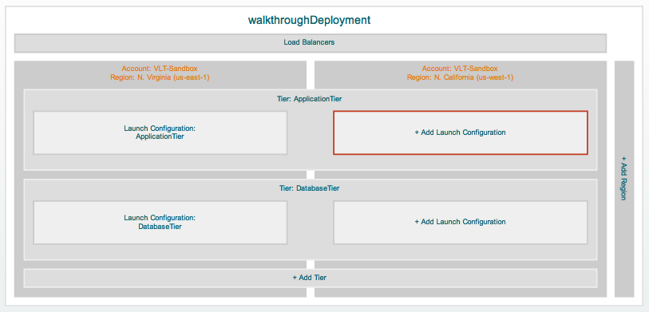

.. enStratus documentation master file, created by
   sphinx-quickstart on Mon Mar 12 21:46:44 2012.
   You can adapt this file completely to your liking, but it should at least
   contain the root `toctree` directive.

..
    enStratus Automation
    ====================

enStratus の自動化機能
======================

..
    Welcome to the enStratus Automation portal. Use the menu on the left to learn more about
    cloud automation using enStratus.

enStratus の自動化ポータルへようこうそ。メニューから選択して enStratus を使ったクラウドの自動化について学びます。

.. toctree::
   :maxdepth: 2
   :hidden:
   :glob:
    
   introduction/introduction
   overview/overview
   services/services
   configuration_management/configuration_management
   deployment_configuration/deployment_configuration
   deployment_operation/deployment_operation
