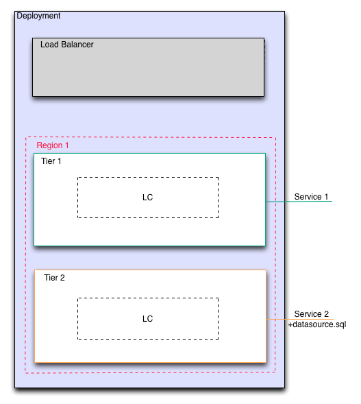

Add Data Source (optional)
--------------------------

In some cases, it may be appropriate to connect a datasource to a service. In our example
deployment, the lower tier is a database tier and the service connected to it is a
database dump file for MySQL.

By connecting a datasource to a service, enStratus knows to first configure the service,
then pass in the datasource to the service. Proper ordering of operations like that is
called *orchestration*.

   Data Source Added to Service
