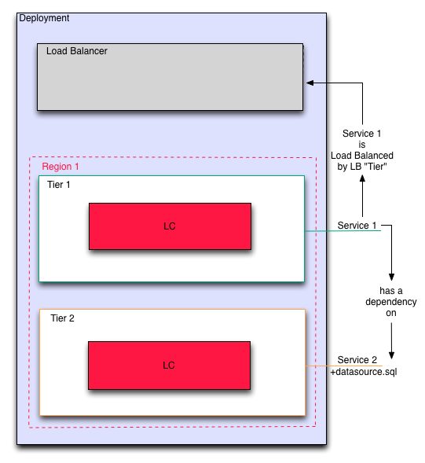

Establish Dependencies
----------------------

A dependency is a logical connection between services that tells enStratus about the
relationship two services have. Here, we've established a dependency relationship between
the top (application) tier and the database service's datasource. 

A special type of dependency is established for the application service to the load
balancer as well.

   Establish Dependencies

Establishing dependencies tells enStratus how to orchestrate the deployment of the
services. Given the dependency relationships described here, the following events will
happen:

#. Service installed on the Database Tier
#. Datasource installed on the Database Service
#. Service installed on the Application Tier.
#. enStratus passes information to the database server so it can grant access to the application servers.
#. enStratus passes information to every server in the application tier about how to find the datasource.
#. enStratus passes information to the load balancer about each application node.

At this point, the deployment is nearly configured. We have yet to tell enStratus about
the servers that will house the services.
