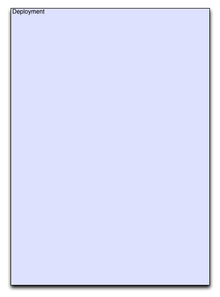

The Deployment
--------------

   enStratus Deployment

An enStratus deployment is a container enStratus uses to manage all of moving parts of an
aribtrarily complex application. The resources running in the deployment are subject to
the constraints the deployment architect places on it, such as when to scale, when backups
are run, and what relationships exist between deployment components.

The deployment itself needs only a name, this initializes the deployment environment for
the rest of the build. The first component added to this deployment is called a tier.

A place holder for adding a load balancer is automatically generated.
