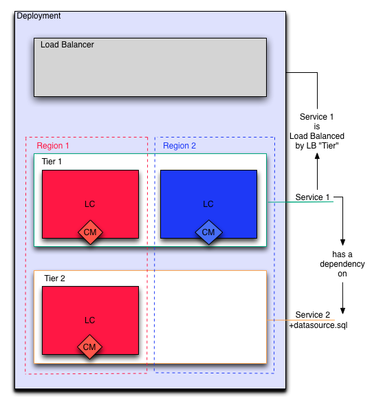

End State
---------
A properly configured enStratus deployment is shown below. Each of the functional
components will be introduced in turn.

   enStratus Deployment

The fully operational enStratus deployment is a mechanism for deploying, orchestrating,
and automating an n-tier application. The above figure shows a 3-tier deployment, running
in two separate clouds with load balancing and a web application that depends on a
database. Let's build the deployment from the ground up.
