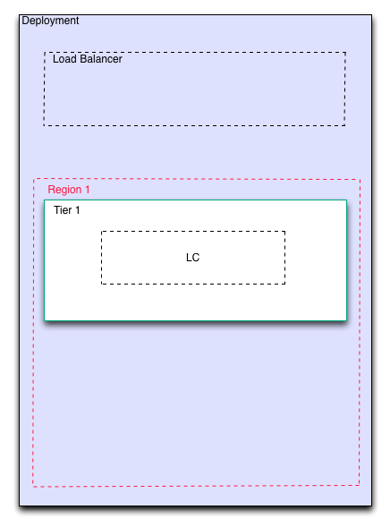

Add First Tier
--------------

An enStratus tier is a component that can have services (software) tied to it. The tier
layer is where attributes such as minimum/maximum servers and scaling rules are set.

In assembling the deployment, the first thing to do after creating the new deployment is
to add tiers. 

   Tier Added

Adding the first tier prompts enStratus to create a placeholder for a launch
configuration. 
