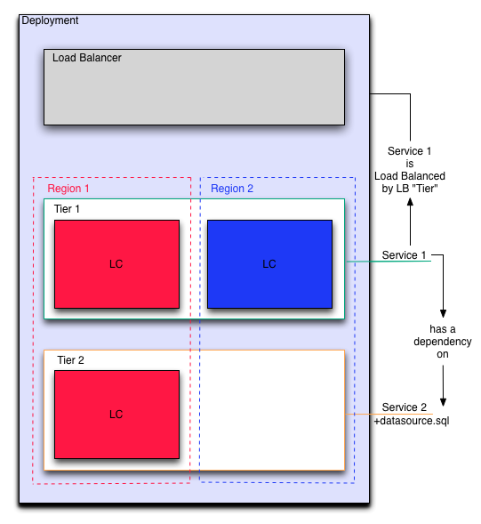

Adding a Second Region
----------------------

enStratus will prompt the user to add a launch configuration for the newly added region.

No other conifguration changes need to be made since enStratus decouples the service
concept from the launch configuration. 

   Add New Region
