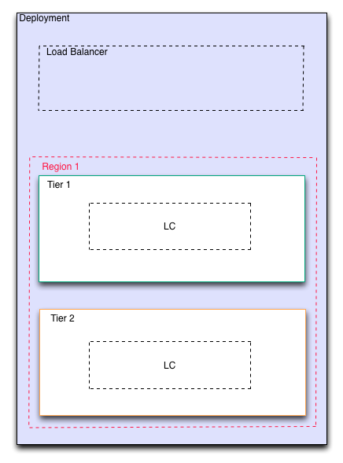

Add Second Tier
---------------

Next we add another tier to bring a more classic 3-tier architecture more clearly into
view. A launch configuration will be automatically generated as a placeholder for the
second tier.

Once the tiers are in place, it's time to start adding services to them.

   Second Tier Added
