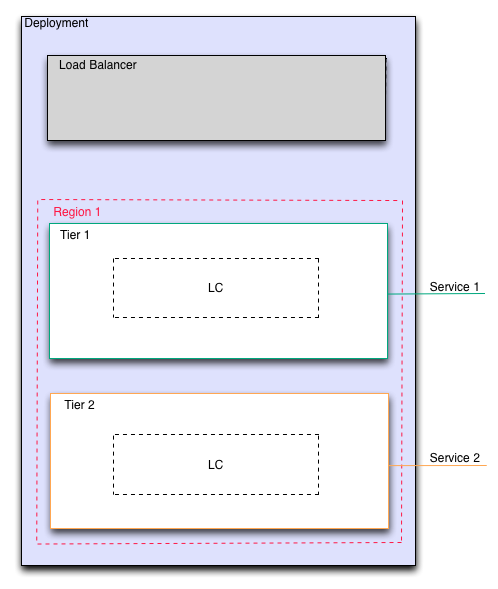

Add Services
------------

Services are connected to a deployment at the tier level. Put simply, a service is a
file that is downloaded from cloudfiles storage to every server running in the tier.

Examples of services include MySQL, Postgres, Wordpress, Drupal, Tomcat, etc.

   Services Added to Tiers
