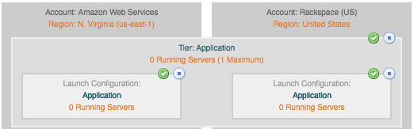

..
    Overview
    --------

概要
----

..
    What's in, and what is, a service?
    ~~~~~~~~~~~~~~~~~~~~~~~~~~~~~~~~~~

サービスとは何か、そこに何があるのか？
~~~~~~~~~~~~~~~~~~~~~~~~~~~~~~~~~~~~~~

..
    A service is a file stored in cloud file storage. Services can be tied to tiers and
    connected to each other by a special relationship called a dependency.

サービスは、クラウドファイルストレージに保存されたファイルです。サービスは、階層に置かれていて、依存関係と呼ばれる特別な関係でお互いに関連付けられています。

..
    Using enStratus automation, services are downloaded to servers when servers reach a
    running state. The enStratus agent downloads, extracts, and executes a service
    configuration routine written by the application designer.

enStratus の自動化を使うことで、サーバーが実行状態になったときに、サービスがサーバーへダウンロードされます。enStratus エージェントは、アプリケーションデザイナーで記述したサービスの構成ルーチンをダウンロードした後でそれらを展開して実行します。

..
    Readers familiar with configuration management services such as Chef should approach
    services in a similar way to a recipe. Services are deployed onto virtual machines that
    are configured accoring to their launch configuration.

Chef のような構成管理サービスに慣れた方は、レシピとよく似た方法でサービスを扱います。サービスは、起動構成により設定された仮想マシン上にデプロイされます。

..
    Services: Logically
    ~~~~~~~~~~~~~~~~~~~

サービス: 論理的
~~~~~~~~~~~~~~~~

..
    enStratus makes a logical connection between tiers and services. Services are tied to
    tiers because tiers are able to span across cloud regions, for example a tier that spans
    AWS region US-East and AWS region US-West.

enStratus は、階層とサービス間で論理的なコネクションを作成します。階層はクラウドリージョン間にまたがることができるので、サービスは階層に置かれています。例えば、米国東部地域の AWS リージョンと米国西部地域の AWS リージョンにまたがるといった階層です。

..
    Beyond spanning tiers across regions within a single cloud, tiers are capable of spanning
    across several clouds as shown in the diagram below.

単一クラウド内のリージョンをまたがるだけでなく、階層は複数のクラウドをまたげます。次の図をご覧ください。

..
   Tier Spanning Clouds

   クラウドをまたぐ階層

..
    This implementation depicts a tier spanning between two public clouds, in this case Amazon
    AWS and Rackspace. It is equally possible to span a tier into a private cloud as well.

この内容は1つの階層が、2つのパブリッククラウド間にまたがっていることを表しています。この例では、Amazon AWS と Rackspace です。これはプライベートクラウドにおいても同様にまたがって設定できます。

..
    Services: Physically
    ~~~~~~~~~~~~~~~~~~~~

サービス: 物理的
~~~~~~~~~~~~~~~~

..
    Physically, services are stored in cloud storage and downloaded as part of the start of a
    deployment. Once downloaded, services are installed onto servers that are running within
    a tier.

物理的に、サービスはクラウドストレージに保存されて、デプロイメント開始時にダウンロードされます。ダウンロードされると、サービスは階層内で実行中のサーバーにインストールされます。
