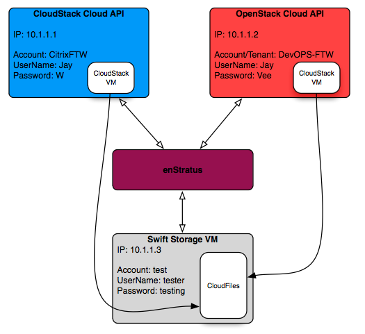

..
    Compute - Storage Hybrid
    ------------------------

コンピューティング - ストレージハイブリッド
-------------------------------------------

..
    Scenario
    ~~~~~~~~

シナリオ
~~~~~~~~

..
    The goal of this project is to bring cloud files (object storage) support to two cloud
    installations that do not have them. Virtual machines running in each cloud should also be
    able to download service images from the swift storage endpoint.

このプロジェクトの目的は、クラウドファイル (オブジェクトストレージ) をもっていない2つのクラウドにクラウドストレージ対応を行うことです。それぞれのクラウドで実行中の仮想マシンは、スウィフト (swift) ストレージのエンドポイントからサーバーイメージもダウンロードできるはずです。

..
   Hybrid Storage Using enStratus

   enStratus を使ったハイブリッドストレージ

..
    Assumptions
    ~~~~~~~~~~~

前提条件
~~~~~~~~

..
    For this example, we will assume 3 clouds, one OpenStack (sans swift), one CloudStack, and
    one standalone swift server installed like this:

この例では、OpenStack (sans swift)、CloudStack、次のようにインストールしたスタンドアロンな Swift サーバーという3つのクラウドです。

`Swift-all-in-one <http://swift.openstack.org/development_saio.html>`_

..
    We assume that both the CloudStack and OpenStack clouds are operational, and join the
    project at the point where the storage VM running the swift software has been added.

CloudStack と OpenStack の両方のクラウドが稼働していることを前提としています。Swift ソフトウェアを追加したストレージ VM を実行しているところに、このプロジェクトを追加します。

..
    CloudStack Cloud
    ^^^^^^^^^^^^^^^^

CloudStack クラウド
^^^^^^^^^^^^^^^^^^^

..
    CloudStack cloud installations have no inherent cloud (object/file) storage capabilities,
    so it's often useful to drop in as a module a third-party modular storage component such
    as OpenStack Swift or Eucalyptus Walrus.

CloudStack クラウドは、クラウド (オブジェクト/ファイル) ストレージの機能を受け継いでいません。そのため、OpenStack Swift や Eucalyptus Walrus といったサードパーティのモジュールストレージを組み込むのに便利です。

..
    OpenStack Cloud
    ^^^^^^^^^^^^^^^^

OpenStack クラウド
^^^^^^^^^^^^^^^^^^

..
    OpenStack clouds are modular enough that they can be deployed in several configurations,
    including a configuration where there is no advertised cloud storage component.

OpenStack クラウドは、商用ではないクラウドストレージコンポーネントの構成を含め、複数の構成でデプロイできる十分なモジュールです。

Swift
^^^^^

..
    Swift is the OpenStack object storage component.

Swift は、OpenStack のオブジェクトのストレージコンポーネントです。

..
    For more information about swift: `Swift <http://swift.openstack.org/>`_

Swift の詳細な情報はこちらをご覧ください: `Swift <http://swift.openstack.org/>`_

..
    Step 1
    ~~~~~~

手順 1
~~~~~~

..
    Create a cloud entry in the provisioning.cloud table for the swift endpoint. A
    properly configured swift endpoint looks like this:

Swift エンドポイントのクラウドエントリーを provisioning.cloud テーブルに作成してください。Swift エンドポイントの設定を行ったプロパティは次のようになります:

..
    +--------------------------+----------------------------------------+
    | Field                    | Swift Value                            |
    +--------------------------+----------------------------------------+

.. tabularcolumns:: |l|l|

+--------------------------+----------------------------------------+
| 項目                     | Swift の値                             |
+==========================+========================================+
| cloud_id                 | 1001                                   |
+--------------------------+----------------------------------------+
| available                | Y                                      |
+--------------------------+----------------------------------------+
| name                     | Swift Cloud                            |
+--------------------------+----------------------------------------+
| delegate                 | org.dasein.cloud.openstack.swift.Swift |
+--------------------------+----------------------------------------+
| supports_addresses       | N                                      |
+--------------------------+----------------------------------------+
| owner                    | NULL                                   |
+--------------------------+----------------------------------------+
| endpoint                 | http://10.1.1.3:8080/auth/v1.0         |
+--------------------------+----------------------------------------+
| provider_name            | Swift                                  |
+--------------------------+----------------------------------------+
| account_label            | ACCOUNT_ID                             |
+--------------------------+----------------------------------------+
| api_id_label             | USER_NAME                              |
+--------------------------+----------------------------------------+
| api_secret_label         | PASSWORD                               |
+--------------------------+----------------------------------------+
| x509_cert_label          | NULL                                   |
+--------------------------+----------------------------------------+
| x509_key_label           | NULL                                   |
+--------------------------+----------------------------------------+
| storage_delegate         | NULL                                   |
+--------------------------+----------------------------------------+
| storage_endpoint         | NULL                                   |
+--------------------------+----------------------------------------+
| storage_account_label    | NULL                                   |
+--------------------------+----------------------------------------+
| storage_api_id_label     | NULL                                   |
+--------------------------+----------------------------------------+
| storage_api_secret_label | NULL                                   |
+--------------------------+----------------------------------------+
| storage_x509_cert_label  | NULL                                   |
+--------------------------+----------------------------------------+
| storage_x509_key_label   | NULL                                   |
+--------------------------+----------------------------------------+
| key_info_text            | NULL                                   |
+--------------------------+----------------------------------------+
| provider_logo_url        | /clouds/swift.gif                      |
+--------------------------+----------------------------------------+
| provider_status_url      | NULL                                   |
+--------------------------+----------------------------------------+
| provider_web_url         | http://swift.openstack.org             |
+--------------------------+----------------------------------------+
| cloud_identifier         | 1001                                   |
+--------------------------+----------------------------------------+

..
    Step 2
    ~~~~~~

手順 2
~~~~~~

..
    Restart the dispatcher service so the enStratus installation knows about this new cloud.
    Create a new account and authenticate to it using the swift credentials.

ディスパッチャーサービスを再起動すると、enStratus がこの新しいクラウドを検知します。Swift 認証情報を使って認証を行う新たなアカウントを作成してください。

.. note::
   ..
       The only capability of this cloud will be "blob_store".

   このクラウドの機能は "blob_store" のみです。

..
    Step 3
    ~~~~~~

手順 3
~~~~~~

..
    Edit the cloud table entry for the CloudStack account, editing the "lower half" of the
    credentials so that there is a definition for storage.

CloudStack アカウントのクラウドテーブルエントリーを開き、認証情報のストレージの定義がある "下半分" を編集してください。

..
    **Before**

**編集前**

..
    +--------------------------+------------------------------------------+
    | Field                    | CloudStack Value                         |
    +--------------------------+------------------------------------------+

.. tabularcolumns:: |l|l|

+--------------------------+------------------------------------------+
| 項目                     | CloudStack の値                          |
+==========================+==========================================+
| cloud_id                 | 2002                                     |
+--------------------------+------------------------------------------+
| available                | Y                                        |
+--------------------------+------------------------------------------+
| name                     | CloudStack Cloud                         |
+--------------------------+------------------------------------------+
| delegate                 | org.dasein.cloud.cloudstack.Cloudstack22 |
+--------------------------+------------------------------------------+
| supports_addresses       | Y                                        |
+--------------------------+------------------------------------------+
| owner                    | NULL                                     |
+--------------------------+------------------------------------------+
| endpoint                 | http://10.1.1.1:8080/client/api          |
+--------------------------+------------------------------------------+
| provider_name            | CloudStack                               |
+--------------------------+------------------------------------------+
| account_label            | ACCOUNT_ID                               |
+--------------------------+------------------------------------------+
| api_id_label             | API_KEY                                  |
+--------------------------+------------------------------------------+
| api_secret_label         | SECRET_KEY                               |
+--------------------------+------------------------------------------+
| x509_cert_label          | NULL                                     |
+--------------------------+------------------------------------------+
| x509_key_label           | NULL                                     |
+--------------------------+------------------------------------------+
| storage_delegate         | NULL                                     |
+--------------------------+------------------------------------------+
| storage_endpoint         | NULL                                     |
+--------------------------+------------------------------------------+
| storage_account_label    | NULL                                     |
+--------------------------+------------------------------------------+
| storage_api_id_label     | NULL                                     |
+--------------------------+------------------------------------------+
| storage_api_secret_label | NULL                                     |
+--------------------------+------------------------------------------+
| storage_x509_cert_label  | NULL                                     |
+--------------------------+------------------------------------------+
| storage_x509_key_label   | NULL                                     |
+--------------------------+------------------------------------------+
| key_info_text            | NULL                                     |
+--------------------------+------------------------------------------+
| provider_logo_url        | /clouds/cloudcom.png                     |
+--------------------------+------------------------------------------+
| provider_status_url      | NULL                                     |
+--------------------------+------------------------------------------+
| provider_web_url         | NULL                                     |
+--------------------------+------------------------------------------+
| cloud_identifier         | 2002                                     |
+--------------------------+------------------------------------------+

..
    **After**

**編集後**

..
    +--------------------------+------------------------------------------+
    | Field                    | CloudStack Value                         |
    +--------------------------+------------------------------------------+

.. tabularcolumns:: |l|l|

+--------------------------+------------------------------------------+
| 項目                     | CloudStack の値                          |
+==========================+==========================================+
| cloud_id                 | 2002                                     |
+--------------------------+------------------------------------------+
| available                | Y                                        |
+--------------------------+------------------------------------------+
| name                     | CloudStack Cloud                         |
+--------------------------+------------------------------------------+
| delegate                 | org.dasein.cloud.cloudstack.Cloudstack22 |
+--------------------------+------------------------------------------+
| supports_addresses       | Y                                        |
+--------------------------+------------------------------------------+
| owner                    | NULL                                     |
+--------------------------+------------------------------------------+
| endpoint                 | http://10.1.1.1:8080/client/api          |
+--------------------------+------------------------------------------+
| provider_name            | CloudStack                               |
+--------------------------+------------------------------------------+
| account_label            | ACCOUNT_ID                               |
+--------------------------+------------------------------------------+
| api_id_label             | API_KEY                                  |
+--------------------------+------------------------------------------+
| api_secret_label         | SECRET_KEY                               |
+--------------------------+------------------------------------------+
| x509_cert_label          | NULL                                     |
+--------------------------+------------------------------------------+
| x509_key_label           | NULL                                     |
+--------------------------+------------------------------------------+
| storage_delegate         | org.dasein.cloud.openstack.swift.Swift   |
+--------------------------+------------------------------------------+
| storage_endpoint         | http://10.1.1.3:8080/auth/v1.0           |
+--------------------------+------------------------------------------+
| storage_account_label    | ACCOUNT_ID                               |
+--------------------------+------------------------------------------+
| storage_api_id_label     | USER_NAME                                |
+--------------------------+------------------------------------------+
| storage_api_secret_label | PASSWORD                                 |
+--------------------------+------------------------------------------+
| storage_x509_cert_label  | NULL                                     |
+--------------------------+------------------------------------------+
| storage_x509_key_label   | NULL                                     |
+--------------------------+------------------------------------------+
| key_info_text            | NULL                                     |
+--------------------------+------------------------------------------+
| provider_logo_url        | /clouds/cloudcom.png                     |
+--------------------------+------------------------------------------+
| provider_status_url      | NULL                                     |
+--------------------------+------------------------------------------+
| provider_web_url         | NULL                                     |
+--------------------------+------------------------------------------+
| cloud_identifier         | 2002                                     |
+--------------------------+------------------------------------------+

..
    After making these changes, restart the dispatcer service to pick up the modification.

これらの変更を行った後、更新内容を反映するためにディスパッチャーサービスを再起動してください。

.. warning::
   ..
       If you have not already authenticated against this cloud endpoint, you should create a new account and provide credentials for **both** the cloustack cloud **and** the swift endpoint.

   このクラウドエンドポイントに対して認証設定を行っていない場合、新しいアカウントを作成して、CloudStack クラウド **と** Swift エンドポイントの **両方** の認証情報を提供する必要があります。

..
    If you have previously authenticated with this CloudStack cloud, you have to edit the
    provisioning.cloud_account table for the CloudStack cloud so that it specifies the swift
    cloud_account as its storage account.

これまでに CloudStack クラウドに認証済みの場合、ストレージアカウントに Swift の cloud_account を指定するために、CloudStack クラウドの provisioning.cloud_account テーブルを編集する必要があります。

.. tabularcolumns:: |l|l|c|

+--------------------------+------------------------------------------+------+
| 項目                     | 値                                       | 備考 |
+==========================+==========================================+======+
| cloud_account_id         | 1                                        |      |
+--------------------------+------------------------------------------+------+
| active                   | Y                                        |      |
+--------------------------+------------------------------------------+------+
| cloud                    | 2002                                     |      |
+--------------------------+------------------------------------------+------+
| account_number           | CitrixFTW                                |      |
+--------------------------+------------------------------------------+------+
| api_credentials          | 412                                      |      |
+--------------------------+------------------------------------------+------+
| encryption_credentials   | NULL                                     |      |
+--------------------------+------------------------------------------+------+
| x509_credentials         | NULL                                     |      |
+--------------------------+------------------------------------------+------+
| volume_credentials       | NULL                                     |      |
+--------------------------+------------------------------------------+------+
| web_service_key          | gtfcGJKg5JsoOUikEKwJyCBjLRG0jfchNYKBP4xe |      |
+--------------------------+------------------------------------------+------+
| billing                  | 1                                        |      |
+--------------------------+------------------------------------------+------+
| primary_storage          | NULL                                     |      |
+--------------------------+------------------------------------------+------+
| automated_dns_zone       | NULL                                     |      |
+--------------------------+------------------------------------------+------+
| automated_dns_ttl        | 3600                                     |      |
+--------------------------+------------------------------------------+------+
| storage_account_number   | test                                     |  1   |
+--------------------------+------------------------------------------+------+
| storage_api_credentials  | 456                                      |  2   |
+--------------------------+------------------------------------------+------+
| storage_x509_credentials | NULL                                     |      |
+--------------------------+------------------------------------------+------+

..
    Note 1: This value is the swift cloud account value, in this case "test".

備考1: これは Swift クラウドアカウントの設定値です。この例では "test" です。

..
    Note 2: This value comes from the **api_credentials** value from the
    provisioning.cloud_account table entry for the **swift** cloud account.

備考2: この値は **Swift** クラウドアカウントの provisioning.cloud_account テーブルエントリーの **api_credentials** の値です。

..
    Testing
    ~~~~~~~

テスト
~~~~~~

..
    Once these steps are completed, the enStratus console should be populated with a
    heretofore absent option in the primary navigation menu called "Platform". Under this menu
    will be one option: files.

これらの手順が完了すると、enStratus コンソールは、"プラットフォーム" というメインナビゲーションのメニューに "absent" オプションを追加します。このメニューには、"files" というオプションが1つあります。

..
    Navigate to Platform > Files in the enStratus console and attempt to provision a storage
    resource (swift calls them containers, walrus calls the buckets). If the bucket is created
    successfully, you have been successful.

enStratus コンソールの "Platform > Files" に移動すると、ストレージリソース (Swift はコンテナーと呼ぶ、Walrus はバケットと呼ぶ) をプロビジョニングしてみてください。このバケットが正常に作成されていれば成功です。

..
    Repeat this process for the OpenStack cloud endpoint.

OpenStack クラウドのエンドポイントにもこれと同じ手順を行ってください。

