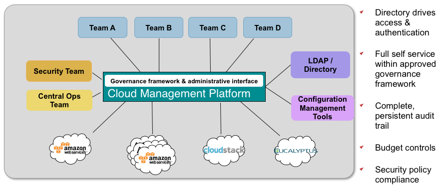

.. enStratus documentation master file, created by
   sphinx-quickstart on Mon Mar 12 21:46:44 2012.
   You can adapt this file completely to your liking, but it should at least
   contain the root `toctree` directive.

enStratus on-Premise
====================

Welcome to the enStratus on-premise documentation portal. Use the menu at left to learn
more about managing an enStratus on-premise installation.

.. toctree::
   :maxdepth: 2
   :hidden:
   :glob:

   introduction/introduction
   installation/installation
   services/services
   troubleshooting/troubleshooting
   advanced/advanced
