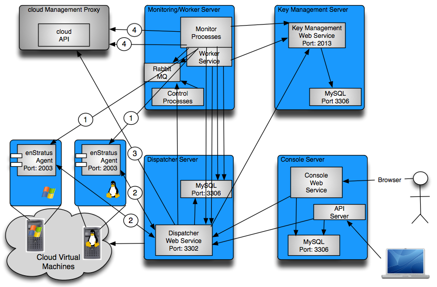

Architecture Requirements
-------------------------

   4-server Architecture

#. Communications from the Monitor/Workers processes to the guest VM agent on port 2003
   for the purpose of collecting logs.
#. Bi-directional communications between the dispatcher service and the guest VM agent.

   * Initiated by the guest VM enStratus agent during handshake to the dispatcher service
     on port 3302

   * Initiated by the enStratus dispatcher service to the guest VM enStratus agent on port
     2003

#. Communications from the enStratus dispatcher service to the cloud provider API
   endpoint.
#. Communications from the enStratus monitor and worker services to the cloud provider API
   endpoint.

To install enStratus on 4-5 machines
~~~~~~~~~~~~~~~~~~~~~~~~~~~~~~~~~~~~

.. tabularcolumns:: |l|l|l|l|l|

+----------------+---------------+-------------+--------------+----------------------------------+
| Component      | Compute Cores | Memory (Gb) | Storage (Gb) | Software                         |
+================+===============+=============+==============+==================================+
| Key Management | 1             | 1           | 10           | Sun Java JDKv6, MySQL            |
+----------------+---------------+-------------+--------------+----------------------------------+
| Dispatcher     | 2-4           | 4-6         | 20           | Sun Java JDKv6, MySQL, Rabbit MQ |
+----------------+---------------+-------------+--------------+----------------------------------+
| Monitor/Worker | 2-4           | 6-8         | 20           | Sun Java JDKv6, MySQL, JSVC      |
+----------------+---------------+-------------+--------------+----------------------------------+
| Console        | 1-2           | 2-4         | 20           | Sun Java JDKv6                   |
+----------------+---------------+-------------+--------------+----------------------------------+

To install enStratus on 2 machines
~~~~~~~~~~~~~~~~~~~~~~~~~~~~~~~~~~

.. tabularcolumns:: |l|l|l|l|l|

+----------------+---------------+-------------+--------------+----------------------------------------+
| Component      | Compute Cores | Memory (Gb) | Storage (Gb) | Software                               |
+================+===============+=============+==============+========================================+
| Backend        | 4-6           | 6-12        | 30           | Sun Java JDKv6, MySQL, Rabbit MQ, JSVC |
+----------------+---------------+-------------+--------------+----------------------------------------+
| Console        | 4-6           | 6-12        | 30           | Sun Java JDKv6, MySQL                  |
+----------------+---------------+-------------+--------------+----------------------------------------+

.. Note:: In the case of the 2-server model, the KM, Dispatcher, Monitor, and Worker services will be installed on one machine. 

To install enStratus on a single machine
~~~~~~~~~~~~~~~~~~~~~~~~~~~~~~~~~~~~~~~~

.. tabularcolumns:: |l|l|l|l|l|

+----------------+---------------+-------------+--------------+----------------------------------------+
| Component      | Compute Cores | Memory (Gb) | Storage (Gb) | Software                               |
+================+===============+=============+==============+========================================+
| Everything     | 6-24          | 6-12        | 30           | Sun Java JDKv6, MySQL, Rabbit MQ, JSVC |
+----------------+---------------+-------------+--------------+----------------------------------------+

.. Warning:: Installing with the bare minimum requirements may result in a degradation of performance.

