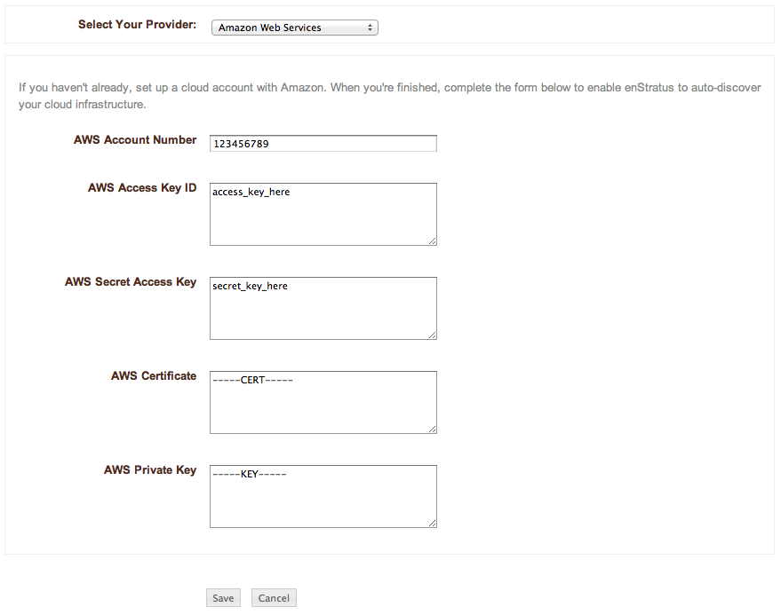

..
    Cloud Credentials
    -----------------

.. _cloud_credentials:

クラウドの認証情報
------------------

..
    Upon login, if there are no cloud accounts tied to the enStratus management software, you
    will be directed to a screen that looks like this, to enter some cloud credentials:

ログイン後、enStratus 管理ソフトウェアにクラウドアカウントが登録されていない場合、次のような画面がクラウドの認証情報を入力するために表示されます:

..
   Cloud Credentials

   クラウドの認証情報
