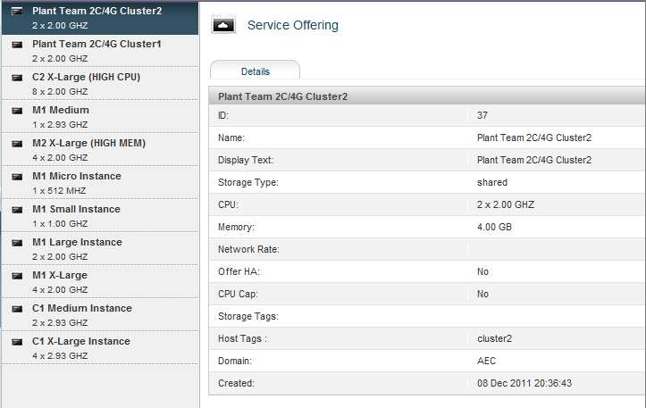
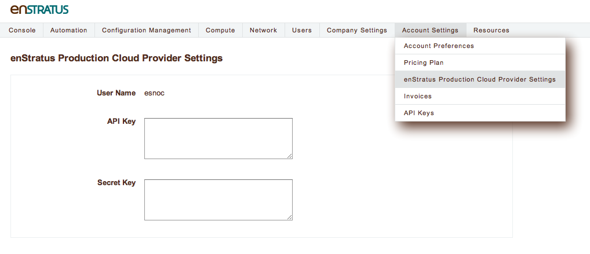

..
    Customizing cloud cost accounting
    ---------------------------------

クラウドの原価計算のカスタマイズ
--------------------------------

..
    Overview
    ~~~~~~~~

概要
~~~~

..
    enStratus allows you to enter customized cost-tracking information for any cloud. To
    accomplish this, you will need the following information:

enStratus では、任意のクラウドのコスト追跡情報をカスタマイズできます。これを行うには、次の情報が必要です:

..
    #. The product offerings list of your cloud. This is the list of products that your cloud provider offers. For example: m1.small in a eucalyptus environment.
    #. If your cloud supports volumes (block storage), you will need to determine a price you wish to charge for them.

#. クラウドのプロダクトオファリングリストです。これは、クラウドプロバイダーが提供するプロダクトリストです。例えば、eucalyptus 環境なら m1.small です。
#. お使いのクラウドがボリューム (ブロックストレージ) に対応しているなら、それに支払う金額を決める必要があります。

..
    Cost Granularity
    ~~~~~~~~~~~~~~~~

コストの単位
~~~~~~~~~~~~

..
    +-----------------+------------------------------+-----------+
    | Resource        | Database Table               | Frequency |
    +=================+==============================+===========+
    | Servers         | provisioning.server_product  | hour      |
    +-----------------+------------------------------+-----------+
    | Volumes         | provisioning.volume_product  | hour      |
    +-----------------+------------------------------+-----------+
    | Storage (files) | provisioning.storage_product | hour      |
    +-----------------+------------------------------+-----------+

.. tabularcolumns:: |l|l|l|

+-----------------------+------------------------------+--------+
| リソース              | データベーステーブル         | 頻度   |
+=======================+==============================+========+
| サーバー              | provisioning.server_product  | 時     |
+-----------------------+------------------------------+--------+
| ボリューム            | provisioning.volume_product  | 時     |
+-----------------------+------------------------------+--------+
| ストレージ (ファイル) | provisioning.storage_product | 時     |
+-----------------------+------------------------------+--------+

..
    For server/instance resources, enStratus tracks costs by matching a product offering
    identifier located in the server_product table to a product offering made by a dynamic
    call to the cloud provider.

サーバー/インスタンスリソースの場合は、enStratus は、クラウドプロバイダーへの動的な呼び出しで作成されたプロダクトオファリングに対して、server_product に置かれたプロダクトオファリング識別子を照合することでコストを追跡します。

..
    As an example, the list of product offerings from a CloudStack cloud may look like this:

例として、CloudStack クラウドのプロダクトオファリングリストは次のようになります:

.. code-block:: mysql

  +----+-------------------+--------------------------+----------+ 
  | id | name              | display_text       | cpu | ram_size | 
  +----+-------------------+--------------------------+----------+ 
  | 22 | M1 Micro Instance | 1x512Mhz 768MB RAM | 1   | 768      | 
  | 23 | M1 Small Instance | 1x1.0GHz, 2GB RAM  | 1   | 2048     | 
  | 24 | M1 Large Instance | 2x2.0GHz, 4GB RAM  | 2   | 4096     | 
  +----+-------------------+--------------------------+----------+ 

..
   CloudStack Service Offerings

   CloudStack サービスオファリング

..
    With this information, we're ready to start crafting entries for tracking server costs.

この情報を使って、サーバーのコストを追跡するためのエントリーを作成する準備が整いました。

..
    Adding Server Product Costs
    ~~~~~~~~~~~~~~~~~~~~~~~~~~~

サーバープロダクトコストの追加
~~~~~~~~~~~~~~~~~~~~~~~~~~~~~~

..
    The general form of a server_product table is shown here:

server_product テーブルの一般的な形式は次の通りです:

..
    The big picture here is that enStratus is looking for a match to the provisioned server in
    the product offerings given to us by the cloud provider.

この大きな画像では、クラウドプロバイダーから提供されたプロダクトオファリングでプロビジョニングされたサーバーを enStratus が探しています。

..
    So, for example, if you start an M1 medium server, enstratus will check to see if there is
    a match to the "product size".

そのため、例えば、M1 の中規模サーバーを起動すると、enStratus は "プロダクトサイズ" に一致するかどうかを確認します。

..
    +---------------------------+------------------------------------------------------------------------------+
    | Field                     | Meaning                                                                      |
    +===========================+==============================================================================+
    | server_product_id         | Unique value                                                                 |
    +---------------------------+------------------------------------------------------------------------------+
    | cloud_id                  | Must match the cloud_id for the cloud in the provisioning.cloud table        |
    +---------------------------+------------------------------------------------------------------------------+
    | product_size              | Must match the id field for the service offering                             |
    +---------------------------+------------------------------------------------------------------------------+
    | active                    | Set to 'Y' if the product is active                                          |
    +---------------------------+------------------------------------------------------------------------------+
    | architecture              | I32 or I64                                                                   |
    +---------------------------+------------------------------------------------------------------------------+
    | core_count                | Number of cores assigned to the product                                      |
    +---------------------------+------------------------------------------------------------------------------+
    | cpu_power                 | Integer value such as 1000 for a 1GHz resource                               |
    +---------------------------+------------------------------------------------------------------------------+
    | description               | Some appropriate description                                                 |
    +---------------------------+------------------------------------------------------------------------------+
    | disk_in_gb                | Size of disk offering (Gb)                                                   |
    +---------------------------+------------------------------------------------------------------------------+
    | memory_in_gb              | Memory allocation (Gb)                                                       |
    +---------------------------+------------------------------------------------------------------------------+
    | name                      | Name of the offering                                                         |
    +---------------------------+------------------------------------------------------------------------------+
    | platform                  | Can be WINDOWS, UNIX, etc.                                                   |
    +---------------------------+------------------------------------------------------------------------------+
    | prepayment_term_in_months | Set to 0, by default                                                         |
    +---------------------------+------------------------------------------------------------------------------+
    | provider_region_id        | Must match the region of the cloud in the provisioning.provider_region table |
    +---------------------------+------------------------------------------------------------------------------+
    | software                  | Must be set to '', not NULL, for now.                                        |
    +---------------------------+------------------------------------------------------------------------------+
    | standard_pricing_currency | Example: USD, GBP                                                            |
    +---------------------------+------------------------------------------------------------------------------+
    | standard_pricing_hourly   | Value for tracking cost. Example 0.10.                                       |
    +---------------------------+------------------------------------------------------------------------------+
    | standard_pricing_prepaid  | Set to 0, by default                                                         |
    +---------------------------+------------------------------------------------------------------------------+

.. tabularcolumns:: |l|l|

+---------------------------+-----------------------------------------------------------------------------------+
| 項目                      | 内容                                                                              |
+===========================+===================================================================================+
| server_product_id         | 一意な値                                                                          |
+---------------------------+-----------------------------------------------------------------------------------+
| cloud_id                  | provisioning.cloud テーブルのクラウドの cloud_id と一致しないといけない           |
+---------------------------+-----------------------------------------------------------------------------------+
| product_size              | サービスオファリングの id と一致しないといけない                                  |
+---------------------------+-----------------------------------------------------------------------------------+
| active                    | プロダクトがアクティブの場合 'Y' を設定する                                       |
+---------------------------+-----------------------------------------------------------------------------------+
| architecture              | I32 または I64                                                                    |
+---------------------------+-----------------------------------------------------------------------------------+
| core_count                | プロダクトに割り当てられているコアの数                                            |
+---------------------------+-----------------------------------------------------------------------------------+
| cpu_power                 | 整数値、1GHz のリソースの場合は 1000                                              |
+---------------------------+-----------------------------------------------------------------------------------+
| description               | 適切な説明                                                                        |
+---------------------------+-----------------------------------------------------------------------------------+
| disk_in_gb                | ディスクオファリングのサイズ (Gb)                                                 |
+---------------------------+-----------------------------------------------------------------------------------+
| memory_in_gb              | メモリ割り当て (Gb)                                                               |
+---------------------------+-----------------------------------------------------------------------------------+
| name                      | オファリングの名前                                                                |
+---------------------------+-----------------------------------------------------------------------------------+
| platform                  | WINDOWS や UNIX 等                                                                |
+---------------------------+-----------------------------------------------------------------------------------+
| prepayment_term_in_months | デフォルトでは 0 に設定                                                           |
+---------------------------+-----------------------------------------------------------------------------------+
| provider_region_id        | provisioning.provider_region テーブルのクラウドのリージョンと一致しないといけない |
+---------------------------+-----------------------------------------------------------------------------------+
| software                  | 現時点では NULL ではなく '' (空文字) に設定                                       |
+---------------------------+-----------------------------------------------------------------------------------+
| standard_pricing_currency | 例: USD, GBP                                                                      |
+---------------------------+-----------------------------------------------------------------------------------+
| standard_pricing_hourly   | コストを追跡するための値、例: 0.10                                                |
+---------------------------+-----------------------------------------------------------------------------------+
| standard_pricing_prepaid  | デフォルトでは 0 に設定                                                           |
+---------------------------+-----------------------------------------------------------------------------------+

..
    We can now begin to create entries in the server_product table. Using the first value shown in the CloudStack offerings above:

これで server_product テーブルにエントリー作成を開始できます。上述した CloudStack オファリングの初期値を使います:

..
    +---------------------------+---------------------------------------+------+
    | Field                     | Value                                 | Note |
    +===========================+=======================================+======+
    | cloud_id                  | 10001 (from the cloud table)          | 1    |
    +---------------------------+---------------------------------------+------+
    | product_size              | 22 (from the CloudStack value above)  | 3    |
    +---------------------------+---------------------------------------+------+
    | architecture              | I64 (admin must know this value)      |      |
    +---------------------------+---------------------------------------+------+
    | provider_region_id        | 1 (from provisioning.provider_region) | 2    |
    +---------------------------+---------------------------------------+------+
    | software                  | '' (set to a blank string, not null)  |      |
    +---------------------------+---------------------------------------+------+
    | standard_pricing_hourly   | 0.14 (For 14 cents/hour)              |      |
    +---------------------------+---------------------------------------+------+

.. tabularcolumns:: |l|l|c|

+---------------------------+-----------------------------------------+------+
| 項目                      | 値                                      | 備考 |
+===========================+=========================================+======+
| server_product_id         | 1                                       |      |
+---------------------------+-----------------------------------------+------+
| cloud_id                  | 10001 (クラウドテーブルを参照)          | 1    |
+---------------------------+-----------------------------------------+------+
| product_size              | 22 (CloudStack の値を参照)              | 3    |
+---------------------------+-----------------------------------------+------+
| active                    | Y                                       |      |
+---------------------------+-----------------------------------------+------+
| architecture              | I64 (管理者は必ず知っている)            |      |
+---------------------------+-----------------------------------------+------+
| core_count                | 1                                       |      |
+---------------------------+-----------------------------------------+------+
| cpu_power                 | 512                                     |      |
+---------------------------+-----------------------------------------+------+
| description               | 1x512Mhz 768MB RAM                      |      |
+---------------------------+-----------------------------------------+------+
| disk_in_gb                | 20                                      |      |
+---------------------------+-----------------------------------------+------+
| memory_in_gb              | 0.75                                    |      |
+---------------------------+-----------------------------------------+------+
| name                      | M1 Micro Instance                       |      |
+---------------------------+-----------------------------------------+------+
| platform                  | UNKNOWN                                 |      |
+---------------------------+-----------------------------------------+------+
| prepayment_term_in_months | 0                                       |      |
+---------------------------+-----------------------------------------+------+
| provider_region_id        | 1 (provisioning.provider_region を参照) | 2    |
+---------------------------+-----------------------------------------+------+
| software                  | '' (NULL ではなく空文字を設定)          |      |
+---------------------------+-----------------------------------------+------+
| standard_pricing_currency | USD                                     |      |
+---------------------------+-----------------------------------------+------+
| standard_pricing_hourly   | 0.14 (14 セント/時)                     |      |
+---------------------------+-----------------------------------------+------+
| standard_pricing_prepaid  | 0                                       |      |
+---------------------------+-----------------------------------------+------+

..
    And, as an insert statement:

この insert 文です:

.. code-block:: mysql

  INSERT INTO server_product VALUES (1,10001,'22','Y','I64',1,512,'1 x 512Mhz, 768MB RAM',2,4,'M1 Micro Instance','UNKNOWN',0,'1','','USD',0.14,0);

..
    Repeat this process for every cloud product offering.

この作業を全てのクラウドのプロダクトオファリングに繰り返します。

..
    **Notes**

**備考**

..
    1. To get your cloud_id, first, navigate inside the console to Account Settings > $YOUR_CLOUD Provider Settings. $YOUR_CLOUD is your cloud name, we're going to use that to find the cloud_id. In the figure below, the cloud name is enStratus Production Cloud.

1. cloud_id を取得するには、まずコンソールの "Account Settings > $YOUR_CLOUD Provider Settings" のページに移動します。$YOUR_CLOUD は、利用しているクラウドの名前です。cloud_id を調べるためにこれを使います。次の図では、クラウド名は "enStratus Production Cloud" です。

..
   Finding the Cloud Name

   クラウドの名前を調べる

..
    With this information, you can issue the following query against the provisioning.cloud table:

クラウド名を使って、provisioning.cloud テーブルに対して次のクエリを実行できます。

.. code-block:: mysql
  
  select cloud_id from cloud where name like 'enStratus Production Cloud%';

  +----------+
  | cloud_id |
  +----------+
  | 20013    |
  +----------+

..
    There should only ever be one line of output from this query. If you get more than one result, narrow your query.

このクエリの出力は1行だけのはずです。もし1行以上の結果が表示されたら、クエリ条件を追加して絞り込みます。

..
    2. To find the provider_region_id, issue the query:

2. provider_region_id を調べるには、次のクエリを実行します:

.. code-block:: mysql

  select provider_region_id from provider_region where cloud_id=20013;

 +--------------------+
 | provider_region_id |
 +--------------------+
 | 1                  |
 +--------------------+

..
    3. Finding the product offerings for your cloud provider. The most reliable method for obtaining information is to ask your cloud administrator.

3. クラウドプロバイダーのプロダクトオファリングを調べます。この情報を取得するのに最も信頼性の高い方法は、クラウドの管理者に尋ねることです。

..
    And, as an insert statement:

そして、次の insert 文を実行します:

.. code-block:: mysql 

  INSERT INTO server_product VALUES (1,10001,'22','Y','I64',1,512,'1 x 512Mhz, 768MB RAM',2,4,'M1 Micro Instance','UNKNOWN',0,'1','','USD',0.14,0);

..
    Repeat this process for every cloud product offering.

この作業を全てのクラウドのプロダクトオファリングに繰り返します。

..
    Adding Volume Product Costs
    ~~~~~~~~~~~~~~~~~~~~~~~~~~~

ボリュームプロダクトコストの追加
~~~~~~~~~~~~~~~~~~~~~~~~~~~~~~~~

..
    The process for adding volume costs is less involved. enStratus tracks volume costs via the volume_product table in the provisioning database.

ボリュームを追加する作業は、コストと少し関係があります。enStratus は、プロビジョニングされたデータベースの volume_product テーブルを経由して、ボリュームコストを追跡します。

..
    +--------------------+---------------------------------------------------+
    | Field              | Meaning                                           |
    +====================+===================================================+
    | volume_product_id  | Unique identifier                                 |
    +--------------------+---------------------------------------------------+
    | cloud_id           | Cloud ID from provisioning.cloud table            |
    +--------------------+---------------------------------------------------+
    | provider_region_id | Region ID from provisioning.provider_region table |
    +--------------------+---------------------------------------------------+
    | product_size       | Set to standard                                   |
    +--------------------+---------------------------------------------------+
    | active             | Set to 'Y'                                        |
    +--------------------+---------------------------------------------------+
    | currency           | Currency type. Example: USD                       |
    +--------------------+---------------------------------------------------+
    | name               | Example: 'Block storage for my cloud.'            |
    +--------------------+---------------------------------------------------+
    | description        | Meaningful description here.                      |
    +--------------------+---------------------------------------------------+
    | pricing_threshold  | Set to 0                                          |
    +--------------------+---------------------------------------------------+
    | volume_pricing     | Price, per hour, for the storage. Example: 0.10   |
    +--------------------+---------------------------------------------------+

.. tabularcolumns:: |l|l|

+--------------------+---------------------------------------------------+
| 項目               | 内容                                              |
+====================+===================================================+
| volume_product_id  | 一意な識別子                                      |
+--------------------+---------------------------------------------------+
| cloud_id           | provisioning.cloud テーブルの Cloud ID            |
+--------------------+---------------------------------------------------+
| provider_region_id | provisioning.provider_region テーブルの Region ID |
+--------------------+---------------------------------------------------+
| product_size       | standard を設定                                   |
+--------------------+---------------------------------------------------+
| active             | 'Y' を設定                                        |
+--------------------+---------------------------------------------------+
| currency           | 通貨の種類。例: USD                               |
+--------------------+---------------------------------------------------+
| name               | 例: 'クラウドブロックストレージ'                  |
+--------------------+---------------------------------------------------+
| description        | わかりやすい説明を記述                            |
+--------------------+---------------------------------------------------+
| pricing_threshold  | 0 を設定                                          |
+--------------------+---------------------------------------------------+
| volume_pricing     | ストレージの1時間あたりの価格、例: 0.10           |
+--------------------+---------------------------------------------------+

..
    As an insert statement (example from Amazon)

insert 文 (Amazon) の例です。

.. code-block:: mysql 

  INSERT INTO volume_product VALUES (1,1,'us-east-1','standard','Y','USD','EBS Storage','Storage costs for an allocated EBS volume.',0,0.1);

..
    Other Currencies
    ~~~~~~~~~~~~~~~~

その他の通貨
~~~~~~~~~~~~

..
    One of the strengths of enStratus customized cost tracking is that it can track costs in
    many currencies. For example, to track the costs of server product against the Indian
    Rupee, use INR as the value for standard pricing currency.

enStratus コスト管理の強みの1つとして、色んな通貨でコストを追跡できます。例えば、インドのルピーでサーバープロダクトのコストを追跡するには、標準の価格通貨の値を INR に設定します。

..
    If you choose to track in a currency other than USD, enStratus will try to reach out to
    the Internet to pull exchange rates. This is not always feasible. To override this, set
    your own exchange rate in the exchange rate table, as shown:

米ドル以外の通貨で追跡したい場合、enStratus は為替レートを取得するためにインターネットへ接続しようとします。これは必ずしも可能というわけではありません。この処理をオーバーライドするには、次のように独自の為替レートをテーブルに設定します:

.. code-block:: mysql 

  mysql> select * from exchange_rate;
  +--------------------+----------+----------+---------+
  | exchange_rate_code | customer | currency | rate    |
  +--------------------+----------+----------+---------+
  | 200:USD            | 200      | USD      | 0.01927 |
  +--------------------+----------+----------+---------+

..
    Where 200 is your enStratus customer ID. If tracking costs in a currency other than USD is
    a priority, please contact an enStratus engineer for assistance finding your customer ID.

200 は enStratus の顧客 ID です。米ドル以外の通貨でコストの追跡が重要な場合、顧客 ID を調べるお手伝いをするので enStratus のエンジニアに連絡を取ってください。

..
    **Checking to see if it worked**

**動作確認**

..
    To see if the products are matching servers, navigate to the Compute > Servers page and
    click on the actions menu for a server. Choose the Product tab. If the costs are tracking
    correctly, you will see output similar to the image below.

プロダクトがサーバーに一致するかどうかを確認するには、"Compute > Servers" ページに移動して、サーバーの "actions" メニューをクリックします。"Product" タブを選択してください。コストを正しく追跡しているなら、次の画像のような出力を確認できます。
