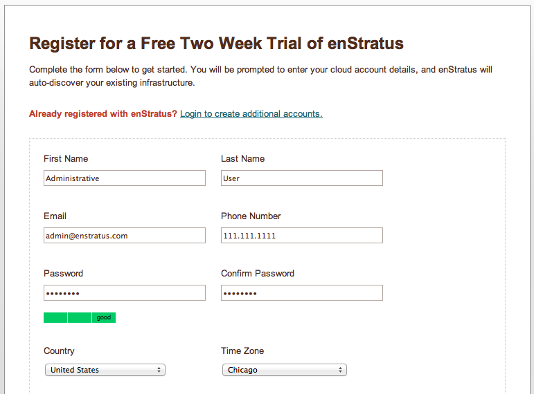
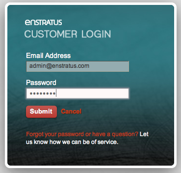

.. _registration:

Registration
------------

After installing the enStratus cloud management software, you will be directed to proceed
to the url you specified as part of the installation process. For example:

.. code-block:: bash

   https://build.enstratus.com/page/1/register.jsp

   Registration

Java Cryptographic Extensions
~~~~~~~~~~~~~~~~~~~~~~~~~~~~~

Tailing the dispatcher log after a new installation is helpful because it can tell you
about common configuration errors. For example, enStratus depends on the Java
Cryptographic Extensions to encrypt inter-process communications. If they are not
installed, and a registration attempt is made, the following error will be visible in the
dispatcher log:

.. code-block:: bash

   INFO: Server startup in 22059 ms
   2012-06-11 16:33:32,957 ERROR [es.inf.100] validateKey(): Failed to decrypt keys for
   enStratus Networks LLC [#100]: Illegal key size or default parameters
   2012-06-11 16:33:32,957 ERROR [es.inf.100] validateKey(): Failed to decrypt keys for
   enStratus Networks LLC [#100]: Illegal key size or default parameters
   java.security.InvalidKeyException: Illegal key size or default parameters
     at javax.crypto.Cipher.a(DashoA13*..)
     at javax.crypto.Cipher.a(DashoA13*..)
     at javax.crypto.Cipher.a(DashoA13*..)
     at javax.crypto.Cipher.init(DashoA13*..)
     at javax.crypto.Cipher.init(DashoA13*..)
     at com.enstratus.util.EncryptionVersion.decryptTwo(EncryptionVersion.java:121)
     at com.enstratus.util.EncryptionVersion.decrypt(EncryptionVersion.java:80)

Install the JCE for your version of Java, restart all affected processes (dispatcher, km,
console, etc.), and try again.

Successful Registration
~~~~~~~~~~~~~~~~~~~~~~~

In the dispatcher log, a successful registration looks like this:

.. code-block:: bash

   INFO: Server startup in 21386 ms
   2012-06-11 16:56:18,836 DEBUG [com.enstratus.provisioning.customer.CustomerFactory] enter
   - com.enstratus.provisioning.customer.CustomerFactory.createEnstratusCustomer
   (org.dasein.persist.Transaction@11,enStratus,XXX,USD,true,America/Chicago)
   2012-06-11 16:56:18,836 DEBUG [com.enstratus.provisioning.customer.CustomerFactory] enter
   - com.enstratus.provisioning.customer.CustomerFactory.createEnstratusCustomer
   (org.dasein.persist.Transaction@11,enStratus,XXX,USD,true,America/Chicago)
   2012-06-11 16:56:18,846 INFO  [com.enstratus.provisioning.customer.CustomerFactory]
   createEnstratusCustomer(): Creating new customer enStratus
   2012-06-11 16:56:18,846 INFO  [com.enstratus.provisioning.customer.CustomerFactory]
   createEnstratusCustomer(): Creating new customer enStratus
   2012-06-11 16:56:18,857 INFO  [com.enstratus.provisioning.customer.CustomerFactory]
   createEnstratusCustomer(): New customer is enStratus [#200]
   2012-06-11 16:56:18,857 INFO  [com.enstratus.provisioning.customer.CustomerFactory]
   createEnstratusCustomer(): New customer is enStratus [#200]
   2012-06-11 16:56:19,961 INFO  [com.enstratus.provisioning.customer.CustomerFactory]
   createEnstratusCustomer(): Default budget for enStratus [#200] is Default [DEF]
   2012-06-11 16:56:19,961 INFO  [com.enstratus.provisioning.customer.CustomerFactory]
   createEnstratusCustomer(): Default budget for enStratus [#200] is Default [DEF]
   2012-06-11 16:56:19,961 DEBUG [com.enstratus.provisioning.customer.CustomerFactory] exit -
   com.enstratus.provisioning.customer.CustomerFactory.createEnstratusCustomer()
   2012-06-11 16:56:19,961 DEBUG [com.enstratus.provisioning.customer.CustomerFactory] exit -
   com.enstratus.provisioning.customer.CustomerFactory.createEnstratusCustomer()
   2012-06-11 16:56:22,517 DEBUG [es.inf.200] enter -
   com.enstratus.provisioning.customer.service.CustomerServiceImpl.createCustomerBilling(enStratus
   [#200],null,enStratus,enStratus Entry Plan,Default [DEF])
   2012-06-11 16:56:22,517 DEBUG [es.inf.200] enter -
   com.enstratus.provisioning.customer.service.CustomerServiceImpl.createCustomerBilling(enStratus
   [#200],null,enStratus,enStratus Entry Plan,Default [DEF])

A successful registration indicates that the core components of the enStratus management
system are operational (KM, Dispatcher, and Console).

After registration, you should be directed to log in for the first time, using the
credentials created during registration.

   Login

If this is the first time logging in or there are no cloud accounts yet associated with
enStratus, you will directed to select a cloud and enter credentials.
