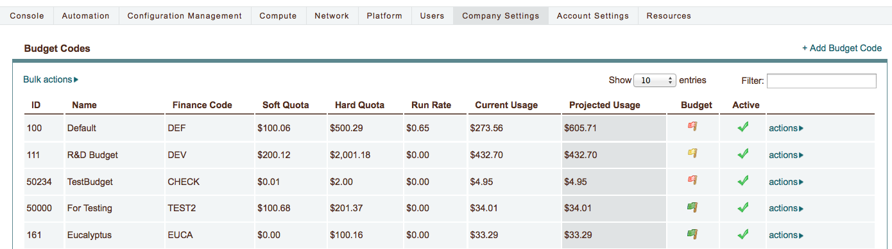
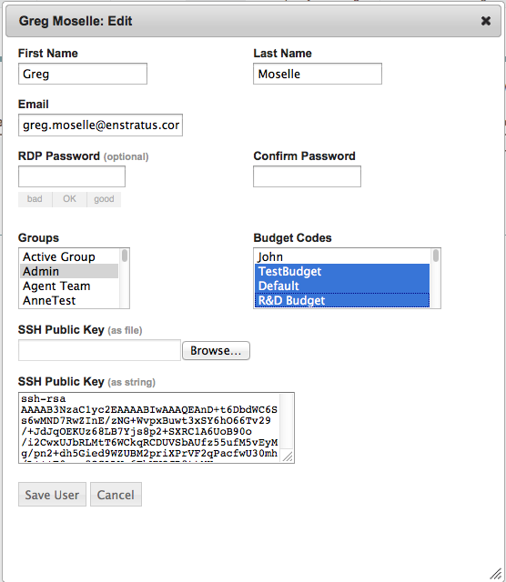
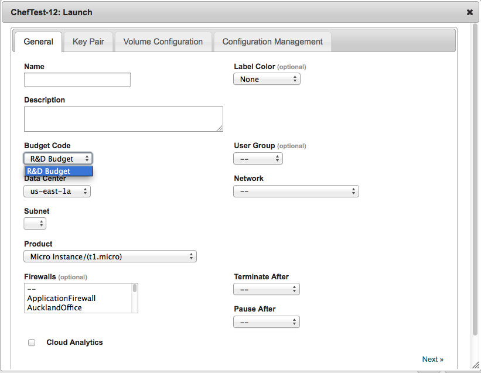
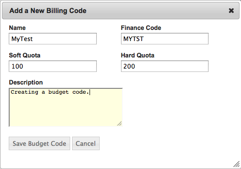
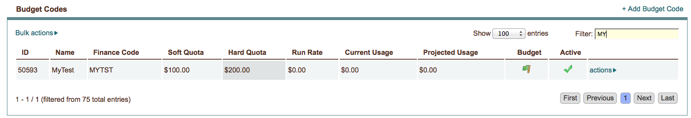
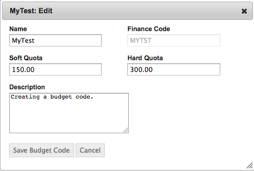
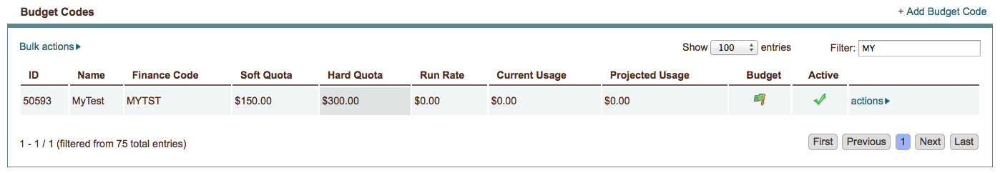
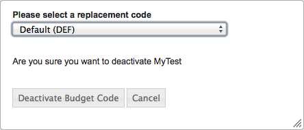

..
    Budget Codes
    ------------

.. _saas_budget_codes:

予算コード
----------

..
    enStratus tracks infrastructure costs based on the costs reported by the cloud provider or
    in the case of an on-premise installation of enStratus, against a customizable set of
    values.

enStratus は、カスタマイズ可能な値に対して、クラウドプロバイダーが報告したコスト、またはオンプレミスの enStratus インストールのインフラストラクチャのコストを追跡します。

..
    enStratus calculates costs based on the hourly run rate for usage. Servers, storage, load
    balancers, databases, and IP Addresses are all examples of items that have an associated
    cost in many of the public clouds. The values for each of these items is used to calculate
    a run rate and project costs.

enStratus は、利用状況の時間単位の実行レートに基づいてコストを計算します。サーバー、ストレージ、ロードバランサー、データベース、IPアドレスが、多くのパブリッククラウドで関連する全コスト項目の例です。これらの各項目の値は、実行レートとプロジェクトコストの計算に使われます。

..
   Budget Codes

   予算コード

..
    In diagram above, there are several billing codes in various quota states. Billing codes
    are color coded for quick reference regarding the state of the billing code.

上の図では、様々なクォーターに複数の課金コードが設定されています。課金コードは、状態に応じてすぐに分かるように色付けできます。

..
    +--------+---------------------------------------------------------------------------------+
    | Color  | Meaning                                                                         |
    +========+=================================================================================+
    | Green  | Run rate has not exceeded and additional infrastructure/capacity may be charged |
    |        | against this code.                                                              |
    +--------+---------------------------------------------------------------------------------+
    | Yellow | Run rate has exceeded the soft quota limit. An email warning will be sent, but  |
    |        | additional infrastructure/capacity may be charged against this code.            |
    +--------+---------------------------------------------------------------------------------+
    | Red    | Run rate exceeded the hard quota. An email message will be sent. No additional  |
    |        | infrastructure/capacity may be charged against this code.                       |
    +--------+---------------------------------------------------------------------------------+

.. tabularcolumns:: |l|l|

+----------+-------------------------------------------------------------------------------------------------+
| カラー   | 内容                                                                                            |
+==========+=================================================================================================+
| 緑色     | 実行レートが制限を超えていない。                                                                | 
|          | インフラストラクチャ/容量がこのコードに対して追加される。                                       |
+----------+-------------------------------------------------------------------------------------------------+
| 黄色     | 実行レートがソフトクォーター制限を超えている。電子メールで警告が送信されるが、                  |
|          | インフラストラクチャ/容量がこのコードに対して追加される。                                       |
+----------+-------------------------------------------------------------------------------------------------+
| 赤色     | 実行レートがハードクォーターを超えている。電子メールが送信される。                              |
|          | インフラストラクチャ/容量は、このコードに対して追加されません。                                 |
+----------+-------------------------------------------------------------------------------------------------+

..
    Definitions
    ~~~~~~~~~~~

定義
~~~~

**RUN RATE**

..
    The run rate is the calculated usage per hour costs for all of the
    infrastructure being tracked against this code.

実行レートは、このコードに対して追跡された全てのインフラストラクチャの時間単位の利用状況を算出します。

**CURRENT USAGE**

..
    The current usage is the total charges tracked against the billing code up
    to the current point in the month. For example, if 10 days of the month have elapsed, the
    current usage value should be approximately one third of the projected usage.

現在使用料は、今月の現時点で課金コードに対して追跡された合計料金です。例えば、今月が10日経過しているなら、現在使用料は予測使用料の約 1/3 になるはずです。

**PROJECTED USAGE**

..
    The projected usage is the projected total usage costs for the month
    based on the current run rate. 

予測使用料は、現時点の実行レートに基づいた今月の予測される合計料金です。

..
    Email Warning Messages
    ~~~~~~~~~~~~~~~~~~~~~~

電子メール警告メッセージ
~~~~~~~~~~~~~~~~~~~~~~~~

..
    An example of the email message that is sent when the soft quota is exceeded is shown
    below:

次にソフトクォーターを超過した場合に送信される電子メールメッセージの例があります:

..
    Soft Quota Exceeded 
    ^^^^^^^^^^^^^^^^^^^^

ソフトクォーターの超過
^^^^^^^^^^^^^^^^^^^^^^

.. code-block:: none

  New Cloud Event: Wed 01 Dec 2010 02:59:41 UTC Cloud: Amazon Web Services 
  Account: Company Subject: NEW EVENT #312218 (Severity 5) - Monthly Soft Run-Rate Exceeded
  for Company Company (YACNGH)

  The current run-rate of usage against the billing code Company Company (YACNGH) exceeds
  the alloted soft run rate for this budget.

  If you need assistance understanding this message or if you believe this message is the
  result of an issue with enStratus, please visit our support site at
  https://support.enstratus.com and login with your standard enStratus login credentials.

  To check on the status of enStratus itself, visit: http://status.enstratus.com

  Subscribe to live status updates via RSS at http://status.enstratus.com/status.xml or via
  Twitter at http://www.twitter.com/enStratusStatus.
  An example of the email message that is sent when the hard quota is exceeded is shown
  below:

..
    Hard Quota Exceeded
    ^^^^^^^^^^^^^^^^^^^

ハードクォーターの超過
^^^^^^^^^^^^^^^^^^^^^^

.. code-block:: none

  New Cloud Event: Wed 01 Dec 2010 02:11:15 UTC Cloud: Amazon Web Services Account: Company
  Acc Subject: NEW EVENT #312214 (Severity 7) - Monthly Hard Run-Rate Exceeded for Website
  (WWW)

  The current run-rate of usage against the billing code Website (WWW) exceeds the alloted
  hard run rate for this budget. As a result, no one will be able to provision resources
  against this budget until the run-rate falls within the hard quota. You may remedy the
  situation either by increasing the hard quota for this budget or reducing the current
  spend against the budget.

  If you need assistance understanding this message or if you believe this message is the
  result of an issue with enStratus, please visit our support site at
  https://support.enstratus.com and login with your standard enStratus login credentials.

  To check on the status of enStratus itself, visit: http://status.enstratus.com

  Subscribe to live status updates via RSS at http://status.enstratus.com/status.xml or via
  Twitter at http://www.twitter.com/enStratusStatus.
  It is important to note that if the hard quota has been breached, enStratus will not take
  any drastic actions such as deleting infrastructure to bring the run rate below the quota.

..
    Users
    ~~~~~

ユーザー
~~~~~~~~

..
    Users may be a part of one or more billing codes as shown in the user profile, located in
    User Manager > Users.

ユーザーは "User Manager > Users" から1つまたは複数の課金コードの一部を、ユーザープロフィールに表示するようにできます。

..
   User Profile

   ユーザープロフィール

..
    In this case, the user is a part of three budget codes: TestBudget, Default, and R&D
    Budget.

この例では、ユーザーは3つの予算コードを選択できます: TestBudget, Default, R&D Budget

..
    Referring back to the overall budget code listing, it becomes apparent that the Default
    and TestBudget budget codes have exceeded the hard quota.

表示されている全ての予算コードをよく見ると、Default と TestBudget 予算コードがハードクォーターを超えているのが分かります。

..
    To see the functionality of budget codes and how they can be used to restrict a users
    ability to provision infrastructure, let's try to start a server from a machine image
    and examine the budget code options presented.

予算コードの機能や、インフラストラクチャのプロビジョニングをユーザーに制限させる方法を確認するために、マシンイメージからサーバーを起動して表示される予算コードのオプションを確認してみましょう。

..
   Launch Machine w/Billing Code

   課金コードを設定したマシンを起動

..
    enStratus hides budget codes that have exceeded their hard quota from use in the
    enStratus console. If a user is only a part of one budget code *and* that code has
    exceeded its hard quota, that user will be unable to provision any resources.

enStratus は、ハードクォーターを超過した予算コードを enStratus コンソールで利用しないように非表示にします。ユーザーが、1つの予算コードのみを持ち *且つ* そのコードがハードクォーターを超過した場合、そのユーザーは如何なるリソースもプロビジョニングできません。

..
    Creating and Editing Budget Codes
    ~~~~~~~~~~~~~~~~~~~~~~~~~~~~~~~~~

予算コードの作成と編集
~~~~~~~~~~~~~~~~~~~~~~

..
    To create a budget code, navigate to Finance > Budget Codes. The list of active budget
    codes will be shown as in Figure 1. To add a new budget code, select + add budget code
    and complete the resulting dialog box.

予算コードを作成するには、"Finance > Budget Codes" に移動します。有効な予算コードのリストが表示されます。新しい予算コードを追加するには、"+ add budget code" を選択して、表示されたダイアログボックスに記入します。

..
   Add New Budget Code

   新規予算コード

..
    Once the dialog box is complete, the new budget code will be added to the list of
    available budget codes.

ダイアログボックスに記入し終えると、新規の予算コードが利用可能な予算コードのリストに追加されます。

..
   Budget Code Added

   予算コードの追加後

.. note::
   ..
       Before the budget code is available to be used, the user must add that code to
       their profile using User Manager.

   予算コードが利用可能になる前に、User Manager を使ってユーザーのプロフィールにそのコードを追加しておく必要があります。

..
    To edit a billing code, click on the actions option and choose edit.

課金コードを編集するには、"actions" オプションをクリックして "edit" を選択します。

..
   Edit Budget Code

   予算コードの編集

..
    Once the changes are made, the list of billing codes will be updated immediately.

変更後、課金コードのリストはすぐに更新されます。

..
   Quota Changed

   クォーターの変更

..
    Deactivating Billing Codes
    ~~~~~~~~~~~~~~~~~~~~~~~~~~

課金コードの無効化
~~~~~~~~~~~~~~~~~~

..
    When a billing code is deactivated, a replacement code must be specified. Any
    infrastructure/services being tracked against the billing code set for deactivation will
    be tracked in the replacement code going forward. Historical data will still be available
    via reports in the old billing code.

課金コードが無効になっている場合は、置換コードを指定する必要があります。無効になった課金コードに対して追跡される任意のインフラストラクチャ/サービスは、今後は置換コードで追跡されるようになります。履歴データは、それでも古い課金コードのレポートを通じて利用できます。

..
    To deactivate a billing code, select the code marked for deactivation, click on actions,
    and choose deactivate.

課金コードを無効にするには、無効にするコードを選択して、action をクリックして無効化を選択します。

..
   Deactivate Budget Code

   予算コードの無効化

..
    Once a replacement code is selected and the deactivation is confirmed, the deactivated
    code is removed from the active list.

置換コードが選択されて無効化が確認されると、無効になったコードは、有効なコードリストから削除されます。

..
    Screenshot

スクリーンショット

..
   Budget Codes

   予算コード
