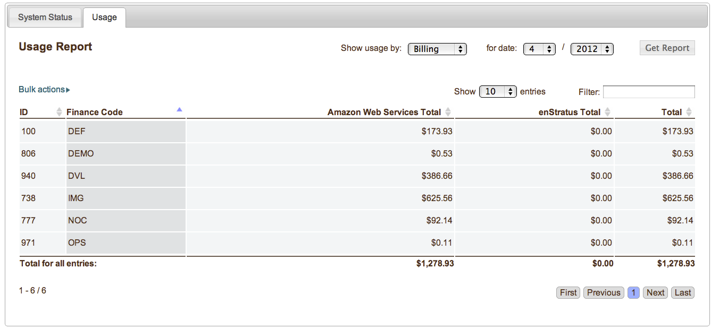
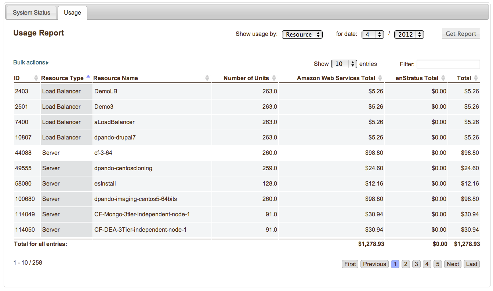
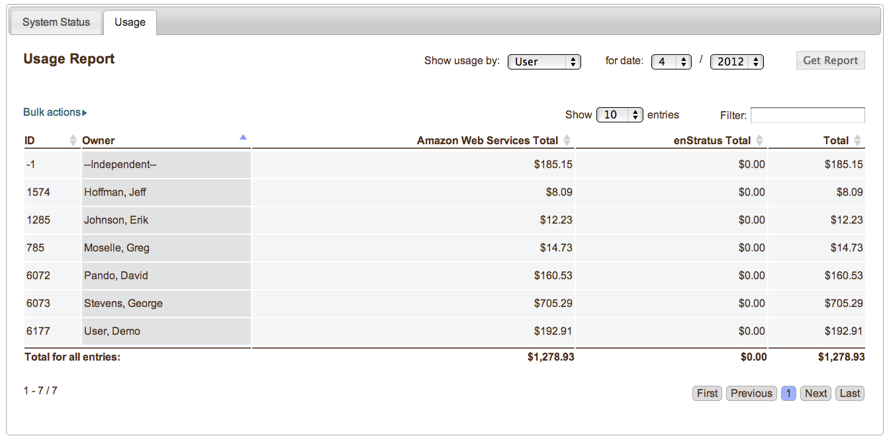
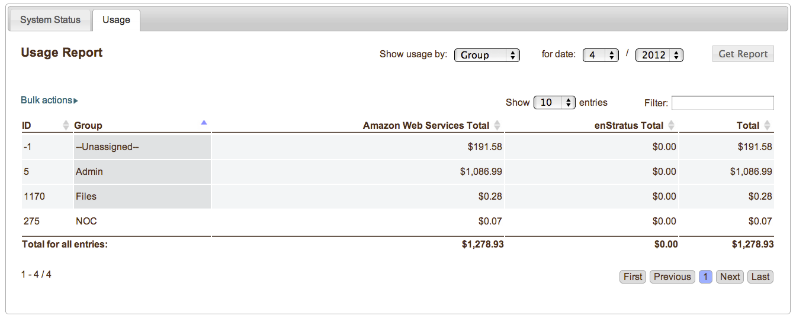

..
    Reports
    -------

.. _saas_budget_reports:

レポート
--------

..
    Using the enStratus console, it is also possible to view detailed reports of your account.

enStratus コンソールを使って、アカウントの詳細なレポートを表示できます。

..
    For an even more granular view of how resources are being used in the account, navigate to
    Console > Reports. Several options are presented in a tabbed interface. Choose the tab
    labeled usage.

アカウントでリソースがどのように使われているかの、より詳細な表示のために "Console > Reports" に移動します。タブ付きインターフェイスでオプションが表示されます。Usage のラベルのついたタブを選択してください。

..
   Budget View

   予算表示

..
    Using the reports tab, information relating to billing and charges can be sorted by
    billing code, resource, user, and group. Use the drop down box selector for Show Usage By:
    to choose the preferred method for displaying data.

Report タブから、課金や請求に関連する情報は、課金コード、リソース、ユーザー、グループにより並び替えられます。"Show Usage By:" のドロップダウンボックスから好みのデータ表示方法を選択してください。

..
    Use the date selector drop down options to look back to previous months usage. 

前月へ戻って利用状況を見るには、ドロップダウンオプションから date セレクターを使ってください。

..
    Billing Code
    ~~~~~~~~~~~~

課金コード
~~~~~~~~~~

..
    Displaying usage by billing code will display the costs associated with each billing code
    for which there is information. This view is similar to the information presented when
    viewing Infrastructure > Budget Codes. In this view, however, costs are segregated into two main
    categories. First, the costs for usage based on the price charged by the cloud provider.
    Second, the costs charged by enStratus. 

課金コードによって利用状況を表示すると、課金情報を持つ各課金コードに関連付けられたコストを表示します。この表示は、"Infrastructure > Budget Codes" で表示される内容によく似ています。しかし、この表示では、コストは2つの主カテゴリーに区分されています。1番目は、クラウドプロバイダーが請求する価格に基づく利用状況のコストです。2番目は、enStratus が請求するコストです。

..
    Resource
    ~~~~~~~~

リソース
~~~~~~~~

..
    To view charges associated with cloud resources such as servers and load balancers, select
    Show Usage By: Resource from the option list and click Get Report.

サーバーやロードバランサーなどのクラウドリソースに関連付けられた料金を表示するには、オプションリストから "Show Usage By: Resource" を選択して "Get Report" をクリックしてください。

..
   Resource View

   リソース表示

..
    As usual, the columns are sortable and the entire list is able to be filtered using the
    filter text box. 

通常、このカラムはソート可能であり、リスト全体を "Filter" テキストボックスからフィルターできます。

..
    User
    ~~~~

ユーザー
~~~~~~~~

..
    To view charges by user, select Show Usage By: User, and click Get Report.

ユーザーでの料金を表示するには、"Show Usage By: User" を選択して "Get Report" をクリックしてください。

..
   User View

   ユーザー表示

..
    Group
    ~~~~~

グループ
~~~~~~~~

..
    Finally, to view usage by group. Select Show Usage By: Group, and click Get Report.

最後に、グループでの利用状況を表示します。"Show Usage By: Group" を選択して "Get Report" をクリックしてください。

..
   Group View

   グループ表示
