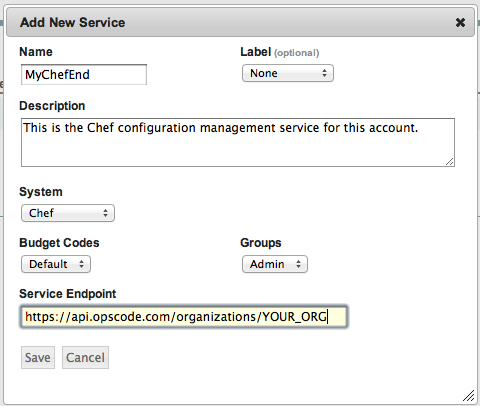
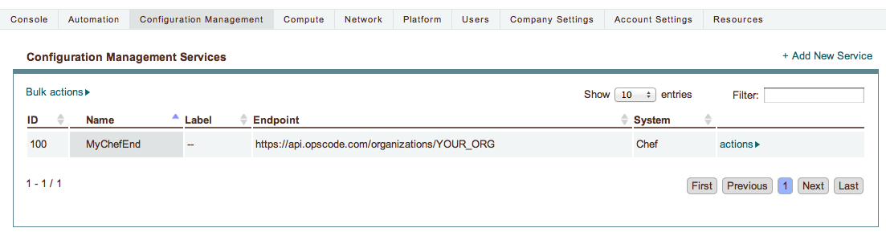
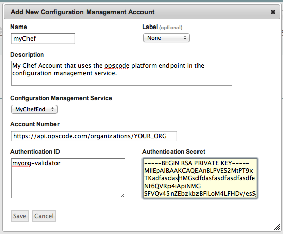
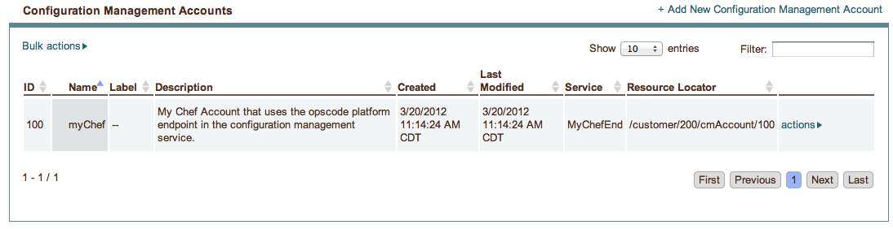
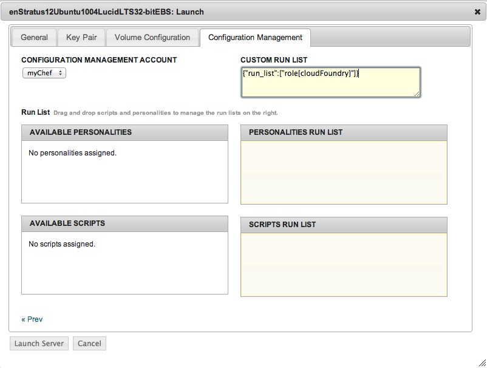
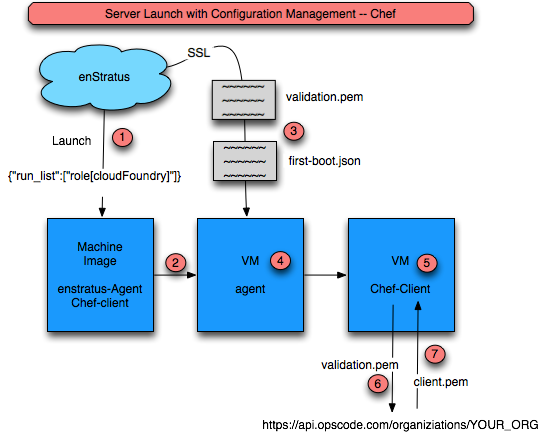

..
    Using Chef
    ----------

.. _saas_using_chef:

Chef の使い方
-------------

..
    Getting Started
    ^^^^^^^^^^^^^^^

はじめに
^^^^^^^^

..
    Using Chef to configure instances requires the following software be installed:

インスタンスを設定するために Chef を使うには、次のソフトウェアがインストールされている必要があります。

..
    1. enStratus agent.

1. enStratus エージェント

   ..
       Although Chef can be used to install the enStratus agent, in an automation enviroment
       where Chef is used to configure instances at run-time, the agent is used as a trigger
       point so that chef runs happen at the appropriate time and with the appropriate
       credentials.

   Chef は enStratus エージェントをインストールすることに使えます。しかし、Chef が実行時にインスタンスを設定する自動化環境では、Chef が適切なときに適切な認証情報で実行できるように、このエージェントがトリガーポイントとして使われます。

.. note::
   ..
       Although the requirement for the enStratus agent seems like an unreasonable
       request at first, it actually allows for a great degree of flexibility in executing Chef
       client calls against Chef endpoints.

   enStratus エージェントの要件は、最初は非合理に思えますが、実際には Chef エンドポイントに対する Chef クライアント呼び出しを実行する柔軟性において道理にかなっています。

.. note::
   ..
       enStratus passes in a chef-endpoint, and the credentials for connecting to
       that endpoint at runtime to the instance via the agent. The agent dynamically writes
       the client.rb file with this information, making the image usable anywhere.

   enStratus は chef-endpoint と、実行時にエージェント経由でそのエンドポイントに接続する認証情報を渡します。エージェントは、この情報を client.rb ファイルに書き込み、どこでも使えるイメージを作ります。

.. note:: 
   ..
       **Use Case**

   **使用例**

   ..
       enStratus engineers frequently do Chef server installations at client sites
       for POC. Often, the Chef server is a VM just like any other instance, and as such has all
       the ephemerality of instances running on a POC cloud project.

   enStratus エンジニアは、POC (Proof Of Concept: 概念実証) のために、クライアントのサイトで Chef サーバーのインストールをよく行います。多くの場合、Chef サーバーは他のインスタンス同様に VM であり、それ自体は POC クラウドプロジェクトで実行する一時的なインスタンスです。

   ..
       enStratus solves the problem of moving Chef server targets by abstracting that process and
       using the agent to handle the passing of necessary information to each instance.

   enStratus は、対象の Chef サーバーが移動する問題点を解決します。それは、各インスタンスへ必要な情報を渡すエージェントを使うことにより、その処理を抽象化するという解決方法です。

   ..
       In summary, the standing up of Chef-enabled instances becomes trivial. Just install
       the Chef client with a templated client.rb (shown below) and let the agent kick off the
       Chef execution.

   要約すると、Chef が有効になったインスタンスを起動するのは些細な作業です。テンプレートの client.rb (下記を参照) と一緒に Chef クライアントを単純にインストールしてください。そして、エージェントから Chef の実行を行います。

..
    2. Chef-client.

2. Chef クライアント

   ..
       The chef-client software is used to execute the Chef run.

   Chef を実行するのに chef-client ソフトウェアを使います。

..
    Add a Configuration Management Service
    ^^^^^^^^^^^^^^^^^^^^^^^^^^^^^^^^^^^^^^

構成管理サービスの追加
^^^^^^^^^^^^^^^^^^^^^^

..
    Location: Configuration Management > Services

場所: "Configuration Management > Services"

..
    Create a new configuration management service of type Chef.

Chef の新しい構成管理サービスを作成します。

..
   Add Configuration Management Service

   構成管理サービスの追加

..
    **Service Added**

**サービスの追加後**

..
   Configuration Management Service Added

   構成管理サービスの追加後

..
    Add a Configuration Management Account
    ^^^^^^^^^^^^^^^^^^^^^^^^^^^^^^^^^^^^^^

構成管理アカウントの追加
^^^^^^^^^^^^^^^^^^^^^^^^

..
    Location: Configuration Management > Accounts

場所: "Configuration Management > Accounts"

..
   Add Configuration Management Account

   構成管理アカウントの追加

..
    **Account Added**

**アカウントの追加後**

..
   Configuration Management Account Added

   構成管理アカウントの追加後

..
    Configure an Image to use Chef
    ^^^^^^^^^^^^^^^^^^^^^^^^^^^^^^

Chef を使うイメージの構成
^^^^^^^^^^^^^^^^^^^^^^^^^

..
    #. Install the enStratus Agent.
    #. Install the chef client.
    #. Edit /etc/chef/client.rb (make it a "template" that the enStratus agent will re-write)

#. enStratus エージェントをインストールする
#. chef-client をインストールする
#. /etc/chef/client.rb を編集する (enStratus エージェントが再書き込みする "テンプレート" になる)

..
    Launch VM with Configuration Management Action
    ^^^^^^^^^^^^^^^^^^^^^^^^^^^^^^^^^^^^^^^^^^^^^^

構成管理アクションによる VM の起動
^^^^^^^^^^^^^^^^^^^^^^^^^^^^^^^^^^

..
    To trigger a vm launch and and accompanying chef action, launch a VM and choose the
    appropriate configuration management engine. For Chef, use the text window to paste in
    json that will be passed to the chef-client call as shown.

VM の起動と chef アクションをトリガーするには、VM を起動して、適切な構成管理エンジンを選択します。Chef のために、次のように chef-client 呼び出しに渡される JSON データを貼り付けるテキスト画面を使います。

..
    Here, we're passing in a chef role.

ここでは、chef のロールを渡します。

..
   Launch VM with Configuration Management Action

   構成管理アクションによる VM の起動

..
    The process for launching a VM with a subsequent chef-client call is shown below.

VM を起動する作業と、それに続く chef-client 呼び出しは次の通りです。

..
   Launching a VM with a chef-client call

   VM の起動と chef-client 呼び出し

..
    #. A launch event is triggered using the Configuration Management tab with a run list.
    #. The VM must have the chef-client pre-installed and the enStratus agent pre-installed.
    #. enStratus will pass to the VM agent script:

#. 起動イベントは、実行リストで構成管理タブを使ってトリガーされる
#. VM は、あらかじめ chef-client と enStratus エージェントをインストールしておく必要がある
#. enStratus は、VM エージェントにスクリプトを渡す:

   * validation.pem
   * first-boot.json

..
    4. The agent script dynamically replaces the template variables in client.rb and copies the validation.pem to /etc/chef
    5. The agent triggers a chef-client call with the first-boot.json file as an argument
    6. Triggering a validation run for the client
    7. The client.pem file is returned and the chef run completes.

4. エージェントスクリプトは、client.rb のテンプレート変数を動的に置き換え、/etc/chef に validation.pem をコピーする
5. エージェントは、first-boot.json ファイルを引数に与えて、chef-client 呼び出しをトリガーする
6. クライアントのバリデーション実行をトリガーする
7. client.pem ファイルが返されて、chef の実行が完了する

.. note::
   ..
       At first, it might seem like the dynamic re-writing of the client.rb variables
       is a hindrance to smooth operations, however, it makes images very portable should the
       chef endpoint change.

   最初のうちは client.rb の変数の動的な書き換えが、円滑な業務の支障に見えるかもしれません。しかし、それは chef エンドポイントを変更してイメージを作るという移植性を高めています。

..
    Agent Script: runConfigurationManagement-CHEF
    +++++++++++++++++++++++++++++++++++++++++++++

エージェントスクリプト: runConfigurationManagement-CHEF
+++++++++++++++++++++++++++++++++++++++++++++++++++++++

..
    This file is part of an agent installation and is located in the /enstratus/bin directory.
    enStratus passes the validation.pem file along with some json used to execute the
    chef-client procedure shown below.

このファイルは、エージェントのインストールの一部であり、/enstratus/bin ディレクトリにあります。
enStratus は、次の chef-client 手続きを実行するために使う JSON ファイルと一緒に validation.pem ファイルを渡します。

..
    The agent script replaces the dummy variables in the client.rb and then it executes a
    chef-client call:

エージェントスクリプトは、client.rb のダミー変数を置き換えてから chef-client 呼び出しを実行します。

.. code-block:: bash
  
   sudo chef-client -j $FIRST_BOOT

..
    Where $FIRST_BOOT is a file with the contents specified via the enstratus console as json
    file for the chef client call. In the example below:

ここで $FIRST_BOOT は、enStratus コンソールから chef-client 呼び出しのために JSON ファイルとして指定したコンテンツをもつファイルです。次に例を示します:

.. code-block:: json

  {"run_list":["role[cloudFoundry]"]}

..
    **Agent Script: /enstratus/bin/runConfigurationManagement-CHEF**

**エージェントスクリプト: /enstratus/bin/runConfigurationManagement-CHEF**

.. literalinclude:: ./files/runConfigurationManagement-CHEF
   :language: bash
   :emphasize-lines: 26,29,35
   :linenos:

..
    #. Line 26: Rewrites the chef endpoint.
    #. Line 29: Rewrites the validator.
    #. Line 35: Executes the chef call.

#. Line 26: chef エンドポイントを書き換える
#. Line 29: バリデーターを書き換える
#. Line 35: chef 呼び出しを実行する

client.rb
+++++++++

**Client.rb: /etc/chef/client.rb**

.. literalinclude:: ./files/client.rb
   :language: ruby
   :emphasize-lines: 8,22
   :linenos:
