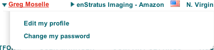
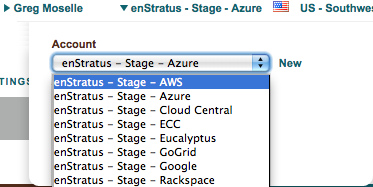
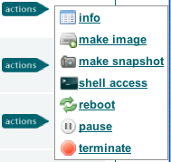
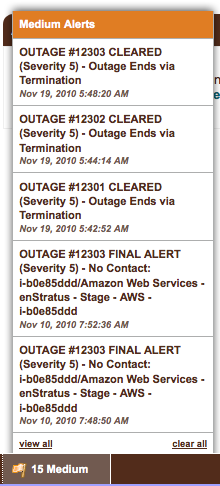
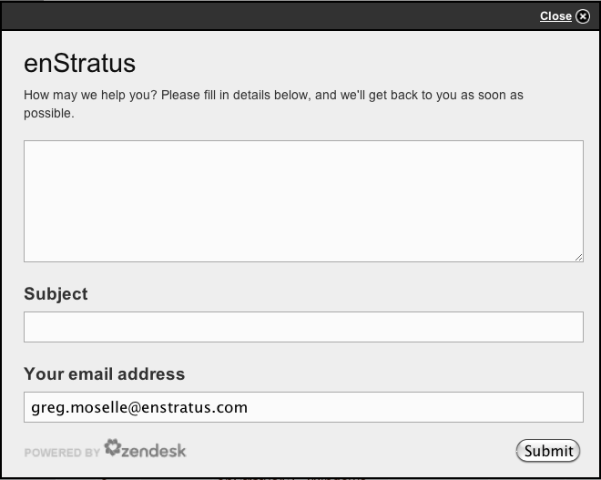

..
    Console Overview
    ----------------

.. _console_overview:

コンソールの概要
----------------

..
    The customer brand can be used to depict the unique logo for a custom deployment of
    enStratus.

顧客ブランドは、enStratus のカスタムデプロイ向けに独自のロゴマークを表示するのに使えます。

..
    User Profile
    ~~~~~~~~~~~~

ユーザープロファイル
~~~~~~~~~~~~~~~~~~~~

..
   User Profile

   ユーザープロファイル

..
    The name of the person currently logged in to the enStratus console. Clicking on this link
    provides functionality for editing user profile or for changing the user's password.

現在の enStratus コンソールにログインしている方の名前です。このリンクをクリックすると、ユーザープロファイルを編集したり、ユーザーのパスワードを変更する機能を提供します。

..
    Account
    ~~~~~~~

アカウント
~~~~~~~~~~

..
   Account

   アカウント

..
    enStratus can access many accounts in one cloud provider or accounts in separate clouds
    simultaneously. Clicking on the account will activate a menu for selecting an account. The
    functionality displayed within the enStratus console is shown in figure at right.

    右に図がないし、内容もおかしい？

enStratus は、1つのクラウドプロバイダー、またはその他の複数クラウドのアカウントに対して同時にアクセスできます。アカウントをクリックすると、アカウントを選択するためのメニューが選択されます。

..
    Region
    ~~~~~~

リージョン
~~~~~~~~~~

..
    If the underlying cloud provider has the concept of regions, those regions will be
    displayed and be selectable from here. After entering your cloud credentials, these
    regions will auto-populate as enStratus begins to discover the attributes of the cloud
    provider.

クラウドプロバイダーがリージョンの概念を持っている場合、それらのリージョンが表示され、このメニューから選択できます。クラウドの認証情報の入力後に enStratus がクラウドプロバイダーの属性を検出し始めると、これらのリージョンも自動的に表示されます。

..
    Cloud
    ~~~~~

クラウド
~~~~~~~~

..
    Logo of the cloud provider. When navigating between different cloud providers, this logo
    will change to reflect the selected cloud.

クラウドプロバイダーのロゴマークです。異なるクラウドプロバイダーを操作するときに、このロゴを選択したクラウドのロゴマークに反映するよう変更します。

..
    Navigation Menu
    ~~~~~~~~~~~~~~~

ナビゲーションメニュー
~~~~~~~~~~~~~~~~~~~~~~

..
    The navigation bar displays the first level of interaction with the cloud provider.

ナビゲーションバーは、クラウドプロバイダーとやり取りする最初のレベルを表示します。

..
    Content Pane
    ~~~~~~~~~~~~

コンテンツペイン
~~~~~~~~~~~~~~~~

..
    The main content window for interacting with cloud resources is the content pane. The
    content displayed in this main window depends on the selections made in the Primary and
    Secondary navigation panes. For example, if Infrastructure > Servers is selected, all
    active servers will be displayed in the content pane.

クラウドリソースとやり取りするメインのコンテンツ画面がコンテンツペインです。このメイン画面に表示されるコンテンツは、プライマリでの選択とセカンダリナビゲーションペインに依存します。例えば、"Infrastructure > Servers" が選択された場合、全ての有効なサーバーが、コンテンツペインに表示されます。

..
    Filter
    ~~~~~~

フィルター
~~~~~~~~~~

..
    The filter text box allows for dynamic filtering of content presented in the content pane.

フィルターのテキストボックスは、コンテンツペインに表示されたコンテンツの動的なフィルタリングを行います。

..
    Actions Menu
    ~~~~~~~~~~~~

アクションメニュー
~~~~~~~~~~~~~~~~~~

..
   Actions Menu

   アクションメニュー

..
    The green action menu is a standard enStratus convention for activating a sub menu of
    options specific to a particular piece of cloud infrastructure. The sub menu, shown below,
    is activated by clicking on the actions button.

アクションメニューは、クラウドインフラストラクチャの特化したオプションのサブメニューです。このアクションメニューを選択して操作するのが enStratus の標準的な使い方です。サブメニューからアクションボタンをクリックすると、選択された状態になります。

..
    The action button menu shown here is for a cloud server. Note: Some options shown in this
    image are only available after the enStratus agent has been installed on the virtual
    machine.

このアクションボタンのメニューは、クラウドサーバーのものです。この図の複数のオプションは、enStratus エージェントを仮想マシン上にインストールした後で使えます。

..
    If the cloud administrator for your account has implemented groups and roles, the action
    button may or may not be present in all cases. Presenting or hiding the green action
    button is one method enStratus uses to enforce role-based access controls for cloud
    infrastructure.

クラウド管理者がアカウントに対してグループとロールを設定している場合、アクションボタンは必ず表示されるかもしれないし、表示されないかもしれません。アクションボタンを表示するか隠すかは、enStratus がクラウドインフラストラクチャのロールベースのアクセス制御を行う方法の1つです。

..
    The action button is available for many different aspects of cloud infrastructure. The sub
    menu is meant to be intuitive easy to use.

アクションボタンは、クラウドインフラストラクチャの様々な場面で利用できます。サブメニューは、直感的で容易に使えます。

..
    Status/Alert/Support Menu
    ~~~~~~~~~~~~~~~~~~~~~~~~~

ステータス/アラート/サポートメニュー
~~~~~~~~~~~~~~~~~~~~~~~~~~~~~~~~~~~~

..
   Alerts

   アラート

..
    The status menu is located at the bottom of the content pane. If there are any alerts in
    any of the accounts of which you are a part, they will be displayed here. Alerts are
    categorized as High, Medium, or Low. Clicking on an alert color will slide out a truncated
    list of alerts, which are accessible by clicking.

ステータスメニューは、コンテンツペインの下部にあります。アカウントのいずれかにアラートが発生している場合、ここに表示されます。アラートは、High、Medium、Low に分類されます。アラートをクリックすると、アラートの概要一覧が表示されます。この一覧はクリックしてアクセスできます。

..
    Options for interacting with alerts include clicking on them to view in more detail or
    deleting them.

アラートを操作するオプションは、クリックして詳細を表示するか、そのアラートを削除するかの機能です。

..
    The support link provided at the bottom of the console provides an integration point for
    external help desk functionality, such as Zendesk. In the SaaS offering for enStratus,
    clicking the support link will activate a dialog window for sending a support request to
    the enStratus team.

コンソールの下部に設けられたサポートリンクは、Zendesk のような、外部ヘルプデスク機能を提供しています。enStratus の SaaS オファリングでは、サポートリンクをクリックすると、enStratus チームへサポートの要望を送信するためのダイアログ画面を表示します。

   チケットの登録
