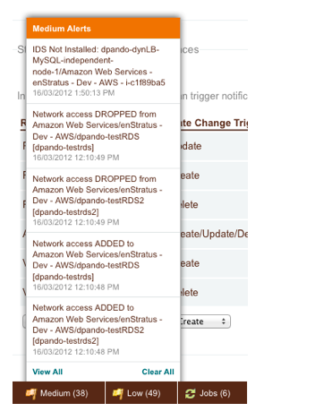

.. _console_notifications:

Notifications
-------------

enStratus has expanded management of notifications and alerts, allowing for more granular control over events which will trigger a notification, as well as the mechanisms by which the notifications will be delivered. 

Account administrators will now be able to set separate preferences for each account, and individual users will also be able to control how they receive alerts and notifications. 

Setting Notification Targets for Accounts and Users
~~~~~~~~~~~~~~~~~~~~~~~~~~~~~~~~~~~~~~~~~~~~~~~~~~~

Notification targets are endpoints to which notifications and alerts can be sent. You can specify the following endpoints:

* Email
* SMS
* API
* Notification Topic

.. figure:: ./images/notifications_1.png
   :alt: Alerts and Notifications targets
   :align: center

   Alerts and Notifications targets

With Email and SMS notification targets specify an email address or mobile number (including country code) to send notifications. The API target allows you to specify an API endpoint for notifications. 

The Notification Topic Target allows you to leverage notification services such as Amazon SNS (`<http://aws.amazon.com/sns/>`_). Topics can be set up and configured at Platform > Notification Topics.

Account administrators may set targets for notifications **specific to that account** at Account Settings > Account Notifications.

Users may set personal targets for notifications **across all their accounts** by editing their profile in their header menu.

.. figure:: ./images/notifications_2.png
   :alt: Setting Notification targets
   :align: center

   Setting notification targets

Setting Account Alert and Notification Preferences
~~~~~~~~~~~~~~~~~~~~~~~~~~~~~~~~~~~~~~~~~~~~~~~~~~~

Account administrators may set alert and notification preferences (as well as notification targets) by going to Account Settings > Account Notifications.

**Alert Preferences**

Alerts are triggered by any alarm event such as unexpected server termination, backup failure, or intrusion detection.

You can choose the minimum severity of the alerts you receive, and how you want to receive them. 

.. figure:: ./images/notifications_3.png
   :alt: Alert Preferences
   :align: center

   Alert Preferences

**Notification Preferences**

enStratus allows granular control when it comes to notifications triggered by state change events. You choose a resource type (Any Resource, Server, Firewall, IP Address), a state change type (Create, Update, Delete), and the delivery targets.

.. figure:: ./images/notifications_4.png
   :alt: Notification Preferences
   :align: center

   Notification Preferences

If you choose identical delivery targets for Create, Update, and Delete on the same resource, those preferences will be consolidated. Otherwise notification settings are additive.

Consider the following preferences:

.. figure:: ./images/notifications_5.png
   :alt: Notification Preferences
   :align: center

In this example, a create event on any resource (ANY.CREATE) will trigger a notification to the Topic target. This includes Servers, Firewalls, and IP Addresses.
An update event on a firewall (FIREWALL.UPDATE) will trigger an SMS notification.
Any kind of event on a server (SERVER.ANY) will trigger both Email and Topic notifications.
Updating or deleting an IP address will trigger NO notifications. 
Deleting a firewall will also trigger no notifications.

**Setting User Alert and Notification Preferences**

Users can set their notification and alert preferences by selecting My Notification Preferences from their header menu.

.. figure:: ./images/notifications_6.png
   :alt: User Preferences
   :align: center

   User Preferences

You will notice that users have an additional “Screen” delivery mechanism for both their alerts and notifications. The endpoint for Screen notifications is the enStratus console - that is to say, alerts and notifications with the Screen preference ticked will be delivered to the footer of the enStratus console and the Console > Alerts page. See Screen Notifications below for more information.

In the following example, any event on any resource (ANY.ANY) will trigger a Screen notification. FIREWALL.CREATE will trigger an Email notification, SERVER.CREATE will trigger a Topic notification, and FIREWALL.UPDATE, FIREWALL.DELETE, and SERVER.DELETE will trigger SMS notifications.

Screen Notifications
~~~~~~~~~~~~~~~~~~~~

Users will see Screen notifications in two places in the enStratus console: in the lower left-hand footer on every page, and at Console > Alerts.

   Screen Notifications

Clicking on the footer notifications menu for a quick view of notifications. To delete a notification, mouse over it in the menu and click the X. If you want to clear all notifications quickly, click the Clear All Alerts link. You will be prompted to confirm you want to clear notifications of all severity across all your accounts.

For more detail on notifications, click the View All link in the notification menu. This will bring you to the Console > Alerts page.

.. figure:: ./images/notifications_9.png
   :alt: Details
   :align: center

   Alert or Notification details

On this page you can mark alerts read and delete them individually or in bulk. If you click the “show more” link in Subject column, you will see more detail about the notification or alert.
