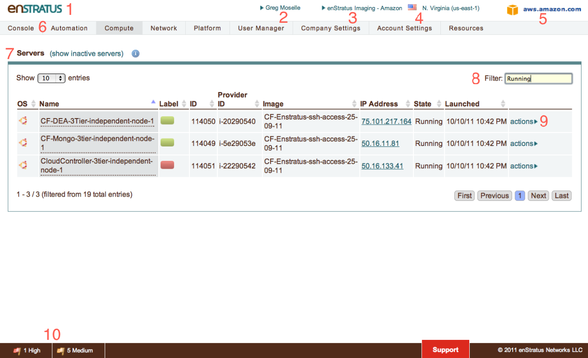

.. _console_purpose:

Purpose
-------

The purpose of this section is to familiarize the user with the enStratus web front end,
referred to as the enStratus console. Upon completing this objective, the user should be
able to identify the major components of the console, as well as feel comfortable
navigating and accomplishing small tasks.

The enStratus console can be divided into several functional areas. In this section, we
will cover each of the following functional areas at a high level.

   UI Overview

.. code-block:: none

  +-------+--------------------------+
  | Field | Meaning                  |
  +-------+--------------------------+
  | 1     | Customer Brand           |
  | 2     | User/Profile             |
  | 3     | Account                  |
  | 4     | Region                   |
  | 5     | Cloud                    |
  | 6     | Navigation Menu          |
  | 7     | Content Pane             |
  | 8     | Filter                   |
  | 9     | Action Menu              |
  | 10    | Staus/Alert/Support Menu |
  +----------------------------------+

