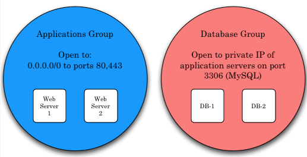
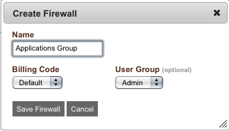
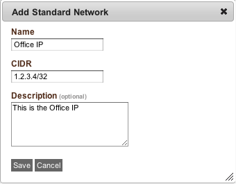
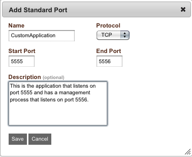
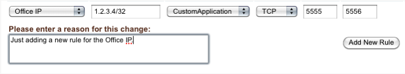
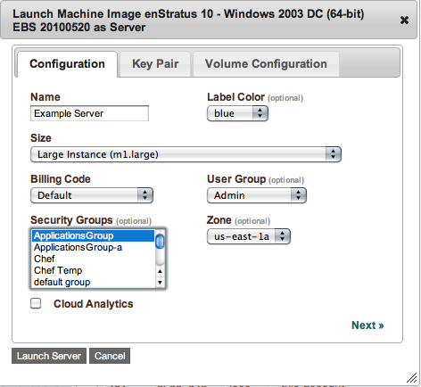

..
    Firewalls
    ---------

.. _saas_firewalls:

ファイアウォール
----------------

..
    Firewalls, or security groups, in enStratus control accessibility to running servers. Each
    account has a firewall called 'default' that is the default firewall into which all
    servers are launched.

enStratus において、ファイアウォールまたはセキュリティグループは、実行中のサーバーへのアクセス制御を行います。各アカウントは、'default' というデフォルトのファイアウォールがあり、全てのサーバーで起動されます。

.. note::
   ..
       The terms firewall and security group are interchangeable in enStratus.

   ファイアウォールとセキュリティグループの用語や概念は enStratus においてどちらも同じです。

..
    Security groups are applied to servers. Servers are part of security groups. A server is
    added to a security group at the time of server start. It is not currently possible to
    change the security group of a server post-launch. This is far less of a limitation than
    it sounds because the individual rules that comprise a security group can be changed at
    any time.

セキュリティグループは、サーバーに適用されます。サーバーは、セキュリティグループの一部です。サーバーは、起動時にセキュリティグループに追加されます。現在のところ起動後にはサーバーのセキュリティグループの変更はできません。これは、セキュリティグループを構成する個々の規則はいつでも変更できるため、思うほどの制限ではありません。

..
   Security Groups

   セキュリティグループ

..
    Generally, the process for managing firewalls is to first create the security group and
    then choose a security group into which servers will be launched at start.

一般的には、ファイアウォールの管理作業は、最初にセキュリティグループを作成することであり、その後、起動時にサーバが属するセキュリティグループを選択します。

..
    To access firewalls in the enStratus console, navigate to Infrastructure > Firewalls. A
    listing of the active firewalls will be shown. To add a new firewall, click on the
    +create_firewall. Only two pieces of information are required to create a firewall: A
    name, billing code, and an optional group.

enStratus コンソールでファイアウォールへアクセスするには、"Infrastructure > Firewalls" に移動します。有効なファイアウォールのリストが表示されます。新しいファイアウォールを追加するには、"+create_firewall" をクリックします。ファイアウォールを作成するには、名称、課金コード、オプショングループの情報が必要です。

..
   Create Security Group

   セキュリティグループの作成

..
    Once the firewall has been saved, it will be added to the list of active firewalls. Once
    the firewall is active, it will be provided as an option when launching new servers.

ファイアウォールが保存されると、有効なファイアウォールのリストに追加されます。新規サーバーの起動時にファイアウォールが有効になれば、それがオプションとして提供されます。

..
    Editing Firewalls
    ~~~~~~~~~~~~~~~~~

ファイアウォールの編集
~~~~~~~~~~~~~~~~~~~~~~

..
    To edit an existing firewall, select the green action button that corresponds to the
    firewall targeted for editing. A dialog box will appear showing the rules that comprise
    the firewall.

既存のファイアウォールを編集するには、編集対象となるファイアウォールに対応するアクションボタンを選択します。ダイアログボックスには、ファイアウォールを構成するルールが表示されます。

..
    The six columns that make up the firewall are:

ファイアウォールを構成する6つのカラムは、次の通りです。

..
    1. Source - A common name for the firewall rule. Standard networks naming conventions apply
    to this column. If a standard network is used, the CIDR column will be automatically
    populated with the information defined by that standard network.

1. ソース - ファイアウォールルールの共通名です。このカラムは標準のネットワークの命名規則が適用されます。標準のネットワークが使われる場合、CIDR のカラムには自動的に標準のネットワークで定義されている情報が割り当てられます。

..
    2. CIDR - CIDR means Classless Inter-Domain Routing. Practically, this means / or "slash"
    notation is required. For example, to apply a rule to only one IP address, the rule takes
    the form: 1.2.3.4/32. This is practical for creating a rule for your home IP address. This
    type of notation allows for firewall rules that encompass ranges of IP addresses. For
    example, to apply a rule to a range of 256 IP addresses, this represents a rule of the
    form: 1.2.3.0/24. This is a very powerful feature of firewall rule creation.

2. CIDR - CIDR はクラスレスのドメイン間ルーティングを意味します。実際に、これは "/" (スラッシュ) 表記法が必要です。例えば、1つの IP アドレスにルールを適用するには、1.2.3.4/32 といった形式を取ります。これはホーム IP アドレスのルールを作成するための実用的なルールです。IPアドレスの範囲を含むファイアウォールルールを表記できるようにします。例えば、256 個の IP アドレスの範囲にルールを適用するには 1.2.3.0/24 と表記します。これは、ファイアウォールルールの作成においてかなり強力な機能です。

..
    3. Method - Refers to the program being used, and provides a common name for the program. For
    example, MySQL or SSH. Standard ports can be used to modify this part of the ruleset.
    Protocol, From Port and To Port are automatically populated with the information provided
    by that standard port.

3. メソッド - これは使われているプログラムを参照し、プログラムの一般的な名前を提供します。例えば、MySQL または SSH です。標準ポートは、このルールセット内で変更できます。これにより提供される "Protocol", "From Port", "To Port" の情報が標準ポートです。

..
    4. Protocol - Indicates the type of protocol that will apply, TCP, UDP, or ICMP.

4. プロトコル - TCP、UDP、または ICMP を適用するプロトコルのタイプを指定します。

..
    5. From Port - The starting port for the rule.

5. From Port - ルールの開始ポートを指定します。

..
    6. To Port - The ending port for the rule.

6. To Port - ルールの終了ポートを指定します。

..
    Standard Networks and Ports
    ~~~~~~~~~~~~~~~~~~~~~~~~~~~

標準のネットワークとポート
~~~~~~~~~~~~~~~~~~~~~~~~~~

..
    enStratus introduces the concept of a standard network to firewalls. A standard network is
    a user-defined commonly used network that can be quickly added to a firewall using a
    common name that maps to the IP address specified. This functionality creates the
    advantage of being able to easily identify, add, and remove specific firewall rules among
    what may be a long list of rules.

enStratus は、ファイアウォールに標準のネットワークの概念を導入しています。標準のネットワークは、ユーザー定義の一般的なネットワークで、指定した IP アドレスにマッピングされた共通名称からファイアウォールへすぐに追加できます。この機能は、特定のファイアウォールルールが長いルールリストになっても、その中から簡単に識別、追加、削除できる利点があります。

..
    For example, if a user typically conncects from a particular office IP address, this
    address should be added as a standard network and named appropriately for ease of
    identification.

例えば、通常、ユーザーが特定のオフィスの IP アドレスから接続するなら、このアドレスは、標準のネットワークとして追加しておいて、簡単に識別できるように適当な名前を付けるようにします。

..
    Similarly, standard ports are user-defined commonly used ports that typically map to a
    specific application. For example, if an application is required to allow connections on
    port 5555, a standard port can be defined to identify that application by a common name
    and add it to the firewall.

同様に、通常、標準のポートは、特定のアプリケーションにマッピングされる、ユーザー定義の一般的なポート番号です。例えば、もしアプリケーションがポート5555の接続を許可する必要があるなら、標準ポートを共通名称で、そのアプリケーションを識別するために定義して、ファイアウォールに追加できます。

..
    Standard networks are defined in Company Settings > Standard Networks. Every enStratus
    account has some default rules defined in a default firewall to allow for the enStratus
    monitoring service to connect to running servers. To define a new standard network, select
    +add_new_standard_network and complete the resulting dialog box.

標準ネットワークは、"Company Settings > Standard Networks" で定義します。全ての enStratus アカウントは、enStratus の監視サービスが実行中のサーバへ接続できるように、デフォルトのファイアウォールで定義されたデフォルトルールを持っています。新しい標準のネットワークを定義するには、"+add_new_standard_network" を選択し、ダイアログボックが表示されるので記入します。

..
   Standard Network

   標準ネットワーク

..
    Once the standard network is saved, it will be added to the list of standard networks.

標準のネットワークが保存されると、それは標準のネットワークのリストに追加されます。

..
    Before we return to editing the firewalls, let's define a standard port. Navigate to
    Company Settings > Standard Ports. To add a new standard port, select
    +add_new_standard_port and complete the resulting dialog box.

ファイアウォールの編集へ戻る前に、標準のポートを定義しましょう。"Company Settings > Standard Ports" に移動します。新しい標準ポートを追加するには、"+add_new_standard_port" を選択し、ダイアログボックが表示されるので記入します。

..
   Standard Port

   標準ポート

..
    Once the standard port is saved, it will be added to the list of standard ports.

標準のポートが保存されると、それは標準のポートのリストに追加されます。

..
    Returning again to editing firewalls, the new standard network called Office IP and the
    standard port called Custom Application can be quickly added to any of the existing
    firewalls.

ファイアウォールの編集に再び戻り、"Office IP" という新規の標準ネットワークと "Custom Application" という標準ポートを、任意の既存ファイアウォールへすぐに追加できます。

..
   Edit Firewall Using Standard Port

   標準ポートを使うファイアウォールの編集

.. note::
   ..
       If a standard network or port is deleted, the rule will still be applied to the
       firewalls, it will only lose the customized name that was given and revert to a Custom
       rule.

   標準のネットワークまたはポートが削除された場合、ルールはまだファイアウォールに適用されています。これは、所定のカスタマイズ名がなくなり、"Custom rule" に戻ります。

..
    Starting a Server in Security Group
    ~~~~~~~~~~~~~~~~~~~~~~~~~~~~~~~~~~~

セキュリティグループのサーバー起動
~~~~~~~~~~~~~~~~~~~~~~~~~~~~~~~~~~

..
    The final step in utilizing firewalls in the cloud is to apply a firewall group when
    starting a new server. To start a new server, navigate to Infrastructure > Machine Images.
    Select an image to launch and in the resulting dialog box, choose the security group to be
    applied to the resulting server. All of the rules comprising the security group will be
    applied to the server.

クラウドでファイアウォールを使う最後のステップは、新規サーバーを起動するときにファイアウォールグループを適用することです。新規サーバーを起動するには、"Infrastructure > Machine Images" に移動します。起動するイメージを選択し、表示されるダイアログボックスで、起動されたサーバーに適用するセキュリティグループを選択します。セキュリティグループを構成する全てのルールがサーバに適用されます。

..
   Start Server in Firewall

   ファイアウォールのサーバー起動
