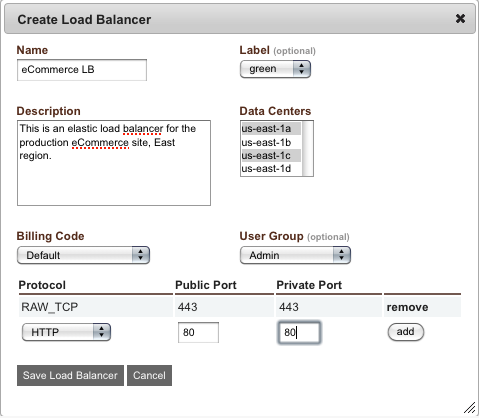

..
    Load Balancers
    --------------

.. _saas_load_balancers:

ロードバランサー
----------------

..
    Successful application load balancing involves dynamically adding and removing application
    nodes from the load balanced pool. This discussion is limited to addressing the activity
    that takes place on the load balancer.

成功したアプリケーションのロードバランシングは、負荷分散プールにアプリケーションノードを動的に追加したり、そこから削除したりします。ここでの議論は、ロードバランサーでの作業範囲のみに収めます。

..
    Overview
    ~~~~~~~~

概要
~~~~

..
    enStratus supports a wide range of load balancers. In the Amazon Cloud, Elastic Load
    Balancers are available for provisioning and use from within enStratus. Server-based load
    balancers can be started for use or an existing server can be purposed as a load balancer
    via HA-Proxy or ajp (mod_jk). Finally, third party load balancing solutions are available
    in the form of the Zeus load balancer.

enStratus は、広範囲のロードバランサーをサポートしています。Amazon のクラウドでは、enStratus 内から Elastic Load Balancer をプロビジョニングして利用できます。サーバーベースのロードバランサーを使う、または既存のサーバーを HA-Proxy や AJP (mod_jk) 経由でロードバランサーにもできます。最後に、サードパーティー製の負荷分散ソリューションが Zeus Load Balancer の形態で利用できます。

Elastic Load Balancer
~~~~~~~~~~~~~~~~~~~~~

..
    Elastic load balancers are an offering from Amazon Web Services that are well supported in
    enStratus. ELB are advantagous because they can be cheaper to operate than server based
    solutions. The configuration requirements for ELB is often simpler than using server-based
    load balancing.

Elastic Load Balancer は、Amazon Web サービスからのオファリングで、enStratus においても対応しています。ELB はサーバーベースのソリューションより安く使えるという利点があります。ELB の構成要件は、多くの場合、サーバーベースの負荷分散を使うよりも簡単です。

..
    To provision a new elastic load balancer using enStratus, navigate to Infrastructure, Load
    Balancers. Select + create_load_balancer. A single dialog box will present the required
    configuration options for the load balancer.

enStratus を使って新規の Elastic Load Balancer をプロビジョンするには、"Infrastructure -> Load Balancers" に移動して、"+ create_load_balancer" を選択します。ロードバランサーに必要な構成オプションのダイアログボックスが表示されます。

..
   Create ELB

   ELB の作成

..
    ELB Discussion
    ~~~~~~~~~~~~~~

ELB の議論
~~~~~~~~~~

..
    The Name, Label, and Description fields should be self-explanatory. More care should be
    taken when configuring the Data Center portion of the dialog. Each configured data center
    will receive an equal portion of the traffic entering the load balancer. This means that
    for each data center configured, there should be a "listening" application server to field
    the load balanced traffic.

名前、ラベル、説明欄は分かりやすい内容にするべきです。ダイアログの "Data Center" 設定を行うときは、より慎重にならなければなりません。構成された各データセンターは、ロードバランサーに入ってくるトラフィックと同じデータ量を受け取ります。各データーセンターには、負荷分散されたトラフィックを捌く "listening" アプリケーションサーバーがあるはずです。

..
    For example, let's assume we have a load balancer configured for data centers us-east-1a
    and us-east-1b. This means that 50% of the inbound traffic that reaches the load balancer
    will be sent to associated servers in east-1a and 50% of the inbound traffic will be sent
    to servers in east-1b. If no servers are provisioned in a data center, the traffic will
    manifest as an error.

例えば、us-east-1a と us-east-1b のデータセンター向けに設定したロードバランサーがあると仮定します。つまり、ロードバランサーに届いた内向きトラフィックの50％が us-east-1a の関連サーバーへ、内向きトラフィックの50％が us-east-1b のサーバーへ送信されます。データセンターにサーバーがプロビジョニングされていない場合、このトラフィックはエラーとして明示されます。

.. note::
   ..
       It is possible to re-configure additional data centers after the load balancer has
       been created. Additionally, in a clustered environment, enStratus knows not to start any
       servers in a data center that is unassociated with the load balancer.

   ロードバランサーの作成後でも追加のデータセンターを再構成できます。さらに、クラスタ環境では、ロードバランサーと関連付けられていないデータセンター内のいずれのサーバーも開始する必要がないことを、enStratus が認識しています。

..
    Billing code and user group are the billing code and user group attributes that enStratus
    will use to track billing charges and access rights tied to the user management and
    billing code offering of enStratus.

"Billing Code" と "User Group" は、課金コードとユーザーグループの属性です。これは、ユーザー管理と enStratus の課金コードオファリングに関連付けられた請求料金とアクセス権を追跡するために使います。

..
    The last step in configuring an elastic load balancer is to configure the protocols that
    pass through the load balancer. Several protocols are available for configuration
    including HTTP, HTTPS, AJP, and RAW TCP. At the time of this writing, it is not possible
    to terminate SSL traffic on an elastic load balancer. To configure SSL traffic to utilize
    an ELB, use the RAW TCP protocol and pass through port 443, or whatever port you will use
    for SSL traffic.

Elastic Load Balancer を構成する最後のステップは、ロードバランサーを通過するプロトコルを設定します。設定には HTTP、HTTPS、AJP、RAW TCP を含む複数のプロトコルが利用できます。執筆時点では、Elastic Load Balancer で SSL 終端点はできません。ELB で SSL トラフィックを使えるよう設定するには、RAW TCP プロトコルでポート443を開けるか、または SSL トラフィックに任意のポートを使うかです。

..
    Once the ELB has been configured, it will appear as an available load balancer in the Load
    Balancer list.

ELB を設定すると、"Load Balancer" リストに利用可能なロードバランサーが表示されます。

..
    The action button for the load balancer allows for changing the configuration of the ELB.
    Manage servers allows currently running servers to be associated with the running ELB.
    Manage zones allows for adding or dropping zone associations. For example, if there are no
    longer any server running in a currently balanced zone, that zone should be removed from
    the ELB.

ロードバランサーのアクションボタンをクリックすると、ELB の設定を変更できます。サーバー管理は、現在実行中のサーバーを実行中の ELB に関連付けられます。管理ゾーンは、ゾーンの関連付けの追加または削除ができます。例えば、現在の負荷分散されたゾーンで実行しているサーバーが必要なくなった場合、ELB からそのゾーンを削除すべきです。

..
    Lastly, to delete an existing ELB, choose the delete option under the actions menu.

最後に、既存の ELB を削除するには、アクションメニューの下にある削除オプションを選択します。

..
    ELB and CNAME
    ~~~~~~~~~~~~~

ELB と CNAME
~~~~~~~~~~~~

..
    One more item of interest with respect to ELB is the way domain names are resolved. Each
    ELB has a host name of the form: CompanyName-LB-1234567890.us-east-1.elb.amazonaws.com.

ELB に関してもう1つの重要なことは、ドメイン名が解決される方法です。各 ELB は、次の形式のホスト名を持っています: CompanyName-LB-1234567890.us-east-1.elb.amazonaws.com

..
    Here is the step-by-step flow of what happens when a client requests a URL served by your
    application:

ここで、クライアントがアプリケーションで使っている URL をリクエストするとき、何が起こるのかを順を追ってみていきます:

..
    When a name resolution request for a domain name is attempted for your webserver,
    www.yourdomain.com, DNS will respond with the CNAME alias of
    CompanyName-LB-1234567890.us-east-1.elb.amazonaws.com. Next, the client request will
    attempt to resolve the name of the ELB,
    CompanyName-LB-1234567890.us-east-1.elb.amazonaws.com.

ドメイン名の名前解決要求が、ウェブサーバ www.yourdomain.com に対して行われる場合、DNS は CompanyName-LB-1234567890.us-east-1.elb.amazonaws.com の CNAME エイリアスを返します。次に、クライアントは ELB の名前 CompanyName-LB-1234567890.us-east-1.elb.amazonaws.com を解決しようとします。

..
    Amazon web services controls this domain name since it is part of the domain
    amazonaws.com. Amazon DNS servers return an address of the ELB, 111.222.222.111. The
    client connection starts with this IP address. The ELB will pass traffic as directed
    through this IP address to the balanced pool of servers.

この名前は amazonaws.com のドメイン名の一部になるので、Amazon Web Services がこのドメイン名を制御します。Amazon の DNS サーバーは ELB, 111.222.222.111 の IP アドレスを返します。クライアント接続は、この IP アドレスから始まります。ELB は、負荷分散プールのサーバーに対して、この IP アドレス経由でトラフィックを送ります。

mod-jk
~~~~~~

..
    A second popular method for load balancing applications is to use mod_jk. Using mod_jk is
    one of two types of virtual machine based load balancing currently supported by enStratus.
    enStratus manages mod_jk balanced applications via the 5 mod_jk scripts that are a part of
    the enStratus agent. These scripts are located in /enstratus/bin/

ロードバランシングアプリケーションの2番目に一般的な方法は、mod_jk を使うことです。mod_jk を使うことは、現在 enStratus が対応している2種類の仮想マシンベースの負荷分散のうちの1つです。enStratus は、enStratus エージェントの一部の5つの mod_jk スクリプト経由で mod_jk で負荷分散されたアプリケーションを管理します。これらのスクリプトは /enstratus/bin/ にあります。

..
    #. modjk-addAddress -- Adds an address to the worker pool.
    #. modjk-buildWorkers -- Creates the workers.list file.
    #. modjk-removeAddress -- Removes an address from the worker pool.
    #. modjk-startProxy -- Calls modjk-addAddress with the necessary parameters to add a worker to the pool.
    #. modjk-stopProxy -- Calls modjk-removeAddress with the necessary parameters to remove a worker from the pool.

#. modjk-addAddress -- ワーカープールにアドレスを追加する
#. modjk-buildWorkers -- workers.list ファイルを作成する
#. modjk-removeAddress -- ワーカープールからアドレスを削除する
#. modjk-startProxy -- プールにワーカーを追加するために必要なパラメータを与えて modjk-addAddress を呼び出す
#. modjk-stopProxy -- プールからワーカーを削除するために必要なパラメータを与えて modjk-removeAddress を呼び出す

..
    modjk Agent Scripts
    ~~~~~~~~~~~~~~~~~~~

modjk エージェントスクリプト
~~~~~~~~~~~~~~~~~~~~~~~~~~~~

..
    +---------------------+-------------------------------------------------------------------------------------------+
    | Agent Script        | Function                                                                                  |
    +=====================+===========================================================================================+
    | modjk-addAddress    | Adds an address to the worker pool.                                                       |
    +---------------------+-------------------------------------------------------------------------------------------+
    | modjk-buildWorkers  | Creates the workers.list file.                                                            |
    +---------------------+-------------------------------------------------------------------------------------------+
    | modjk-removeAddress | Removes an address from the worker pool.                                                  |
    +---------------------+-------------------------------------------------------------------------------------------+
    | modjk-startProxy    | Calls modjk-addAddress with the necessary parameters to add a worker to the pool.         |
    +---------------------+-------------------------------------------------------------------------------------------+
    | modjk-stopProxy     | Calls modjk-removeAddress with the necessary parameters to remove a worker from the pool. |
    +---------------------+-------------------------------------------------------------------------------------------+

.. tabularcolumns:: |p{5cm}|p{9cm}|

+------------------------+------------------------------------------------------------------------------------------------+
| エージェントスクリプト | 機能                                                                                           |
+========================+================================================================================================+
| modjk-addAddress       | ワーカープールにアドレスを追加する                                                             |
+------------------------+------------------------------------------------------------------------------------------------+
| modjk-buildWorkers     | workers.list ファイルを作成する                                                                |
+------------------------+------------------------------------------------------------------------------------------------+
| modjk-removeAddress    | ワーカープールからアドレスを削除する                                                           |
+------------------------+------------------------------------------------------------------------------------------------+
| modjk-startProxy       | プールにワーカーを追加するために必要なパラメーターを与えて modjk-addAddress を呼び出す         |
+------------------------+------------------------------------------------------------------------------------------------+
| modjk-stopProxy        | プールからワーカーを削除するために必要なパラメーターを与えて modjk-removeAddress を呼び出す    |
+------------------------+------------------------------------------------------------------------------------------------+

.. note::
   ..
       The drop-in point for this and the other types of load balancing are the
       /enstratus/bin/startProxy and /enstratus/bin/stopProxy scripts.

   このための一時的な場所と他の種類のロードバランシングは、/enstratus/bin/startProxy と /enstratus/bin/stopProxy のスクリプトです。

HA-Proxy
~~~~~~~~

..
    Another popular method for load balancing is using the High Availability Proxy or HA-Proxy
    method. This method is the other type of virtual machine based load in active support by
    enstratus. Although HA-Proxy is highly customizable and extensible, the support scripts
    are arranged for the most basic proxying. However, the scripts are open for customization
    and extension. They are located in /enstratus/bin/

負荷分散のもう1つの一般的な方法は、高可用性プロキシ、または HA-Proxy を使います。この方法は、enStratus が現在対応している仮想マシンベースのロードバランサーのもう1つの方法です。HA-Proxy はカスタマイズ性と拡張性に優れていますが、このサポートスクリプトは最も基本的なプロキシ向けに調整されています。但し、このスクリプトには、カスタマイズと拡張性があり、/enstratus/bin/ に置かれます。

..
    haproxy-addService -- Adds a balanced node to /etc/haproxy.cfg and auto-increments.
    haproxy-runLb -- Ensures haproxy runs at start.  haproxy-startProxy -- Creates a basic
    /etc/haproxy.cfg script to control the proxy service.  haproxy-stopProxy -- Removes a
    balanced node from /etc/haproxy.cfg.

#. haproxy-addService -- /etc/haproxy.cfg に負荷分散されたノードを追加して自動インクリメントする
#. haproxy-runLb -- 開始時に haproxy の実行を保証する
#. haproxy-startProxy -- プロキシサービスを制御するために基本的な /etc/haproxy.cfg スクリプトを作成する
#. haproxy-stopProxy -- /etc/haproxy.cfg から負荷分散されたノードを削除する

..
    HA-Proxy Agent Scripts
    ~~~~~~~~~~~~~~~~~~~~~~

HA-Proxy エージェントスクリプト
~~~~~~~~~~~~~~~~~~~~~~~~~~~~~~~

..
    +---------------------+----------------------------------------------------------------------+
    | Agent Script        | Function                                                             |
    +=====================+======================================================================+
    | haproxy-addService  | Adds a balanced node to /etc/haproxy.cfg and auto-increments.        |
    +---------------------+----------------------------------------------------------------------+
    | haproxy-runLb       | Ensures haproxy runs at start.                                       |
    +---------------------+----------------------------------------------------------------------+
    | haproxy-startProxy  | Creates a basic /etc/haproxy.cfg script to control the proxy service.|
    +---------------------+----------------------------------------------------------------------+
    | haproxy-stopProxy   | Removes a balanced node from /etc/haproxy.cfg.                       |
    +---------------------+----------------------------------------------------------------------+

.. tabularcolumns:: |p{5cm}|p{9cm}|

+-------------------------+------------------------------------------------------------------------------------+
| エージェントスクリプト  | 機能                                                                               |
+=========================+====================================================================================+
| haproxy addService      | /etc/haproxy.cfg に負荷分散されたノードを追加して自動インクリメントする            |
+-------------------------+------------------------------------------------------------------------------------+
| haproxy runLb           | 開始時の haproxy の実行を保証する                                                  |
+-------------------------+------------------------------------------------------------------------------------+
| haproxy startProxy      | プロキシサービスを制御するために基本的な /etc/haproxy.cfg スクリプトを作成する     |
+-------------------------+------------------------------------------------------------------------------------+
| haproxy stopProxy       | /etc/haproxy.cfg から負荷分散されたノードを削除する                                |
+-------------------------+------------------------------------------------------------------------------------+

.. note::
   ..
       The drop-in point for this and the other types of load balancing are the
       /enstratus/bin/startProxy and /enstratus/bin/stopProxy scripts.

   このための一時的な場所と他の種類のロードバランシングは、/enstratus/bin/startProxy と /enstratus/bin/stopProxy のスクリプトです。

..
    Using any type of virtual machine-based load balancing requires that the underlying
    machine image have the supporting binaries imaged onto it. The advantages to using a
    virtual machine to perform load balancing are:

いずれの種類の仮想マシンベースのロードバランシングも、その基本となるマシンイメージ内に対応しているバイナリが入っている必要があります。ロードバランシングを実行するのに仮想マシンを使う利点は次の通りです:

..
    SSL-termination is possible on the load balancer.  Fine-grained control of load balancer
    configuration. Third party plugin extensions.  Adding additional load balancers in a DNS
    round robin configuration.  The disadvantages to using a virtual machine to perform load
    balancing are:

ロードバランサーで SSL 終端点が利用できます。細粒度のロードバランサーの構成制御、サードパーティー製のプラグイン拡張、DNS ラウンドロビン構成で新規にロードバランサーを追加するといった利点があります。ロードバランサーを実行するのに仮想マシンを使う欠点は次の通りです:

..
    Costs for running a virtual machine are generally higher than using an ELB.  Increased
    configuration complexity

仮想マシンを実行するためのコストは、一般的に ELB を使うよりも高くなります。構成が複雑になります。

Zeus 
~~~~

..
    The final method of application load balancing for this discussion is the Zeus Load Balancer.

アプリケーションのロードバランシングの最後の方法は Zeus Load Balancer です。

..
    Zeus is a very powerful solution for high-availability and high-performance load
    balancing. It is available for use with enStratus and a demonstration of the auto-scaling
    and recovery behavior can be viewed here:

Zeus は、高可用性と高パフォーマンスの負荷分散のための非常に強力なソリューションです。enStratus で利用可能で、自動スケーリングとリカバリ動作のデモを次から視聴できます:

..
    `Zeus Load Balancing in Rackspace <http://www.youtube.com/watch?v=jRPNhQSPrws>`_

`Rackspace での Zeus Load Balancing <http://www.youtube.com/watch?v=jRPNhQSPrws>`_

..
    The agent scripts that control the functionality of the zeus load balancer are locate in
    /enstratus/bin/

Zeus Load Balancer の機能を制御するエージェントスクリプトは /enstratus/bin/ にあります。

..
    To Do:
    ~~~~~~

やること
~~~~~~~~

..
    #. Links to tutorials
    #. Links to agent discussion

#. チュートリアルへのリンク
#. エージェントへのリンク
