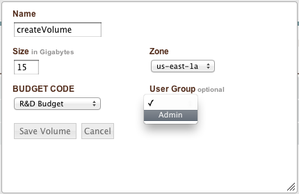

..
    Snapshots
    ---------

.. _saas_snapshots:

スナップショット
----------------

..
    Snapshots are the reciprocal of volumes. When a snapshot of a volume is created, a
    differential backup of the devices is created and stored in S3. From this snapshot, a
    clone of the original volume can be created. enStratus leverages this property of
    snapshots when automating application deployments. At the time of this writing, snapshot
    creation is only supported by the Amazon EC2 cloud.

スナップショットは、ボリュームと相互関係を表すものです。ボリュームのスナップショットが作成されるとき、デバイスの差分バックアップが作成されて S3 に格納されます。このスナップショットから、元のボリュームのクローンを作成できます。enStratusは、スナップショットのプロパティをアプリケーションデプロイメントの自動化に活用します。執筆時点でスナップショットの作成は、Amazon EC2 クラウドのみ対応しています。

..
    Creating Volumes from Snapshots
    ~~~~~~~~~~~~~~~~~~~~~~~~~~~~~~~

スナップショットからボリュームの作成
~~~~~~~~~~~~~~~~~~~~~~~~~~~~~~~~~~~~

..
    Creating volumes from snapshots is a way to create an exact duplicate of the volume from
    which the snapshot came. If the filesystem on the volume supports increasing the size of
    the volume, the volume created from the snapshot may be increased in size.

スナップショットからボリュームを作成することは、スナップショットからボリュームの正確な複製を作成する方法です。ボリュームのファイルシステムが、ボリュームのサイズ増加に対応しているなら、スナップショットから作成されたボリュームのサイズ増加もできます。

..
    The volume created from the snapshot must be at least the size of the original volume.

スナップショットから作成されたボリュームは、元のボリュームのサイズ以上でなければなりません。

..
    To create a volume from a snapshot, navigate to Infrastructure > Snaphots and select a
    snapshot. Click on the appropriate actions button and choose create_volume. The resulting
    dialog box allows for the customization of several options, including standard enStratus
    options of name, group, and billing code.

スナップショットからボリュームを作成するには、"Infrastructure > Snaphots" に移動してスナップショットを選択します。適切なアクションボタンをクリックし "create_volume" を選択します。表示されるダイアログボックスでは、標準の enStratus オプションの、名前、グループ、課金コードを含め、複数のオプションをカスタマイズできます。

..
    The size field will automatically be populated with the size of the original volume, but
    can be increased. For Amazon, volumes are specific to an availability zone, so a zone is
    required for volume creation.

Size フィールドは、自動的に元のボリュームのサイズが割り当てられますが、増加できます。Amazon では、ボリュームは可用性ゾーン特有なので、ボリュームの作成にゾーンが必要です。

..
   Create Volume from Snapshot

   スナップショットからボリュームの作成

..
    The created volume will soon appear in the Infrastructure > Volumes page for selection and
    attachment to servers.

作成されたボリュームは、"Infrastructure > Volumes" ページにすぐ表示されて、選択やサーバーへの接続が行えます。

..
    Sharing Snapshots
    ~~~~~~~~~~~~~~~~~

スナップショットの共有
~~~~~~~~~~~~~~~~~~~~~~

..
    Sometimes it is advantageous to share snapshots to another account for ease of data
    transfer. Sharing snapshots in enStratus is accomplished by selecting the snapshot to
    share and clicking on the action button choosing sharing.

別のアカウントとスナップショットを共有することで、データ転送を容易にするという利点があります。enStratus でスナップショットの共有は、"snapshot to share" を選択してアクションボタンをクリックすることにより行えます。

..
    A dialog box with two primary options is presented. The first share type is Private.
    Private sharing enables an enStratus user who is a part of several accounts to share
    snapshots between those accounts. The accounts of which the user is a part will populate a
    dropdown window. Once the snapshot is shared, the snapshot will appear in the other
    account.

2つの主要オプションを持ったダイアログボックスが表示されます。最初の共有タイプは Private です。プライベート共有は、複数のアカウントの一部である enStratus ユーザーが、これらのアカウント間でスナップショットを共有できるようにします。一部のユーザーアカウントは、ドロップダウン画面が表示されます。スナップショットが共有されると、そのスナップショットが他のアカウントにも表示されます。

..
    The second share type is Public. Public sharing enables an enStratus user to add a
    snapshot to the publicly available pool of snapshots. This is an option that carries the
    risk of making publicly available private data, so this action should be restricted using
    enStratus groups and roles.

2番目の共有タイプは Public です。パブリック共有は、enStratus ユーザーがパブリックなスナップショットのプールに、スナップショットを追加できます。これはプライベートなデータを公に利用可能な状態にしてしまうリスクをもったオプションです。そのため、このアクションは enStratus のグループとロールを使うように制限すべきです。

..
    Snapshot Strategies
    ~~~~~~~~~~~~~~~~~~~

スナップショットの戦略
~~~~~~~~~~~~~~~~~~~~~~

..
    Because snapshots are differential backups, the time snapshots take to create varies based
    on the amount of changed information since the last snapshot was taken. Frequent snapshots
    will generally be created more quickly than infrequent ones.

スナップショットは、差分バックアップであるため、スナップショット作成にかかる時間は最後のスナップショットが取られてから、変更された情報量に基づいて異なります。頻繁にスナップショットを取ることは、一般的には、たまに行うよりも迅速に作成されます。

..
    In an automated environment with enStratus, it is possible to have enStratus automate both
    the creation of snapshots and recovery volumes according to a customizable schedule.

enStratus の自動化された環境では、カスタマイズ可能なスケジュールにより、スナップショットと復元ボリューム作成の両方を自動化できます。
