IAM
---

enStratus now supports the IAM feature for Amazon and Eucalyptus cloud environments.
enStratus acts as a nexus through which authoritative user management is coordinated with
the cloud provider. The integrated IAM feature in enStratus allows an administrator user
of an account to securely control access to cloud console and api services and resources
for users in that particular account. 

Providing Cloud Console Access for enStratus Users
~~~~~~~~~~~~~~~~~~~~~~~~~~~~~~~~~~~~~~~~~~~~~~~~~~

There are two ways an admin enStratus user can provide cloud console access to users.

#. Cloud Console Access (Console Access using password)
#. API Console Access  (API Access using API keys)

.. note:: enStratus does not automatically generate Cloud Console Access and API Console
   Access when the user is created. In order to provide access, an admin user must manually
   grant access to the user from the user list page. 

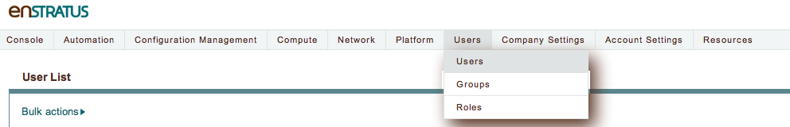

   Users, Users

An admin user can edit a user’s cloud access settings in the User List table of the Users
> Users page in the enStratus console.

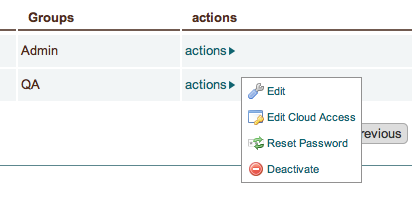

   Users, Actions

The admin user can edit a user by clicking the ‘actions’ link in the User List table.
Selecting the ‘Edit Cloud Access’ option from the drop down list will prompt the user with
the following options:

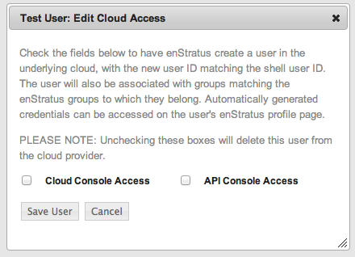

   Users, Actions

Checking either one of the boxes for the first time and clicking the Save User button will
add the user to the cloud provider’s IAM user list. Unchecking the boxes will revoke the
user’s access to the cloud provider’s console. Please wait about 2-3 minutes between
adding and revoking accesses. Modifying the same user’s cloud access rapidly can result in
a delay synchronizing with the cloud provider.

When only Cloud Console Access is checked and the user is saved, enStratus will generate a
login password which can be used by that user to login to the cloud provider (e.g. AWS)
console. 

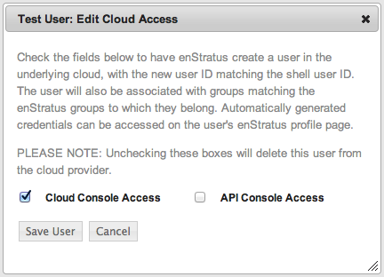

   Cloud Console, Access

An enStratus user who has been granted Cloud Console Access can check their Cloud Console
Password under the ‘Edit My Profile’ page.

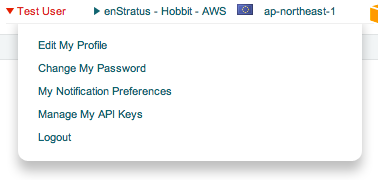

   Cloud Access, Check Password

The user will have the option to show or hide the console password.

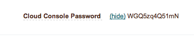

   Cloud Access, Show Password

For example, if the enStratus user’s cloud provider is Amazon and the user wants to verify
the password, the user should be provided with an account specific link for the login page
by the admin user. 

For AWS see: http://aws.amazon.com/iam/faqs/#How_do_i_know_what_the_link_is

Then the enStratus user will have to provide the proper username,  which is the User ID
from the User List table in the enStratus console, and the Cloud Console Password, which
is displayed in the ‘Edit My Profile’ page of the enStratus Console. 

Similarly when only the API Console Access is checked and the user is saved, enStratus
will generate API keys with the underlying cloud provider. 

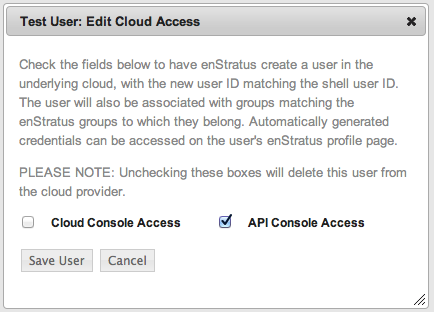

   API Access

An enStratus user who has been granted API Console Access can now find their API access
keys under ‘Edit My Profile’ page.

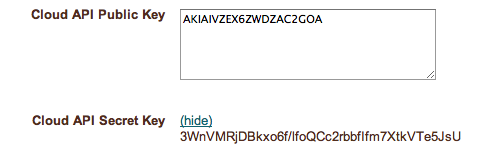

   View API Keys

The enStratus user can use these keys to make API calls to the cloud provider.

If both of the boxes in the Edit Cloud Access form are checked, then the user is provided
with both Cloud API keys and a Cloud Console password, and they are both displayed under
the ‘Edit My Profile’ page. If both the boxes are unchecked while editing a user’s cloud
access then both kinds of access are revoked and credentials are removed from the ‘Edit My
Profile’ page.

.. note:: Generating a cloud console access password or API access keys for an enStratus user
   for the first time creates an IAM user with the enStratus User Id as their username in the
   cloud provider’s console but does not attach a user policy to the user. The user will not
   have any set of permissions associated with it which prevents the user from performing any
   actions in the cloud provider’s console. 

In order to provide an IAM user with proper access rights, the admin enStratus user must
log into the cloud provider’s console and manually attach the proper user policy to the
IAM user.  

For example, for an IAM user in an Amazon cloud account:

The admin user will log on to AWS console and select the IAM tab to display the list of IAM users.

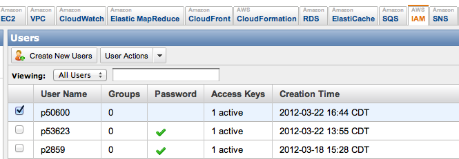

   IAM Users, List

After the admin selects a user, a window below the IAM user list is displayed that allows
for modifying the user’s attributes. Selecting the Permissions tab from that window will
show the option to attach a user policy to a particular user. 

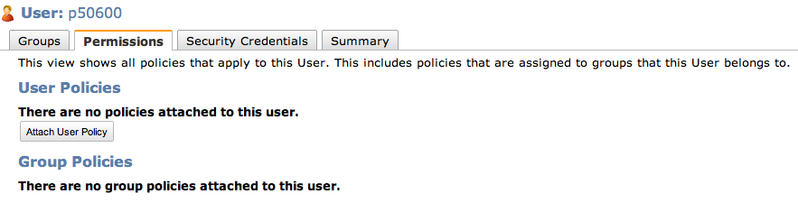

   IAM Policy, Single User

A user can then be attached to different types of access rights based on the configuration
selected by an administrator.

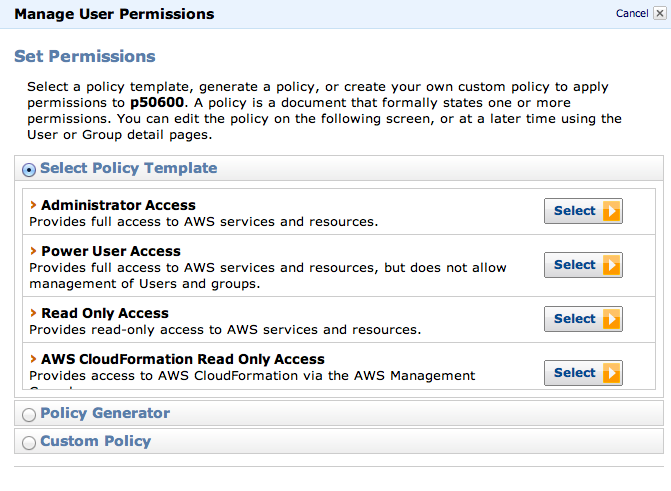

   Access Rights, Edit

After the user has been attached to an appropriate user policy, the user will be able to
log in to the AWS console and perform permissible actions and/or make permissible API
calls.
