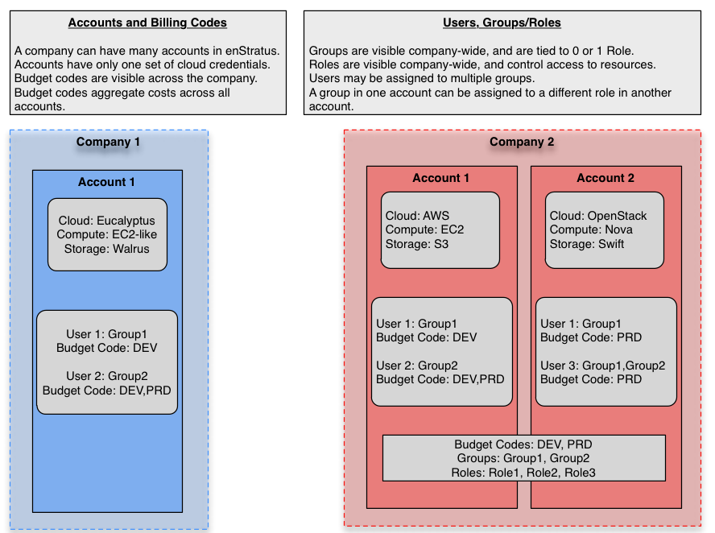
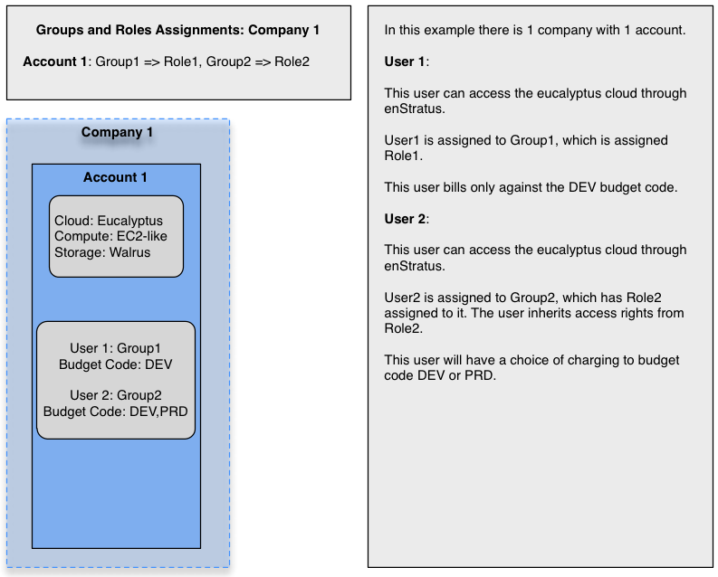
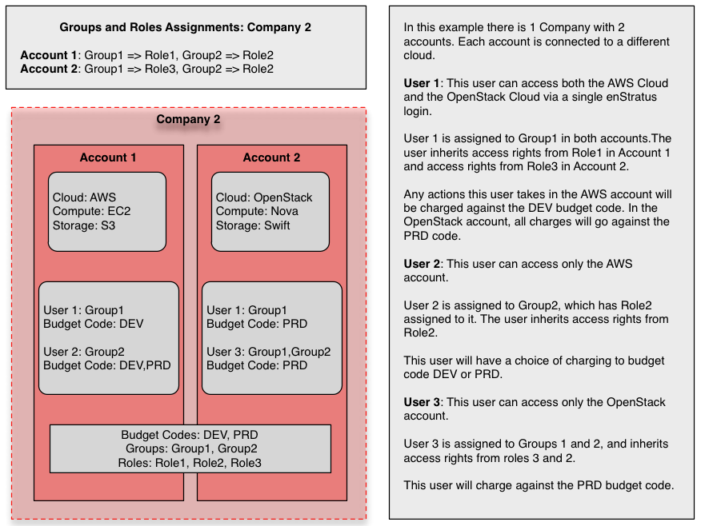

..
    Introduction
    ------------

.. _saas_users_introduction:

はじめに
--------

..
    User management with enStratus is tightly integrated with enStratus accounts, groups,
    roles, and budget codes. Let's define a few terms that will help provide useful
    context for understanding how users work.

enStratus のユーザー管理機能は、enStratus アカウント、グループ、ロール、予算コードが連動するよう統合されています。ここで、ユーザー管理がどう行われるのかを理解するために、便利なコンテキストを提供するのに役立つ概念を少し定義してみましょう。

..
    #. Company. A company is a logical entity in enStratus that contains one or more accounts.
       When the first account is created, a company name is required.
    #. Account. A account has a one to one relationship with a set of cloud credentials tied
       to a cloud provider.
    #. Group. A group is visible company-wide. Users can be assigned one or more groups. Each
       group can have 0 or 1 role applied to it.
    #. Role. A role is also visible company-wide. Roles are the mechanism through which access
       rights are managed. A role of the same name may have different access rights applied on
       the account level.
    #. Budget Code. Budget codes are visible company-wide and costs are aggregated across all
       accounts.

#. Company: 会社は、1つまたは複数のアカウントを含む enStratus の論理的なエンティティです。最初にアカウントが作成されるときに会社名が必要になります。
#. Account: アカウントはクラウドプロバイダーの、一連の認証情報と1対1の関係になります。
#. Group: グループは、全社に渡って見えます。ユーザーは、1つまたは複数のグループを割り当てられます。各グループは、1つのロールを適用するか、ロールを適用しなくても構いません。
#. Role: ロールは、全社に渡って見えます。ロールは、アクセス権を管理するための仕組みです。同じ名前のロールは、適用するアカウントレベルに応じて別のアクセス権になる場合もあります。
#. Budget Code: 予算コードは、全社に渡って見えて、コストはアカウント全体で集約されます。

..
   Companies and Accounts

   会社とアカウント

..
    In the above example, we have two companies being managed through enStratus and tied to one
    or more cloud accounts. Let's take a closer look at each company.

この例では、enStratus 経由で2つの会社に所属する1つ、または複数のクラウドアカウントを管理します。各会社を詳しく見てみましょう。

..
   Company One

   会社1

..
    The first company example is a simple example showing one company and one account. Here
    there are only two users, each having potentially differing levels of access to the
    underlying cloud depending on how their respective roles are configured. Group one is
    assigned role one and group two is assigned role 2.

会社1は、1つの会社と1つのアカウントを表す簡単な例です。ここでは、2人だけユーザーがいて、対応するロールに依存するクラウドに対して潜在的に異なるアクセス権が設定されています。グループ1はロール1に、グループ2はロール2に割り当てられています。

..
    It is possible that role 1 and role 2 are identical and therefore each user will have the
    same capabilities, although doing so is not practical.

ロール1とロール2が同一なので各ユーザーが同じ機能を持っています。但し、この設定は実用的ではありません。

..
    The other primary difference between these two users is at the level of the bugdet code.
    User 1 has only one budget code against which to charge, in this case the code called DEV.
    User 2 has access to both the DEV and PRD budget codes.

この2ユーザー間における別の大きな違いは、予算コードです。ユーザー1は、課金対象の予算コードを1つだけもっていて、この例だと DEV というコードです。ユーザー2は、DEV と PRD 両方の予算コードにアクセスできます。

..
   Company Two

   会社2

..
    Company two displays a more complex account relationship with more users, groups, and
    roles. Here, there are two groups and three roles.

会社2は、複数のユーザ、グループ、ロールをもった、より複雑なアカウントの関係を表します。ここでは、2つのグループと3つのロールがあります。

..
    The first highlight to notice is that the group definitions for group 1 are different in
    each account. In account 1, group one is assigned role 1, in account 2, group one is
    assigned role 3. The practicality of such a design depends on what you’re trying to
    accomplish in each account.

最初に注意する内容は、グループ1のグループ定義がアカウント毎に異なることです。アカウント1では、グループ1はロール1が割り当て、アカウント2ではグループ1にロール3を割り当てています。このような設計の実用性は、各アカウントで行いたいロール設定に依存します。

..
    The effect of such a group and role mapping is on User 1. If User 1 is operating in the
    first account, tied to AWS in this case, he or she will inherit the access rights from
    Role 1. If User 1 switches to the second account, tied to OpenStack, they inherit access
    rights from Role 2.

このようなグループとロールマッピングの効果は、ユーザ1にあります。この例では、ユーザー1が AWS に関連付けられた最初のアカウントであり、ロール1からアクセス権を継承します。ユーザー1が OpenStack に関連付けられた2番目のアカウントに切り替わったら、ロール2からアクセス権を継承します。

..
    The other interesting user in this case is User 3. This user as been assigned into two
    groups, Groups 1 and 2. When a user is assigned into two groups, the User inherits the sum
    of the access rights. So in this case, User 3 is inheriting access rights from role 3 and
    role 2, which are assigned to groups 1 and 2, respectively.

この例の、興味深い他のユーザーはユーザー3です。このユーザーは、次の2つのグループ、グループ1と2に割り当てられています。ユーザーが2つのグループに割り当てられているとき、そのユーザーは両方のグループのアクセス権を継承します。そのため、この例では、ユーザー3はグループ1と2に割り当てられたロール3とロール2からアクセス権を継承します。

..
    Budget codes for company 2 are visible across the entire company. This means charges to
    the DEV and PRD budget codes, regardless of account, will aggregate and be shown in the
    companies budget code summary. Users can be assigned into one or many budget codes.

会社2の予算コードは、会社全体に渡って見えます。これはアカウントに関係なく、DEV と PRD 予算コードのコストが集計されて、会社の予算コードをまとめて表示します。ユーザーには、1つか複数の予算コードを割り当てられます。
