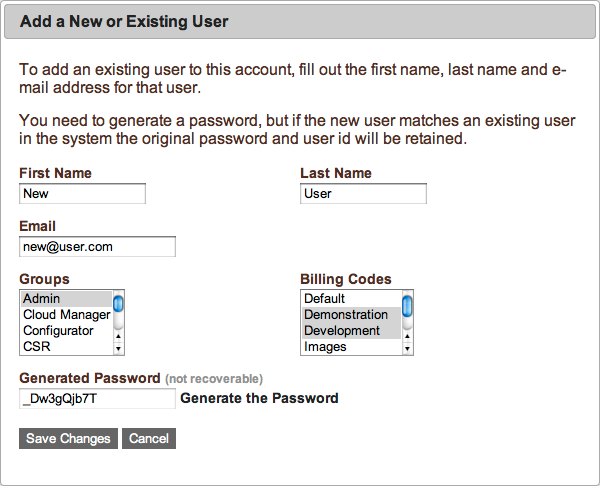
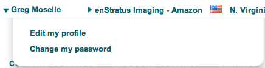
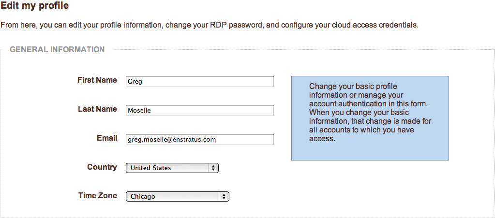
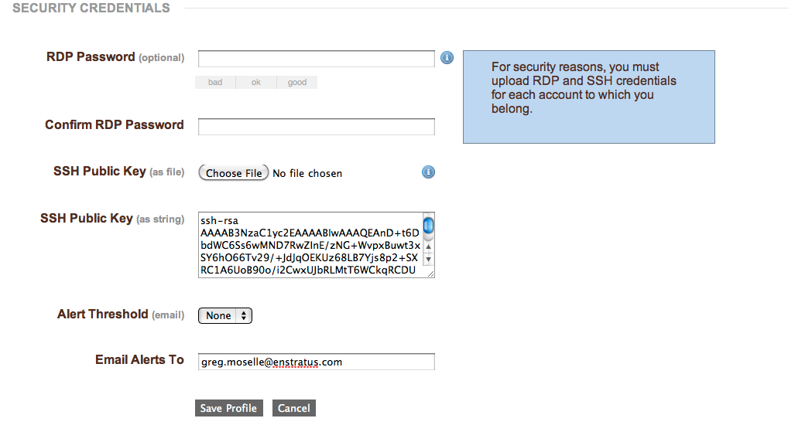

..
    Managing Users
    --------------

.. _saas_users_manage:

ユーザーの管理
--------------

..
    The challenge of user management breaks down roughly along two boundaries. The first of
    which is enStratus console access and the second is access rights to an individual cloud
    resource such as a server.

ユーザー管理の課題は、大まかに言って2つの内容に分けられます。1つ目は enStratus コンソールアクセスで、2つ目はサーバのような個々のクラウドリソースへのアクセス権です。

..
    The elasticity inherent in cloud computing creates a unique challenge for enterprise shell
    and remote desktop access. enStratus operates as an arbiter between your authoritative
    user database and user access to cloud virtual machines. Because of this arbitration, your
    cloud virtual machines do not need to participate in any kind of trust relationship with
    a corporate directory service.

クラウドコンピューティング特有の弾力性には、エンタープライズ分野固有のシェル/リモートアクセスの課題があります。enStratus は、認証ユーザーデータベースとクラウド仮想マシンへのユーザーアクセス間での調停者として動作します。この調停処理により、クラウド仮想マシンと企業のディレクトリサービスが何らかの信頼関係を築く必要はありません。

..
    enStratus acts as this arbiter by adding individual user accounts to virtual machines
    based on the users enStratus access rights to that VM. enStratus maintains a separate set
    of login credentials for VM access so that corporate passwords are never placed in a
    public cloud.

enStratus は、仮想マシンへのユーザーのアクセス権に基づき、個々のユーザーアカウントを仮想マシンへ追加することにより、この調停者として動作します。enStratus は、企業のパスワードをパブリッククラウドに置かないようにするために、VM にアクセスする別の認証情報を保持します。

..
    Any enStratus user may be granted shell/remote desktop access to a cloud virtual machine
    if that user has shell access rights to that virtual machine. If you want to grant a user
    access to a virtual machine, they must have first created Linux (SSH) or Windows
    (password) credentials in enStratus. You can then select the virtual machine to which they
    should be granted access and then grant them access to the virtual machine. When you grant
    that access, a new user account is created on the virtual machine with that users
    authentication credentials.

任意の enStratus ユーザーは、クラウドの仮想マシンへのシェルアクセス権があれば、その仮想マシンへのシェル/リモートデスクトップのアクセス権が与えられます。ユーザーに仮想マシンへのアクセス権を与えたいなら、Linux では SSH を、Windows ではパスワード情報を enStratus で最初に作っておく必要があります。それから、アクセス権を与えたい仮想マシンを選択して、ユーザーへ与えます。ユーザーにアクセス権を与えると、その仮想マシン上で認証情報をもつ新規のユーザーアカウントが作られます。

..
    If you remove the user from enStratus, enStratus also removes all virtual machine access
    as well.

enStratus からこのユーザーを削除する場合、enStratus は全ての仮想マシンへのアクセスも同様に削除します。

..
    To create a new user, navigate to User Manager > Users. Click on the + add user link in
    the upper right of the User List and complete the resulting dialog box. After providing
    the required information the user will be added to the user list.

新規のユーザーを作成するには、"User Manager > Users" へ移動します。"+ add user" リンクをクリックして、表示されたダイアログボックスに記入します。必要な情報を入力後、このユーザーがユーザーリストに追加されます。

..
   New User

   新しいユーザー

..
    Once the user is added to the system, they will inherit the rights associated with the
    group(s) to which they have been added.

ユーザーがシステムに追加されると、追加されたグループに関連付けられている権限を継承します。

..
    A user must specify remote access credentials prior to gaining access to individual
    running servers in the cloud. To gain access to a running Windows server, the user must
    specify an RDP password. To access a Linux server, a user must specify a public SSH key.

ユーザーは、クラウドで実行されている個々のサーバーへアクセスする前に、リモートアクセスの認証情報を指定する必要があります。実行中の Windows サーバーへアクセスするには、ユーザーは RDP パスワードを指定する必要があります。Linux サーバーへアクセスするには、ユーザーは SSH の公開鍵を指定する必要があります。

..
    To associate these credentials, click on their name at the top of the console, and select
    Edit my profile. On the profile page, the RDP password should be entered twice before
    saving the changes to the profile. The SSH public key can be entered either as a string or
    uploaded as a file.

これらの認証情報を関連付けるには、コンソールの上部の自分の名前をクリックして、"Edit my profile" を選択します。プロフィールページで、RDP パスワードは、プロフィールの変更を保存する前に2回入力する必要があります。SSH の公開鍵は、文字列か、ファイルをアップロードするかのどちらかで入力できます。

..
   Edit Profile

   プロフィールの編集

..
    Once the credentials have been entered and the profile is saved, the user can then access
    remote servers as outlined in the Infrastructure > Servers section through Shell/Remote
    access provided they have the appropriate access rights to take this action.

認証情報を入力してプロフィールが保存されると、ユーザーはリモートサーバーにアクセスできます。このユーザーは、"Infrastructure > Servers section" セクションで説明した "Shell/Remote access" に適切なアクセス権を設定することでアクセスできます。

..
   General Profile Information

   プロフィール情報全般

|

..
   Profile Security Credentials

   プロフィールのセキュリティ情報
