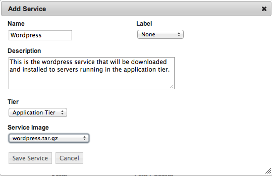
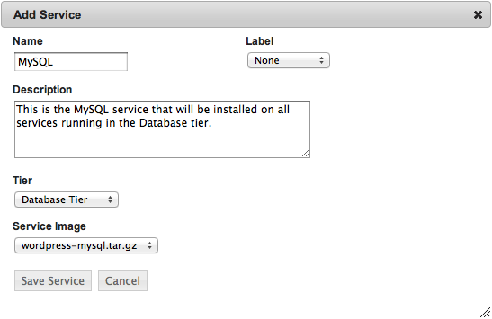
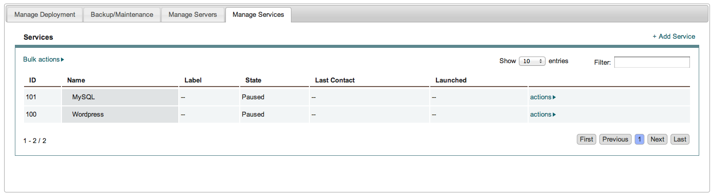

Add Services
------------

Adding services to tiers means telling enStratus what service should be installed on
servers running in the tier. This action only needs to be completed once, no matter how
many regions/clouds the tier spans.

To add a service to a tier, select the tier by clicking on it in the designer diagram and
choose +add service. enStratus will present the list of the services available for
attaching to the tier. This list should have at a minimum the two services uploaded above. 

Add Wordpress Service
~~~~~~~~~~~~~~~~~~~~~

   Add Service, Wordpress

.. note:: If there was a previously running deployment where automated backups were made,
  it is also possible to tell enStratus to use a previously generated backup as a service.

  Pretty cool.

Add MySQL Service
~~~~~~~~~~~~~~~~~

   Add Service, MySQL

Associate the wordpress service with the application tier and the mysql service with the
database tier.

   Services Added

Next, it's time to configure the services. Configuring services means telling enStratus
what the relationship is, if any, between the services and what information should be
passed to dynamically configure the service at run time.
