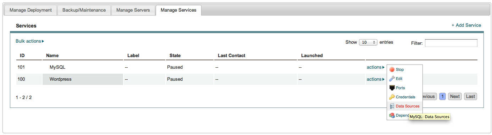
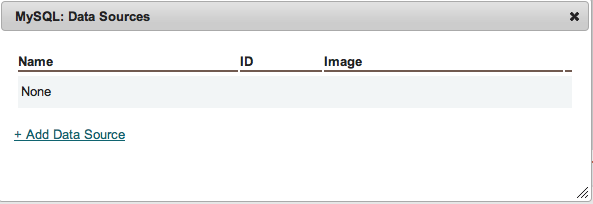
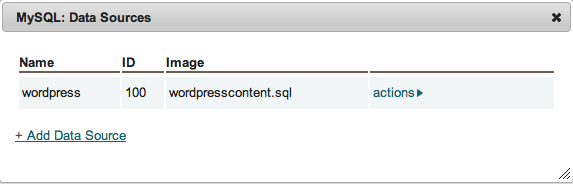

Data Source
-----------

The Datasource options in actions menu for services allows the application designer to
associate a starting datasource with a database service. On the MySQL service, associate
the datasource uploaded earlier as shown:

The MySQL service is special, enStratus will execute a routine to install a datasource
once the mysql service is configured. On the MySQL service, choose actions > Data Sources

   Service, Data Source

   Service, Data Source

.. figure:: ./images/addDataSource2.png
   :height: 700px
   :width: 900 px
   :scale: 50 %
   :alt: Service, Data Source
   :align: center

   Service, Data Source

   Service, Data Source
