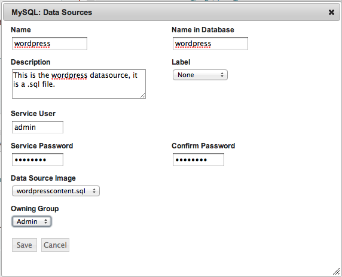

..
    Data Source
    -----------

データソース
------------

..
    The Datasource options in actions menu for services allows the application designer to
    associate a starting datasource with a database service. On the MySQL service, associate
    the datasource uploaded earlier as shown:

サービスのアクションメニューのデータソースオプションは、データベースサービスと共にデータソースの起動をアプリケーションデザイナーで関連付けます。MySQL サービスでは、これまでの作業でアップロードした次のデータソースを関連付けます。

..
    The MySQL service is special, enStratus will execute a routine to install a datasource
    once the mysql service is configured. On the MySQL service, choose actions > Data Sources

MySQL サービスは特別なものです。enStratus は、mysql サービスが設定されると、あるデータソースをインストールする処理を実行します。MySQL サービスでは、"choose actions > Data Sources" を選択します。

..
   Service, Data Source

   サービス、データソース

..
   Service, Data Source

   サービス、データソース

..
   Service, Data Source

   サービス、データソース

..
   Service, Data Source

   サービス、データソース
