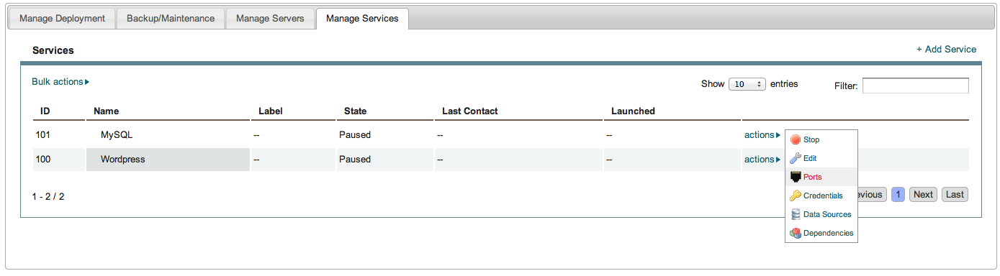
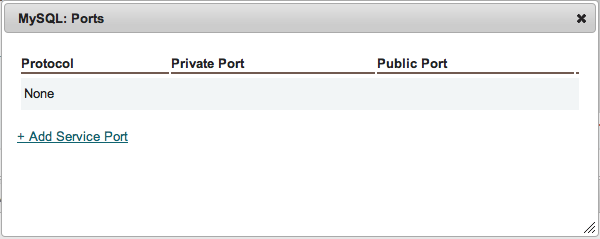
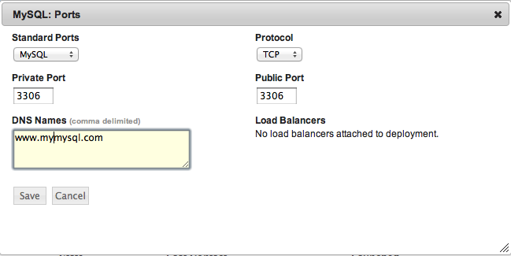
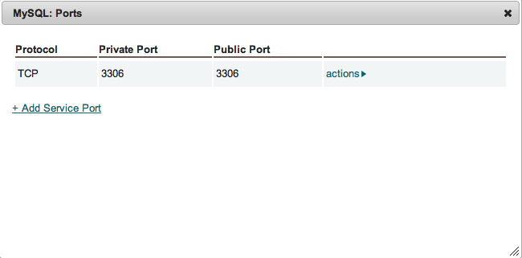
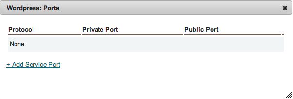
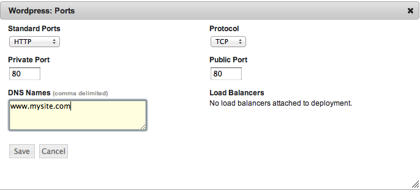
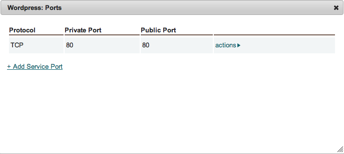

Ports
-----

The ports option in the actions menu for services allows the application designer to
specify ports information that will be passed to the service at run time.

MySQL Ports
~~~~~~~~~~~

For the MySQL service, make the ports setting as shown:

   Service, Ports

   Service, Ports

   Service, Ports

   Service, Ports

Wordpress Ports
~~~~~~~~~~~~~~~

For the wordpress service, make ports setting as shown:

.. figure:: ./images/ports4.png
   :height: 500px
   :width: 1900 px
   :scale: 50 %
   :alt: Service, Ports
   :align: center

   Service, Ports

   Service, Ports

   Service, Ports

   Service, Ports
