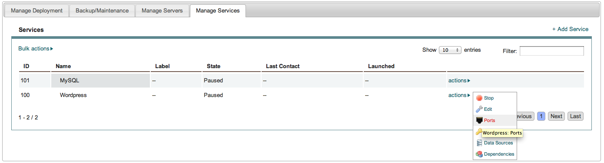

..
    Ports
    -----

ポート番号
----------

..
    The ports option in the actions menu for services allows the application designer to
    specify ports information that will be passed to the service at run time.

サービスのアクションメニューのポートオプションは、実行時にサービスと情報をやり取りする特定のポート番号をアプリケーションデザイナーで設定します。

..
    MySQL Ports
    ~~~~~~~~~~~

MySQL ポート
~~~~~~~~~~~~

..
    For the MySQL service, make the ports setting as shown:

MySQL サービスには、次のようなポート設定を行います:

..
   Service, Ports

   サービス、ポート番号

..
   Service, Ports

   サービス、ポート番号

..
   Service, Ports

   サービス、ポート番号

..
   Service, Ports

   サービス、ポート番号

..
    Wordpress Ports
    ~~~~~~~~~~~~~~~

Wordpress ポート
~~~~~~~~~~~~~~~~

..
    For the wordpress service, make ports setting as shown:

Wordpress サービスには、次のようなポート設定を行います:

..
   Service, Ports

   サービス、ポート番号

..
   Service, Ports

   サービス、ポート番号

..
   Service, Ports

   サービス、ポート番号

..
   Service, Ports

.. figure:: ./images/ports7.png
   :height: 400px
   :width: 800 px
   :scale: 50 %
   :alt: Service, Ports
   :align: center

   サービス、ポート番号
