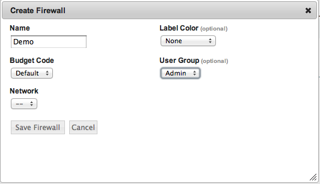

Create Firewall
~~~~~~~~~~~~~~~

Let's create a firewall (security group) for use in this tutorial.

   Create Firewall

Open ports 22 and 80 to your IP for testing. enStratus will automatically adjust the
firewall for the applications deployed according to the services > ports settings.
