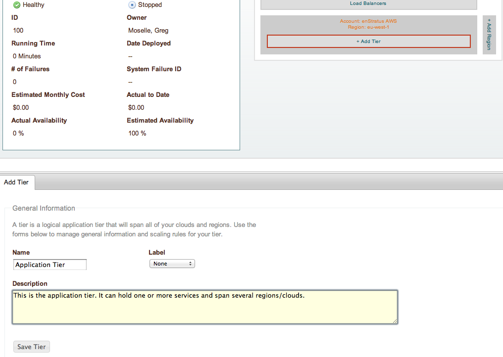
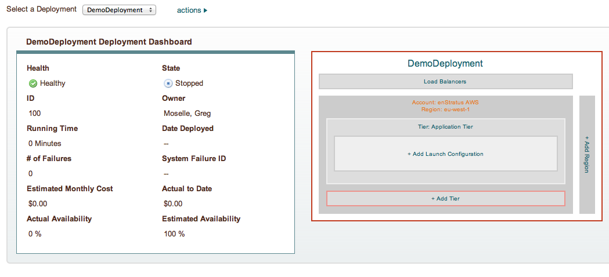
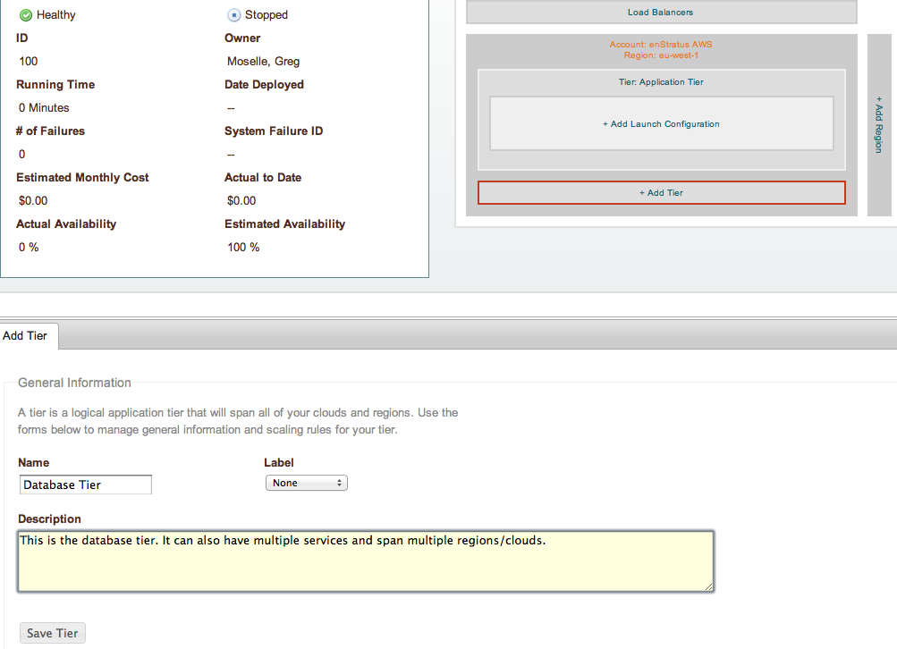
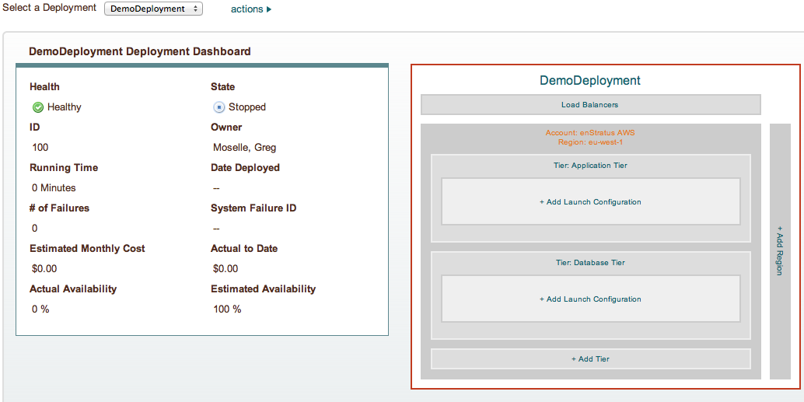

Create Tiers
------------

Create Application Tier
~~~~~~~~~~~~~~~~~~~~~~~

Use the designer diagram to add a tier. Give the tier a high-level generic name like
Application Tier. Tiers can hold many services, and we'll give a more specific name for
the services. This tier will house only one service for this tutorial, the wordpress
application.

   Deployment Designer, Add Tier

When the tier is added, the designer diagram is updated.

   Deployment Designer, Add Tier

Create Database Tier
~~~~~~~~~~~~~~~~~~~~

Use the desginer diagram to add another tier. Give the tier a name like Database Tier.
This tier will hold the MySQL service.

   Deployment Designer, Add Tier

When the tier is added, the designer diagram is updated.

   Deployment Designer, Add Tier
