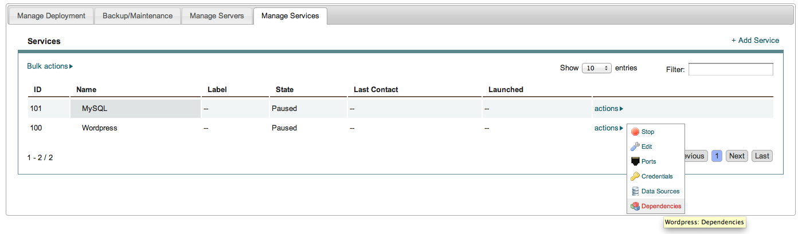
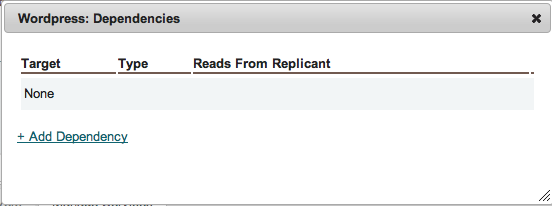
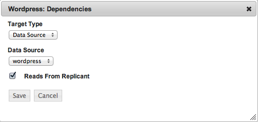
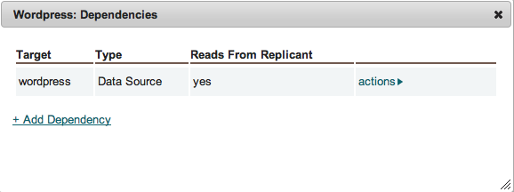

Set Dependencies
----------------

This step is critical. Dependencies let enStratus know how to *orchestrate* the deployment
launch and service configuration.

For this tutorial, we're going to set a dependency for the wordpress service. It's going
to depend on the *data source* installed as part of the MySQL service. What this means is
that at run time, enStratus will ensure:

1. The MySQL service is installed and successfully configured
2. The datasource is successfully installed on the MySQL service.

and then, and only then will

3. The application service be installed, since it *depends* on steps 1 and 2.

To set up a dependency, select the actions menu on the wordpress service.

   Dependency

   Dependency, Add

Choose Target Type: Data Source, and select the previously created data source from the
menu.

   Dependency, Data Source

   Dependency, Saved
