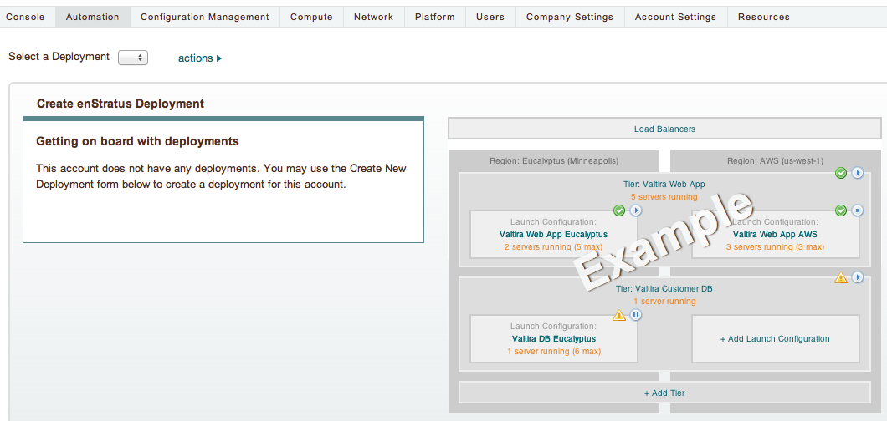
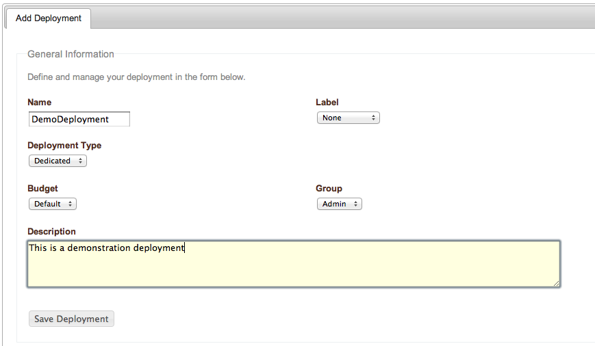
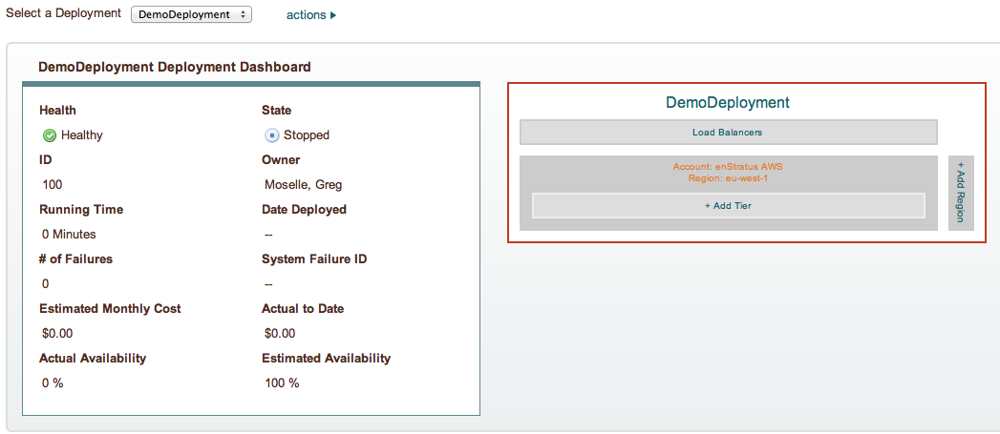

Design Deployment
-----------------

Now that those steps are complete, it's time to start building the application
architecture. 

First, create a new deployment by navigating to Automation > Designer. If you have not yet
created a deployment, a placeholder image greets you:

   Deployment Designer

To create a new deployment, select the actions menu and choose Create a New Deployment.

   Deployment Designer, Create New Deployment

And that's it, the deployment is created.

   Deployment Designer, Deployment Created
