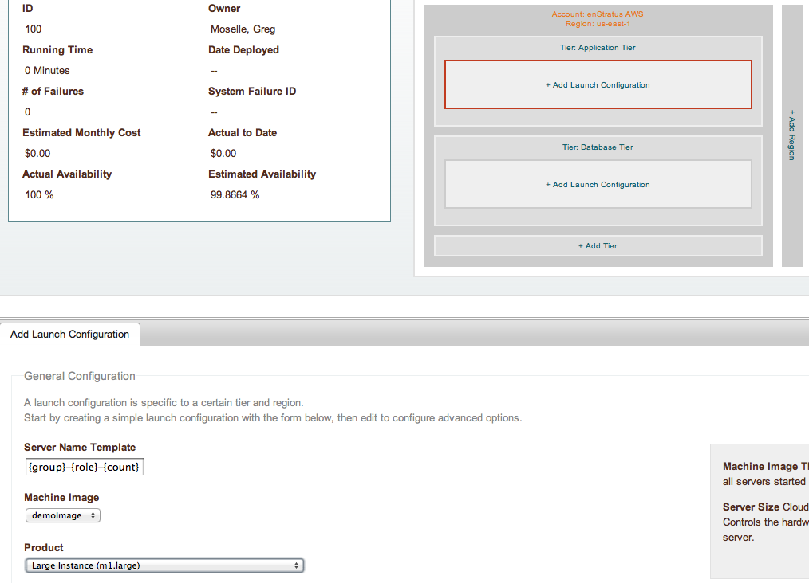
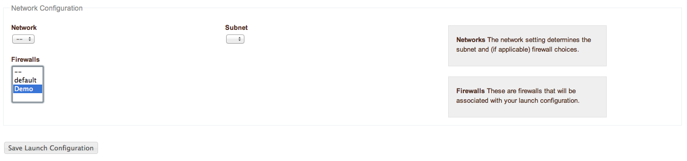
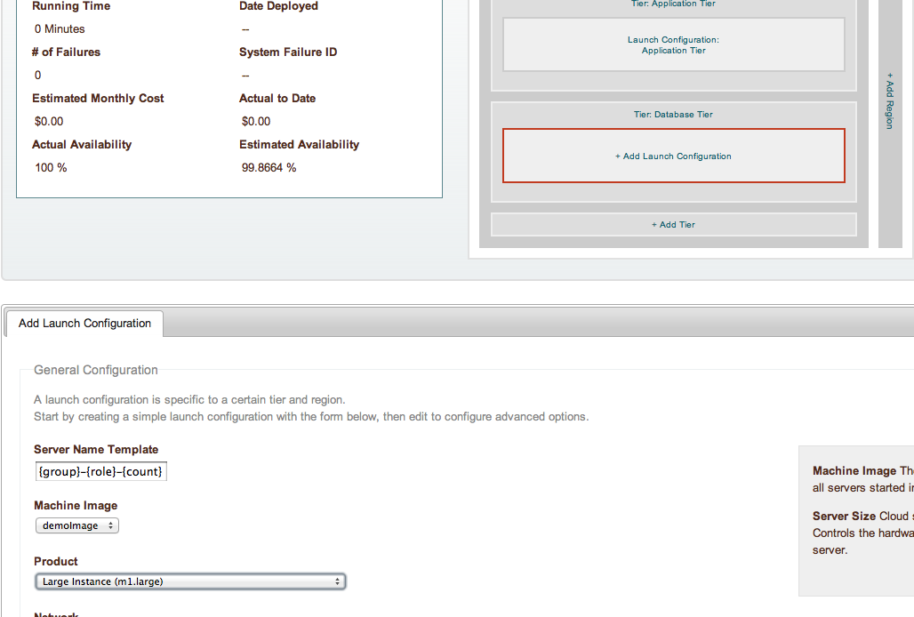

Configure Launch Configuration
------------------------------

The next and final thing to do is to configure virtual resources to use in the deployment.
By now, the imaged we prepared earlier should be ready for use in the launch
configuration.

In these steps, we'll tell enStratus what Image to use when starting servers, along with
what firewall into which the servers will be started.

.. note:: For this tutorial, we'll be using the same image for both launch configurations.
  In practice, this would probably not be the case, as a dedicate image would be used to
  support the application, and likewise the database.

Set an image for use in each of the launch configurations, as shown:

Wordpress Launch Configuration
~~~~~~~~~~~~~~~~~~~~~~~~~~~~~~

   Launch Configuration, Wordpress

|

Once the initial launch configurations are set, click on the launch configuration, scroll
to the bottom, and use the previously created firewall.

   Launch Configuration, Edit Wordpress

MySQL Launch Configuration
~~~~~~~~~~~~~~~~~~~~~~~~~~

   Launch Configuration, MySQL

Once the initial launch configurations are set, click on the launch configuration, scroll
to the bottom, and use the previously created firewall.

   Launch Configuration, Edit MySQL
